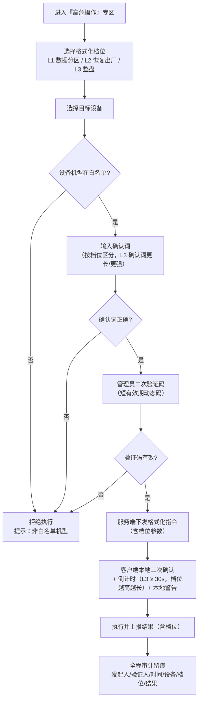

# sea2 商用客户端 + sea1 运维控制台全功能中文 UI 改造 PRD v1.0

> 产品经理：许清楚（Xu）｜ 语言：简体中文 ｜ 版本：v1.0（简单 PRD）
> 上游基线：`PRD_fleet_ops_v1.0.md`（已落地的集群/指令/授权模型在本 PRD 沿用，不重复展开）
> 输出路径：`activation-server/docs/prd_sea2_ops_v1.0.md`

> **修订记录**：v1.0 → v1.1（用户拍板 3 项，更新 P0-6/P0-8/§4.2/§6）：① 格式化=三档分级（数据分区/恢复出厂/整盘），整盘档门禁最强；② 二进制 napcat 来源转架构师调研，结论待补；③ 登录中间页默认显示 + 「记住本机」开关。

---

## 0. 代际关系（铁律，所有设计必须遵守）

| 代际 | 角色 | 状态 | 是否可动 | 说明 |
|---|---|---|---|---|
| **sea** | 初代 | 即将停用 | **不可作为开发基准** | 不做任何开发基准，不做维护增强 |
| **sea1** | 单机重构版 | 基本稳定，接替 sea 用于真实生产 + 真机备份 | **不能动** | 本次**开发基准** + **配套服务端**所在（`/root/sea1-activation-server`，10.0.0.11:3457） |
| **sea2** | 商用开发版客户端 | 以 sea1 为基础重构 | **本期主交付** | 集成**二进制版 napcat（解耦 docker）**，目标装机 **1000 台**，全部连接 sea1 配套服务端，通过运维后台 UI + 机器人指令统一管理 |

### 目录与平台约束（用户已拍板）

| 项 | 约束 |
|---|---|
| 开发目录 | 所有开发在 `/root`；sea2 二进制 QQ 目录迁入 **`/root/sea2`** 内 |
| sea1 服务端 | `/root/sea1-activation-server` 维持不动（仅允许经评审的运维 UI 增强与 reason 文案修正） |
| 平台 | **x86_64 + arm64 双平台分发**（按平台打包） |
| 运维后台 | 复用并增强 sea1 `/console`，sea2 客户端连入后即集群一员，**不另起炉灶** |

---

## 1. 产品目标

**一句话目标**：以 sea1 为基准交付 sea2 商用客户端（x86_64 + arm64，内置二进制 napcat，支持 1000 台），并把 sea1 运维控制台升级为「全变量可设、全数据可改、全进程可控、全中文、高危强门禁」的一站式中文运维平台。

可量化目标：

| # | 目标 | 量化指标 |
|---|---|---|
| G1 | 1000 台容量可用 | 1000 台在线设备（30s 心跳）下，集群列表/详情接口 **P95 响应 < 2s**，控制台可流畅操作 |
| G2 | 虚假 X86 修复闭环 | 遗留授权码 `SEA1-8GA4-NCHC-HF5P` 绑定关系纠正后 24h 内真实设备恢复在线；修复后集群页 **0 台"假在线"** |
| G3 | 中文化覆盖 | 全站可见文案中文化覆盖率 **≥ 99%**（专有名词 napcat/PM2/CUPS/QQ 除外），QA 抽查无英文残留 |
| G4 | 高危强门禁 100% | 格式化等毁灭性操作 **100% 走强门禁流程**，0 起误触/未审计执行 |
| G5 | 运维效率 | 80% 日常处置（看状态 / 重启进程 / 改配置 / 清打印队列）可在控制台完成，**无需 SSH 上机** |
| G6 | 双平台一致 | x86_64 + arm64 两平台安装包均可一键安装、功能同版本一致 |

---

## 2. 用户故事

### 角色 A：运维员（日常值班）

| ID | 故事 |
|---|---|
| US-OP-1 | 作为运维员，我希望在控制台看到每台设备的 PM2 进程实时状态并能一键重启/停止/启动，这样 QQ 掉线不用 SSH 上机 |
| US-OP-2 | 作为运维员，我希望所有配置项都能在网页上修改并即时生效（或明确标注"重启后生效"），这样不用改代码重启服务 |
| US-OP-3 | 作为运维员，我希望授权码、设备、打印机等所有数据都能在网页增删改查，这样不再依赖数据库直连 |
| US-OP-4 | 作为运维员，我希望全站是中文、状态一眼可读，这样交接给任何值班同事都零门槛 |
| US-OP-5 | 作为运维员，我希望下发指令后能看到真实回执（成功/失败/不支持），这样不会误以为处置已完成 |

### 角色 B：管理员（负责授权与安全）

| ID | 故事 |
|---|---|
| US-AD-1 | 作为管理员，我希望格式化等毁灭性操作必须经过「二次确认 + 我的验证码 + 白名单校验」，这样即使运维误操作也拦得住 |
| US-AD-2 | 作为管理员，我希望所有高危操作全程留痕（谁、何时、对哪台、结果），这样事后可追溯可追责 |
| US-AD-3 | 作为管理员，我希望看到按机型/地域/版本的分布统计，这样能判断 1000 台设备健康度与灰度风险 |
| US-AD-4 | 作为管理员，我希望授权码↔机器码绑定关系可纠正并审计，这样能处理"绑错机器"类事故 |
| US-AD-5 | 作为管理员，我希望系统按 1000 台容量设计且性能可预期，这样规模化部署不失控 |

### 角色 C：客户端现场（装机/驻场人员）

| ID | 故事 |
|---|---|
| US-CL-1 | 作为现场人员，我希望登录 QQ 后看到中间页，明确显示已登录的号码/昵称/头像，这样我能确认登录的是对的那台机器和账号 |
| US-CL-2 | 作为现场人员，我希望中间页支持确认进入/切换账号/退出，这样不用重装就能换号 |
| US-CL-3 | 作为现场人员，我希望打印配置（驱动/队列）能自动识别推荐，这样我不需要懂 CUPS 命令 |
| US-CL-4 | 作为现场人员，我希望客户端安装是一键的、不用手动装 docker/napcat，这样部署 1000 台不靠人肉 |
| US-CL-5 | 作为现场人员，我希望被远程格式化前机器上有明确本地警告（倒计时/确认），这样不会被偷偷清掉 |

---

## 3. 需求池

> 优先级定义：**P0** 本期必须做（缺任一则交付不成立）；**P1** 本期强烈建议（可用性核心）；**P2** 下期或视排期。

### P0 — 必须做

#### P0-1｜虚假 X86 客户端修复（sea1 基准 + 绑定纠正）
- **需求描述**：以 sea1 为唯一开发基准（延续 machine-mismatch 遗留）；对现网 X86 激活码 `SEA1-8GA4-NCHC-HF5P` 绑错机器的问题，提供授权码↔机器码绑定关系的查看与纠正能力，纠正全程审计。
- **验收要点**：
  1. sea2 客户端代码基线可追溯至 sea1，无 sea 初代代码混入；
  2. 控制台「授权管理」可查看该授权码当前绑定的机器码，并支持纠正为真实设备机器码；
  3. 纠正后 24h 内该设备心跳正常、`connectivity=online`、`licenseState=valid`；
  4. 绑定变更产生审计记录（操作人/时间/旧值/新值）。

#### P0-2｜sea2 二进制 napcat 集成（解耦 docker）
- **需求描述**：sea2 客户端内置**二进制版 napcat**（解耦 docker 版），随安装包分发；数据目录约定在 `/root/sea2`；进程由 pm2 托管（如 `sea2-napcat`）；x86_64 + arm64 双平台可用。
- **验收要点**：
  1. 全新安装 sea2 后**无需 docker** 即可运行 napcat 并登录 QQ；
  2. napcat 数据目录位于 `/root/sea2` 内，升级不影响用户数据；
  3. 二进制 napcat 由 pm2 托管，进程名/状态/日志在运维后台可见可操作；
  4. arm64 平台安装包同样通过验收用例。

#### P0-3｜运维全功能 CRUD（全变量可设、全数据可增删改）
- **需求描述**：`/console` 提供"所有变量可设置、所有数据可增删改"：授权码管理、配置项管理（全键可视可改）、设备档案、打印机数据；菜单科学分组（见 §4.1）。
- **验收要点**：
  1. 授权码：增/删/改/查 + 状态流转（签发/吊销/过期/重签）；
  2. 配置项：全部配置键可视可编辑，支持热生效或标注"重启后生效"，支持回滚到历史版本；
  3. 设备：备注/分组/机型白名单标记可编辑，支持删除与重新注册；
  4. 打印机：增删改查 + 关联设备；
  5. 所有写操作记录操作人/时间/变更前后值（审计）。

#### P0-4｜PM2 进程状态显示 + 即时操作
- **需求描述**：运维后台实时展示服务端（`sea1-*`）与各客户端（`sea2-*`）的 pm2 进程状态（运行中/已停止/重启中/异常），支持即时操作：**重启、停止、启动、查看日志**。
- **验收要点**：
  1. 进程列表显示 name/status/restarts/uptime/cpu/mem + 日志尾部；
  2. 重启/停止/启动即时生效，操作结果回显，操作记录审计；
  3. 服务端与客户端两类进程分区展示，支持按设备过滤客户端进程；
  4. "停止"类危险操作需二次确认（红色）。

#### P0-5｜运维 UI 中文化
- **需求描述**：全站可见文案中文化（按钮/表头/状态/指令/字段/提示），一目了然为原则。
- **验收要点**：
  1. QA 全站抽查无英文残留（专有名词 napcat/PM2/CUPS/QQ 除外）；
  2. 状态值中文：连接（在线/掉线/离线/未上报）、授权（已授权/未授权/已过期/机器码不匹配/已吊销）；
  3. 指令面板中文名 + 英文原名双显示（如 `重启 napcat (restart_napcat)`）。

#### P0-6｜客户端登录中间页（账号信息展示）
- **需求描述**：客户端登录 QQ 后进入**中间页**，展示已登录账号信息（号码、昵称、头像），提供确认进入/切换账号/退出登录；**默认显示中间页**，并提供「记住本机」开关（开启后后续启动自动进入，不再展示中间页）。
- **验收要点**：
  1. 登录成功后先进入中间页而非直接进主界面（默认）；
  2. 中间页正确展示 QQ 号、昵称、头像（来自 napcat 登录态）；
  3. 支持「确认进入 / 切换账号 / 退出登录」，切换与退出有明确二次确认；
  4. 「记住本机」开关默认关闭；开启后本机后续启动自动进入主界面，可随时在设置中关闭恢复中间页；
  5. 未登录/登录失败有明确引导文案（中文）。

#### P0-7｜CUPS 配置全功能
- **需求描述**：运维后台与客户端展示 CUPS 打印配置全貌（打印机列表/型号/驱动/状态/队列），支持配置项增删改；**智能识别打印机型号并推荐驱动**。
- **验收要点**：
  1. 显示 CUPS 打印机：名称/型号/驱动/状态/队列数（数据来自客户端上报，可下钻）；
  2. 支持添加/删除/修改打印机配置（走既有指令通道或新指令）；
  3. 智能识别：按 USB/网络打印机信息匹配型号库，推荐驱动并标注置信度；
  4. 驱动安装需人工确认步骤，不静默装驱动。

#### P0-8｜格式化等高危操作 = 强门禁（安全红线）
- **需求描述**：远程格式化设备等毁灭性操作**绝不 UI 一键直达**，必须走强门禁：二次独立确认 + 管理员二次验证码 + 仅白名单机型 + 全程审计留痕（详见 §5）。格式化按危险度**三档分级**，各自对应不同门禁强度：
  - **L1 数据分区**（清空业务/打印数据分区，保留系统与 napcat 程序）：标准门禁（确认词 + 验证码 + 白名单）；
  - **L2 恢复出厂**（重置系统配置与数据，回到出厂态）：高门禁（确认词 + 验证码 + 白名单 + 额外管理员复核）；
  - **L3 整盘格式化**（磁盘级格式化，最不可逆）：**最强门禁**（确认词 + 验证码 + 白名单 + 客户端本地倒计时 ≥ 30s + 需要更高权限/更严格校验）。
- **验收要点**：
  1. 格式化入口不在一级菜单，需进入「高危操作」专区，且三档分级清晰可选；
  2. 完整流程：选设备 → 选格式化档位 → 设备白名单校验 → 输入确认词 → 管理员二次验证码 → 客户端本地二次确认+倒计时 → 执行；
  3. **整盘档门禁最强**：倒计时最长、权限校验最严、审计字段最多，且非白名单机型直接拒绝（前端后端双重校验）；
  4. 各档位前后端门禁强度与实际危险度严格对应（L3 ≥ L2 ≥ L1），档位不可越级降级；
  5. 全链路审计：发起人/验证人/时间/设备/档位/结果/前后状态，缺一不可。

#### P0-9｜1000 台容量 + 双平台分发
- **需求描述**：按 1000 台装机容量设计服务端与协议；x86_64 + arm64 双平台安装包按平台分发。
- **验收要点**：
  1. 1000 台量级下聚合/列表接口 P95 < 2s（分页/索引/聚合优化）；
  2. 安装包命名与渠道区分平台（如 `sea2-x86_64` / `sea2-arm64`），一键安装脚本；
  3. 1000 台设备可统一接入 `10.0.0.11:3457`，控制台正常呈现。

### P1 — 应该做

| ID | 需求 | 验收要点 |
|---|---|---|
| P1-1 | **心跳 reason 文案修正**：成功路径 `reason='ok'`（现为 `no-record`） | 正常授权设备心跳响应 `{ok:true, valid:true, reason:'ok'}`；仅文案不影响判定 |
| P1-2 | **清理 console.js 遗留布尔**（`s.online` 与 connectivity 自相矛盾，QA 定位 `public/console.js:1445`） | 状态渲染统一走 `connectivity`/`licenseState` 双维模型，无死代码分支 |
| P1-3 | **指令回执实时可见**（沿用 P1-3 上一版设计）：下发后保持抽屉打开，5s 轮询至终态 | 60s 内状态自动流转至 acked/failed/unsupported，超时标红并提示"客户端可能已离线" |
| P1-4 | **批量操作**：批量推送通知/下发配置/探活/重启（并发上限 5，前端并发、后端不新增批量接口） | 10 台批量操作出 10 条明细，单台失败不影响其余，审计逐条记录 |
| P1-5 | **审计中心完善**：操作/指令/高危三类审计，支持时间/操作人/设备检索与导出 CSV | 高危操作审计单独分区高亮，可一键导出 |
| P1-6 | **arm32 测试沙盒适配**（玩客云 10.0.0.198）：双平台包先在沙盒跑通回归 | x86_64 包与 arm64 包在沙盒上通过安装/登录/上报/指令全链路 |
| P1-7 | **集群分布统计**：按机型/地域/版本 Top5 分布条，可点击筛选 | 分布数之和 == 总计，点击后表格联动筛选 |

### P2 — 可以做（下期或视排期）

- **P2-1｜指令模板与灰度下发**：常用指令存模板；批量下发支持分批（每批 N 台、间隔 M 分钟）。
- **P2-2｜健康大盘趋势**：在线率/授权有效率/指令成功率的 24h 趋势（需时序采样存储）。
- **P2-3｜客户端自更新 `update_client`**：本期**明确不做**（独立项目量级）。
- **P2-4｜remote_shell**：本期**明确不做**（等同远程代码执行入口，与当前鉴权强度不匹配）。

---

## 4. UI 设计稿

### 4.1 运维控制台菜单层级树（Mermaid）

```mermaid
graph TD
    ROOT["运维控制台 /console（全中文）"] --> DASH["总览 Dashboard"]
    ROOT --> CLU["集群管理 Cluster"]
    ROOT --> LIC["授权管理 License"]
    ROOT --> PM["进程管理 PM2"]
    ROOT --> CUPS["打印与 CUPS"]
    ROOT --> CFG["配置中心 Config"]
    ROOT --> DEV["设备管理 Devices"]
    ROOT --> HOP["高危操作（强门禁专区）⛔"]
    ROOT --> AUD["审计中心 Audit"]

    DASH --> D1["聚合卡片：在线/掉线/离线/异常/总计"]
    DASH --> D2["容量条：当前设备数 / 1000"]
    DASH --> D3["待办告警：授权异常/进程异常/待审高危"]

    CLU --> C1["设备列表（筛选/搜索/复选框）"]
    CLU --> C2["详情抽屉（状态/指标/指令/进程）"]
    CLU --> C3["批量操作条（通知/配置/探活/重启⚠）"]

    LIC --> L1["授权码列表：增/删/改/查/状态流转"]
    LIC --> L2["激活记录查询"]
    LIC --> L3["绑定关系纠正（机器码）"]

    PM --> P1["服务端进程（sea1-*）"]
    PM --> P2["客户端进程（sea2-*，按设备过滤）"]
    P1 --> P1A["重启 / 停止⚠ / 启动 / 日志"]
    P2 --> P2A["重启 / 停止⚠ / 启动 / 日志"]

    CUPS --> U1["打印机列表（跨设备）"]
    CUPS --> U2["CUPS 配置（驱动/队列/默认打印机）"]
    CUPS --> U3["驱动识别推荐（型号匹配+置信度）"]

    CFG --> F1["服务端配置（fleetConfig 全键）"]
    CFG --> F2["客户端配置（下发 push_config）"]
    CFG --> F3["配置历史与回滚"]

    DEV --> V1["设备档案（备注/分组/机型白名单标记）"]
    DEV --> V2["注册 / 重新注册 / 删除⚠"]

    HOP --> H1["格式化设备 ⛔（强门禁）"]
    HOP --> H2["其他高危（批量禁用/吊销授权）"]

    AUD --> A1["操作审计（CRUD）"]
    AUD --> A2["指令审计（下发/回执）"]
    AUD --> A3["高危审计（单独高亮）"]
```



### 4.2 客户端登录中间页布局（文字线框）

```
┌────────────────────────────────────────────┐
│              sea2 客户端 · 登录中间页        │
│                                            │
│               ┌──────────┐                 │
│               │  头像区域  │                 │
│               └──────────┘                 │
│                                            │
│   QQ 号      123456789                     │
│   昵称       华东·打印-01                   │
│   状态       ✅ 已登录（napcat 在线）        │
│                                            │
│   ☐ 记住本机（下次自动进入）                │
│                                            │
│   ┌───────────────┐  ┌─────────────┐      │
│   │   确认进入     │  │   切换账号   │      │
│   └───────────────┘  └─────────────┘      │
│   ┌───────────────┐                        │
│   │   退出登录     │                        │
│   └───────────────┘                        │
└────────────────────────────────────────────┘
```

- 说明：中间页在 napcat 登录成功回调后展示（**默认显示**）；「确认进入」进入主界面；「切换账号/退出登录」二次确认后回到登录页；断线/登录态失效时状态区变红并提示；**「记住本机」开关默认关闭**，开启后本机后续启动自动进入主界面（可在设置中关闭恢复）。

### 4.3 高危操作（格式化）强门禁交互流程（Mermaid）



---

## 5. 强门禁安全设计原则（格式化 / 高权限操作）

> 安全红线：**绝不做 UI 一键直达**。以下原则适用于格式化设备及其他毁灭性/批量高危操作（批量禁用、吊销授权、清除数据等）。

| 原则 | 说明 |
|---|---|
| **P1 二次独立确认** | 前端确认 ≠ 后端确认。前端弹确认词输入（不可复制粘贴需手输）；后端独立校验确认词，双端缺一不可 |
| **P2 管理员二次验证码** | 由管理员角色生成/持有的短有效期动态码（建议 TOTP 或一次性口令，有效期 ≤ 5 分钟）；与发起人可为同一人但**必须二次输入**，验证码校验在服务端完成 |
| **P3 白名单机型** | 仅白名单机型的设备可执行；白名单按机型标识（硬件型号/机器码前缀/授权批次）维护，服务端强校验，前端仅提示 |
| **P4 客户端本地再确认** | 设备收到指令后本地弹警告 + 倒计时，本地确认后才执行；倒计时按危险度分级（基础 ≥ 15s，格式化 L3 整盘档 ≥ 30s）；设备离线/无响应则拒绝执行 |
| **P5 全程审计留痕** | 记录：发起人、验证人、确认词校验结果、验证码校验结果、目标设备、指令内容、下发时间、执行结果、前后状态快照；审计只增不改不删 |
| **P6 入口降权** | 高危入口不在一级菜单，需进入「高危操作」专区；默认隐藏，需管理员权限展开 |
| **P7 分级最小化** | 高危指令按危险度分级，非必要不做；`remote_shell`、`update_client` 本期一律不做 |

---

## 6. 待确认问题

> 状态图例：✅ 已拍板（结论见"问题"列）｜🔧 转架构师定技术方案

| # | 问题 | 状态与结论 | 影响 |
|---|---|---|---|
| Q1 | **"格式化设备"的具体语义** | ✅ **用户已拍板：三档分级** —— L1 数据分区 / L2 恢复出厂 / L3 整盘格式化，按危险度分级，各自对应不同门禁强度（**整盘档门禁最强**，见 P0-8） | 决定强门禁流程与白名单校验的粒度 |
| Q2 | **管理员二次验证码实现方式**：TOTP / 短信 / 一次性口令？与 L2/L3 分级如何映射？ | 🔧 转架构师定技术方案 | 决定 P0-8 落地成本 |
| Q3 | **白名单机型判定依据**：硬件型号 / 机器码前缀 / 授权码批次？ | 🔧 转架构师定技术方案 | 决定 P0-8 校验实现 |
| Q4 | **CUPS 驱动数据源**：离线驱动包仓库 or 在线下载？arm64 驱动可用性？ | 🔧 转架构师定技术方案 | 决定 P0-7 可行性 |
| Q5 | **二进制 napcat 来源与版本**：官方发布包 or 自编译？arm64 官方二进制可用性？授权合规？ | 🔧 **转架构师调研**（调研各平台官方发布情况 + arm64 官方二进制可用性 + 授权合规），**结论待补** | 决定 P0-2 方案可行性 |
| Q6 | **1000 台容量压测是否本期做**：压测环境与 SLA 验收？ | 🔧 转架构师定技术方案（含压测口径） | 决定 G1 的验收方式 |
| Q7 | **登录中间页是否可跳过** | ✅ **用户已拍板：默认显示 + 提供「记住本机」开关**（开启后自动进入，见 P0-6） | 影响现场使用效率 |
| Q8 | **sea2 客户端通信协议**：沿用现有心跳 + 指令通道，还是需新增字段（进程列表/CUPS 详情/格式化回执）？ | 🔧 转架构师定技术方案 | 决定服务端协议扩展面 |
| Q9 | **sea2 是否保留 docker napcat 兼容模式**用于灰度过渡？ | 🔧 转架构师定技术方案 | 影响安装包与运维复杂度 |
| Q10 | **PM2 进程操作的服务端落地方式**：客户端进程走指令通道 or 服务端进程直连 pm2？ | 🔧 转架构师定技术方案 | 决定 P0-4 架构 |

---

## 7. 范围边界

### 本期做（In Scope）
- sea1 基准开发 + 虚假 X86 客户端修复（含 `SEA1-8GA4-NCHC-HF5P` 绑定纠正）；
- sea2 商用客户端：二进制 napcat 集成（解耦 docker）、x86_64 + arm64 双平台、登录中间页、客户端 CUPS 能力；
- 运维控制台：全功能 CRUD、PM2 监控与即时操作、全中文 UI、集群/授权/审计增强、批量操作；
- 格式化强门禁专区（二次确认 + 验证码 + 白名单 + 审计）；
- 1000 台容量设计与性能验收。

### 本期明确不做（Out of Scope）
- **sea 初代**：不做任何开发基准、维护与兼容（仅停用）；
- **remote_shell**（远程 shell）：等同远程代码执行入口，本期不做；
- **update_client**（客户端自更新）：独立项目量级，本期不做；
- **docker 版 napcat 增强**：sea2 走二进制版，docker 版不增强（sea1 真机备份版除外，维持现状）；
- **移动端 App / 小程序 / 多语言**：仅中文 Web 控制台；
- **sea1 服务端核心授权逻辑改动**：除经评审的运维 UI 增强与 reason 文案修正外，不动核心授权/验签链路。

---

## 8. 交付物与验收基线（汇总）

| 交付物 | 对应需求 | 验收基线 |
|---|---|---|
| sea2 客户端（x86_64 + arm64 安装包） | P0-2 / P0-6 / P0-7 / P0-9 | 一键安装、napcat 免 docker 登录、中间页展示、CUPS 可配置、双平台通过沙盒回归 |
| 运维控制台增强 | P0-3 / P0-4 / P0-5 / P1 系列 | 全 CRUD、PM2 可操作、中文全覆盖、审计可检索导出 |
| 强门禁专区 | P0-8 / §5 | 格式化等 100% 走门禁，0 误触，审计完整 |
| 授权修复 | P0-1 | `SEA1-8GA4-NCHC-HF5P` 恢复在线，绑定变更可审计 |
| 容量压测报告（若做，见 Q6） | P0-9 | 1000 台 P95 < 2s |
