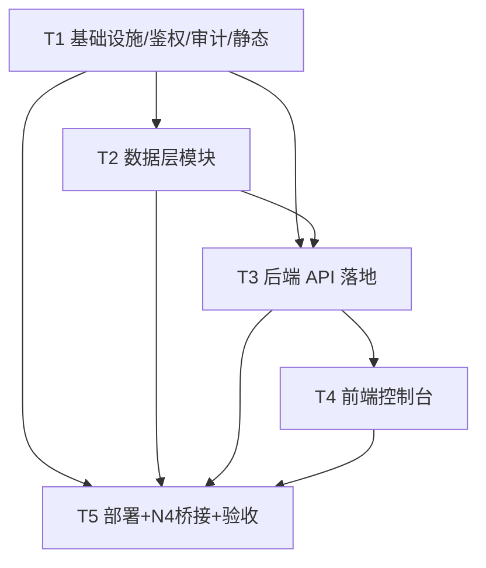

# SEA1 商业化运维控制台 · 系统架构设计 + 任务分解

> 作者：架构师 Bob（软件交付团队）
> 版本：v1.0　|　承载方：`activation-server`（同机 `:3457`）　|　语言：简体中文
> 配套图：`class-diagram.mermaid`（类/接口）、`sequence-diagram.mermaid`（时序）

---

## 一、实现方案 + 框架选型

### 1.1 总体结论
- **前端**：纯原生 `HTML/CSS/JS`，**无 CDN、无构建步骤**，复用 `config.html` 的深色玻璃拟态风格（accent `#6c8cff`、渐变标题、blur 卡片），新增**左侧边栏导航**组织 5 大模块。单页应用 `console.html` + `console.css` + `console.js`。
- **后端**：`activation-server` 的 Node 原生 `http` 扩展。新增路由全部以 `/api/admin/console/*` 或既有 `/api/admin/*` 命名，由新增的 `lib/consoleApi.js` 统一接管，server.js 仅做“接线 + 静态服务”。
- **依赖**：仅用 Node 内置（`http`/`fs`/`os`/`child_process`/`path`/`crypto`）。**不引入任何第三方包**（与现有 activation-server 一致；现有 `qrcode` 为历史依赖，本次不动）。

### 1.2 同机服务如何分工取数（关键设计）
生产机 `10.0.0.11` 上，**bot 进程**（`sea1-bot`，含 N4 权限 SQLite、CUPS 打印机、LicenseGate）与 **activation-server 进程**（`sea1-activation`）同机。两者分工：

| 数据/能力 | 真实归属 | activation-server 取数方式 | 复用/新增 |
|---|---|---|---|
| 订单、激活码、license、心跳、试用 | activation-server 自身 Store | 直接 `require('./lib/store')` | **复用** store/orders/codes/license |
| 23 项配置中心 | activation-server `configManager` | 直接调用 | **复用** configManager |
| N4 权限（L0–L3 账号） | **bot 侧** SQLite（`db.sqlite`） | **文件桥接**：读 bot 导出的快照 JSON + 写“命令信箱”JSONL，由 bot 桥接落库 | 新增 `permissionBridge`（两侧各一份） |
| 打印机（CUPS） | 同机 CUPS 服务 | `child_process` 直调 `lpstat`/`lpadmin`/`lpoptions`/`cupsenable`/`cupsdisable` | 新增 `lib/console/printers.js` |
| 设备（客户端机器） | activation-server Store（license/心跳）+ bot LicenseGate 降级 | 直接读 Store 派生；操作经 Store 写 + `child_process pm2 restart` | 新增 `lib/console/devices.js` |
| 服务端运行状态 | 本进程 + 同机 `pm2`/`df` | `os` + `child_process`（`pm2 jlist`、`df`） | 新增 `lib/console/runtime.js` |

### 1.3 N4 权限复用的落地机制（重点，已定方案）
需求要求“启用已建好的 N4 并部署到后台”，但 activation-server **不能**引入 `sqlite3`，且生产机无 `sqlite3` CLI。因此采用**bot 侧文件桥接**（决策 #2 允许的“必要时的 bot 内部接口实现”）：

1. **bot 侧** 新增 `sea1/lib/permissionBridge.js`，在 `sea.js` 权限初始化后启动：
   - 导出只读快照 `permission_snapshot.json`（含 `user_permissions`、`permission_audit`、`meta{superAdmin,developer,exportedAt}`），启动即导出 + 每 3s 重导（并 `fs.watch` 信箱即时处理）。
   - 轮询/监听 `permission_inbox.jsonl`：逐行解析 `{operator, action:'set'|'remove', target, level}`，调 `PermissionService.setLevel/removeLevel`（operator = 后台管理员 QQ），成功后移除已处理行并重导快照。
   - **bot 始终是 DB 唯一写者** → 无双进程并发写竞争（避免 SQLITE_BUSY）。
2. **server 侧** 新增 `lib/console/permissionBridge.js`（纯 `fs`）：
   - `readSnapshot()` 读快照；`verifyL2Plus(uin)`、`hasAccess(uin)` 基于快照判定；
   - `enqueueAdminCommand(cmd)` 以 `fs.appendFile` 追加一行到信箱；
   - `listAudits()` 读快照中的审计。
3. **优雅降级**：若 N4 未部署（快照不存在），`verifyL2Plus` 返回 false、列表为空 → 后台仅 `ADMIN_TOKEN` 超管可用，部署 N4 桥接后自动具备 QQ 登录能力。

> 备选（不采用）：① `node:sqlite`（需生产 node≥23 且可能加启动 flag，风险）；② `child_process` 每次请求 spawn bot 的 `perm-cli.js`（每次拉起 node，重）。推荐方案零第三方、单写者，最优。

### 1.4 远程设备操作语义（已落实为可实现的机制）
- **禁用** = 吊销该设备 license：`store.updateCode(code,{status:'revoked'})` → 客户端下次 `/api/heartbeat` 返回 `reason:'revoked'` → 本地 `LicenseGate` 进入只读降级（已有能力，无需改 bot）。
- **重置** = 清空该 QQ/机器 的试用与授权记录回到未授权态：`updateCode(revoked)` + 删除 `store.trials[machineId]`（机器试用）+ `updateTrialUser(qq, 清空)`（用户维度试用）。客户端下次心跳自然降级。
- **重启** = `child_process.exec('pm2 restart sea1-bot')`，**仅 L2+**，前端二次确认 + 审计 + 限频（同操作 60s 内不重复）。风险面见“待明确事项”。

### 1.5 鉴权模型（演进）
- **超管兜底**：`ADMIN_TOKEN`（既有）始终全权，走 `x-admin-token` 头。
- **QQ 登录**：`POST /api/admin/console/login` 支持 `{mode:'qq', qq}`，服务端经 `permissionBridge.verifyL2Plus/hasAccess` 校验：
  - 未知 QQ（不在 N4 且无兜底）→ 拒绝；
  - L2/L3 → `scope:'admin'`（可读可写）；
  - L0/L1 → `scope:'viewer'`（仅看概览/订单，不能改配置/操作设备）。
- 登录成功返回**会话令牌**（服务端内存 Map，默认 8h 过期），后续请求带 `x-console-token`。
- **授权矩阵**（见下文接口表“鉴权”列）。

---

## 二、文件列表及相对路径（全部位于 `sea1-installer/activation-server/`，bot 侧另注）

### 2.1 新增 / 修改（activation-server）

| 文件 | 职责 | 类型 |
|---|---|---|
| `public/console.html` | 统一控制台 SPA：左侧边栏（5 模块）+ 顶栏登录；结构 + 内联 bootstrap | 新增（前端） |
| `public/console.css` | 深色玻璃拟态样式（复用 config.html 变量，accent `#6c8cff`，侧边栏布局） | 新增（前端） |
| `public/console.js` | 前端逻辑：登录、fetch 封装、5 视图渲染、操作确认、toast | 新增（前端） |
| `lib/consoleApi.js` | **路由聚合 + 鉴权中间件** `verifyAuth`；分发所有新端点；静态 `/console` 委托 | 新增（后端核心） |
| `lib/console/auth.js` | 登录与会话：`loginConsole` / `verifyAuth(req,minLevel)` / 会话 Map | 新增 |
| `lib/console/audit.js` | 控制台审计：`logAction` / `listAudit`（追加 `data/console_audit.json`） | 新增 |
| `lib/console/permissionBridge.js` | **server 侧 N4 客户端**：读快照 / `verifyL2Plus` / `hasAccess` / 写命令信箱 / 读审计 | 新增 |
| `lib/console/devices.js` | 设备聚合 + 操作：`listDevices` / `disableDevice` / `resetDevice` / `restartDevice` | 新增 |
| `lib/console/printers.js` | CUPS 集成：`listPrinters` / `addPrinter` / `printerAction`（child_process） | 新增 |
| `lib/console/runtime.js` | 服务端状态：`getStatus`（cpu/mem/disk/进程/模块/统计） | 新增 |
| `lib/console/orders.js` | 订单视图 + 开通：`listOrdersRich` / `grantMember`（复用签发逻辑） | 新增 |
| `server.js` | **修改**：接线 `consoleApi`、新增 `/console` 静态路由、serve `.css`/`.js`、转发新端点 | 修改 |

### 2.2 新增 / 修改（bot 侧 `F:/ai/开发1/sea1/`，为 N4 桥接上线）

| 文件 | 职责 | 类型 |
|---|---|---|
| `lib/permissionBridge.js` | bot 侧桥接：导出快照 + 处理命令信箱（写 N4 DB） | 新增 |
| `sea.js` | **修改**：权限初始化后调用 `startPermissionBridge(...)` | 修改 |

> 配置扩展（可选，写 `activation-server/config.env`）：`N4_SNAPSHOT_PATH`（默认 `/root/sea1/data/permission_snapshot.json`）、`N4_INBOX_PATH`（默认 `/root/sea1/data/permission_inbox.jsonl`）、`CONSOLE_SESSION_TTL`（默认 28800s）。

---

## 三、数据结构与接口（类图见 `class-diagram.mermaid`；下表为新增 API 契约）

> 复用约定：所有响应统一 `{ok:bool, ...}`；错误 `{ok:false, error:string}`。鉴权列：`R0`=登录即可读，`W2`=需 L2+（超管令牌可绕过），`PUB`=公开（仅登录接口本身）。

### 3.1 鉴权矩阵

| 端点 | 方法/路径 | 鉴权 | 请求体 | 响应体（关键字段） |
|---|---|---|---|---|
| 登录 | `POST /api/admin/console/login` | PUB | `{mode:'token'\|'qq', token?, qq?}` | `{ok, scope:'super'\|'admin'\|'viewer', level, token, expiresAt}` |
| 状态 | `GET /api/admin/console/status` | R0 | — | `{ok, status:{health,uptimeSec,memory,cpu,disk,processes,modules,stats}}` |
| 订单(富) | `GET /api/admin/console/orders` | R0 | `?status=&plan=` | `{ok, orders:[{order_id,qq,machine_id,plan,planName,amount,channel,status,created_at,paid_at,issued_at,code}]}` |
| 开通会员 | `POST /api/admin/console/grant` | W2 | `{order_id}` | `{ok, order_id, code, license, status:'issued'\|'already', message}` |
| 变量(读) | `GET /api/admin/console/vars` | R0 | — | `{ok, groups:[{group,fields:[{key,label,type,value,secret,set,requiresRestart,hot,editable}]}], runtime:[{key,label,value}]}` |
| 变量(写) | `POST /api/admin/console/vars` | W2 | `{patch:{key:value}}` | `{ok, restartRequired, changed}`（复用 `configManager.writeConfig`） |
| 管理员列表 | `GET /api/admin/admins` | R0 | — | `{ok, admins:[{uin,level,levelName,role,updated_by,updated_at,remark,fallback}], meta, bridgeReady}` |
| 设管理员 | `POST /api/admin/admins` | W2 | `{qq, level:0-3, remark?}` | `{ok, enqueued:true, message}`（异步落 N4） |
| 删管理员 | `DELETE /api/admin/admins/:qq` | W2 | — | `{ok, enqueued:true}` |
| 管理员审计 | `GET /api/admin/admins/audit` | R0 | `?limit=` | `{ok, audits:[{id,operator,action,target,from_level,to_level,detail,created_at}]}` |
| 设备列表 | `GET /api/admin/devices` | R0 | — | `{ok, devices:[{machine_id,qq,code,plan,planName,status,last_heartbeat,license_expires_at}]}` |
| 设备操作 | `POST /api/admin/devices/:id/action` | W2 | `{action:'disable'\|'reset'\|'restart'}` | `{ok, action, machine_id, message}` |
| 打印机列表 | `GET /api/admin/printers` | R0 | — | `{ok, printers:[{name,enabled,accepting,status,deviceUri,isDefault}], cupsRunning}` |
| 加打印机 | `POST /api/admin/printers` | W2 | `{name, uri, model?, isDefault?}` | `{ok, name, message}` |
| 打印机操作 | `POST /api/admin/printers/:name/action` | W2 | `{action:'enable'\|'disable'\|'accept'\|'reject'\|'default'\|'delete'\|'test'}` | `{ok, action, name}` |
| 控制台审计 | `GET /api/admin/console/audit` | R0 | `?limit=` | `{ok, logs:[{ts,operator,operatorLevel,action,target,detail,ok}]}` |

### 3.2 复用现有（不重写）
- **Store**（`lib/store.js`）：`listLicenses()`、`listHeartbeats()`、`getCode/updateCode`、`getOrder/listOrders`、`saveTrial/getTrial`、`updateTrialUser`。
- **configManager**（`lib/configManager.js`）：`readConfig(cfg,store)`、`writeConfig({cfg,store,patch,envPath})`、`SCHEMA`（23 项）。
- **orders/codes/license**：`grantMember` 复用 `codes.makeCodeRecord` + `license.buildLicense(keys.privateKey,…)` + `store.createCode/saveLicense/updateCode/attachCode`，与既有 `/api/order/issue` 逻辑一致（可抽为共享函数 `issueOrderForConsole`）。
- **bot 侧 N4**：`PermissionService`（经 bridge 间接写）。

### 3.3 关键派生逻辑
- **设备状态判定**（`DeviceService.listDevices`）：以 `machine_id` 聚合 license + 心跳：
  - code 已 `revoked` → `revoked`；心跳 `valid=false`/`reason∈{revoked,expired,machine-mismatch}` → `anomaly`；有 license 但无近期心跳 → `offline`；无 license 但有机器 trial 记录 → `trial`；其余 → `normal`。
- **运行时变量**（RuntimeService）：`memory`= `os.totalmem/freemem`+`process.memoryUsage`；`cpu.busyPct`= 两次 `os.cpus()` 采样 delta；`disk`= `child_process` 调 `df -P <dataDir>` 解析；`processes`= `pm2 jlist` 解析 `sea1-activation`/`sea1-bot` 的 `status/restart_time/pm_uptime/cpu/mem`；`modules.n4Bridge`= 快照存在且 `exportedAt` 新鲜；`modules.cups`= `lpstat -r`；`stats`= 由 Store 算（今日订单/已付/已发、活跃设备数、试用用户数、webhook 日志数）。

---

## 四、程序调用流程（时序图见 `sequence-diagram.mermaid`）

- **图1 开通会员**：console 点“开通”→ `grantMember` → 查订单(paid) → 复用签发逻辑生成 code+license + `attachCode` → 审计 → 返回。
- **图2 禁用设备**：console 点“禁用”→ `disableDevice` → 查 license→code → `updateCode(revoked)` → 审计 → 客户端下次心跳降级。
- **图3 N4 设等级跨进程写**：console → `enqueueAdminCommand` 追加信箱 → bot `permissionBridge` 监听/轮询 → `PermissionService.setLevel` 写 DB → 重导快照 → 下次列表即见。

---

## 五、任务列表（有序、含依赖，建议顺序遵循“数据层→API→前端→N4 登录集成→部署”）

> 遵循架构师硬约束：首个任务为基础设施；每任务 ≥3 文件；任务间尽量少线性依赖（均依赖 T1）。

### T1　基础设施与共享内核（server 接线 + 鉴权 + 审计 + 静态服务）
- **源文件**：`server.js`(改)、`lib/consoleApi.js`(新)、`lib/console/auth.js`(新)、`lib/console/audit.js`(新)
- **依赖**：无
- **优先级**：P0
- **内容**：server.js 接线 `consoleApi`、新增 `/console` 静态路由并 serve `.css`/`.js`、转发所有新端点；`consoleApi` 提供 `verifyAuth(req,minLevel)` 中间件骨架；`auth.js` 实现登录/会话；`audit.js` 实现审计落盘。

### T2　后端数据层模块（devices / printers / permissionBridge / runtime / orders）
- **源文件**：`lib/console/devices.js`、`lib/console/printers.js`、`lib/console/permissionBridge.js`、`lib/console/runtime.js`、`lib/console/orders.js`
- **依赖**：T1
- **优先级**：P0
- **内容**：实现 5 个取数/操作模块（设备派生+操作、CUPS 打印机、N4 快照读写、运行状态采集、订单富视图+开通）。均依赖 T1 的 auth/audit 辅助，但逻辑独立、可并行编写。

### T3　后端 API 落地（全部端点，复用 configManager/orders/permissionBridge）
- **源文件**：`lib/consoleApi.js`(扩)
- **依赖**：T1, T2
- **优先级**：P0
- **内容**：在 `consoleApi` 中落地“三、接口表”全部 16 个端点；订单/开通复用 orders+license+store；变量读写复用 configManager；管理员读写走 permissionBridge；设备/打印机走 T2 模块；每个写操作经 `verifyAuth(W2)` + `audit.logAction`。

### T4　前端控制台（console.html + console.css + console.js，5 模块 + 侧边栏 + 登录）
- **源文件**：`public/console.html`、`public/console.css`、`public/console.js`
- **依赖**：T3（接口契约已定）
- **优先级**：P1
- **内容**：深色玻璃拟态 + 左侧边栏（①订单与开通 ②管理员账号 ③全量变量 ④服务端状态 ⑤设备与打印机）；登录页（令牌 / QQ 两种模式）；逐模块渲染表格/卡片/表单；操作二次确认 + toast；统一 fetch（自动带 `x-console-token`）。

### T5　部署、N4 桥接上线与端到端验收
- **源文件**：`sea1/lib/permissionBridge.js`(新)、`sea1/sea.js`(改)、生产 `config.env`(改)
- **依赖**：T1–T4
- **优先级**：P0
- **内容**：实现 bot 侧桥接并接入 `sea1.js`；生产部署（`pm2 restart sea1-activation`、`pm2 restart sea1-bot`）；安全校验（默认弱口令告警、MONITOR_TOKEN）；端到端验证 16 端点 + 设备禁用/重置/重启 + 打印机增删启停 + N4 QQ 登录与等级设置生效。

### 任务依赖图

---

## 六、依赖包列表
- **activation-server 侧**：仅 Node 内置 —— `http`、`fs`、`os`、`child_process`、`path`、`crypto`、`util`。**不新增任何 npm 依赖**。
- **bot 侧**：桥接仅用 `fs`/`path` + 既有 `sqlite3`（已依赖）、`PermissionService`（已存在）。无新增依赖。

---

## 七、共享知识（跨文件约定）

1. **鉴权中间件复用**：所有写接口统一 `const a = auth.verifyAuth(req, 2); if(!a.ok) return send(res,403,{ok:false,error:a.error});`；读接口 `verifyAuth(req,0)`。超管 `ADMIN_TOKEN`（`x-admin-token`）恒为 `scope:'super'` 绕过等级。
2. **错误响应格式**：一律 `{ok:false, error:'中文原因'}`；成功 `{ok:true, ...}`。HTTP 状态码：401 未登录 / 403 等级不足 / 400 参数错 / 404 不存在 / 500 意外。
3. **JSON 响应辅助**：复用 server.js 既有 `send(res,code,obj)`；读取体复用 `readBody(req)`；新模块通过 `ctx` 拿到 `cfg/keys/store/send/readBody`。
4. **secret 不泄露**：变量/配置读取沿用 `configManager` 的 `{secret:true, set:bool}`，绝不回显明文；写时留空=保持不变。
5. **审计**：所有写操作先 `verifyAuth` 后 `audit.logAction({operator: session.qq||'super', operatorLevel, action, target, detail, ok})`。
6. **命令注入防护**：printers/devices 的输入经白名单校验（`name` 匹配 `^[A-Za-z0-9_-]+$`、`uri` 限 `http/ipp/lpd/usb` 等安全 scheme），禁止拼接未净化 shell 参数。
7. **N4 异步终态**：管理员“设置/移除”返回 `enqueued:true` 即成功入队，真正落库由 bot 桥接在秒级内完成；前端刷新即见。
8. **会话令牌**：内存存储（重启失效需重登），默认 TTL 8h；`x-console-token` 头携带。

---

## 八、待明确事项（需用户拍板，附推荐默认值）

1. **设备「重启」web 触发**：是否允许后台一键 `pm2 restart sea1-bot`？风险=短暂中断 bot 收发/激活心跳。
   → **推荐：允许，但仅 L2+，前端二次确认 + 审计 + 60s 限频**。备选：重启仅走 SSH 手动，后台只提供“禁用/重置”。
2. **N4 桥接方案**：确认走“bot 导出快照 + 命令信箱”（推荐，零第三方、单写者），而非 node:sqlite / child_process perm-cli。
   → **推荐：文件桥接方案**。
3. **磁盘采集**：默认 Linux `df -P`；若需跨平台，改读 `/proc`。生产为 Linux，默认成立。
4. **会话持久化**：默认内存、重启失效；是否要落盘持久化令牌？→ **推荐：不持久化**（安全优先）。
5. **打印机“test”**：是否提供打印测试页（耗材）？→ **推荐：提供按钮但默认不勾选/不自动**。
6. **设备“reset”是否清客户端本地 license 文件**：跨机难主动清理；→ **推荐：仅清服务端试用/授权记录，靠心跳/吊销让客户端自然降级**（与现有 LicenseGate 一致）。
7. **控制台落点**：`/console` 独立新页，旧 `/admin` 保留兼容？→ **推荐：独立 `/console`，旧页保留**。

---

## 九、与现有能力的复用核对（确保“复用而非重写”）
- ✅ 配置中心 23 项 → `configManager` 直接复用（读/写/掩码/热更区分）。
- ✅ 旧后台发码/吊销/订单/公钥 → store/orders/codes API 复用；`console` 的开通会员复用签发逻辑。
- ✅ 订单系统 + 微信 webhook（5/12/48/128）→ orders/wechatWebhook 复用，grant 直接基于 paid 订单。
- ✅ N4 权限（54/54 测试通过，未部署）→ 经 bridge 启用到后台，不重写。
- ✅ 打印插件 CUPS → printers 模块直调同机 CUPS 命令，不重写打印逻辑。
- ✅ LicenseGate 降级 → 禁用/重置经 Store 写 + 心跳驱动，不重写 bot。
- ✅ config.html 风格 → console.css 继承其 CSS 变量与玻璃拟态，仅加侧边栏。
