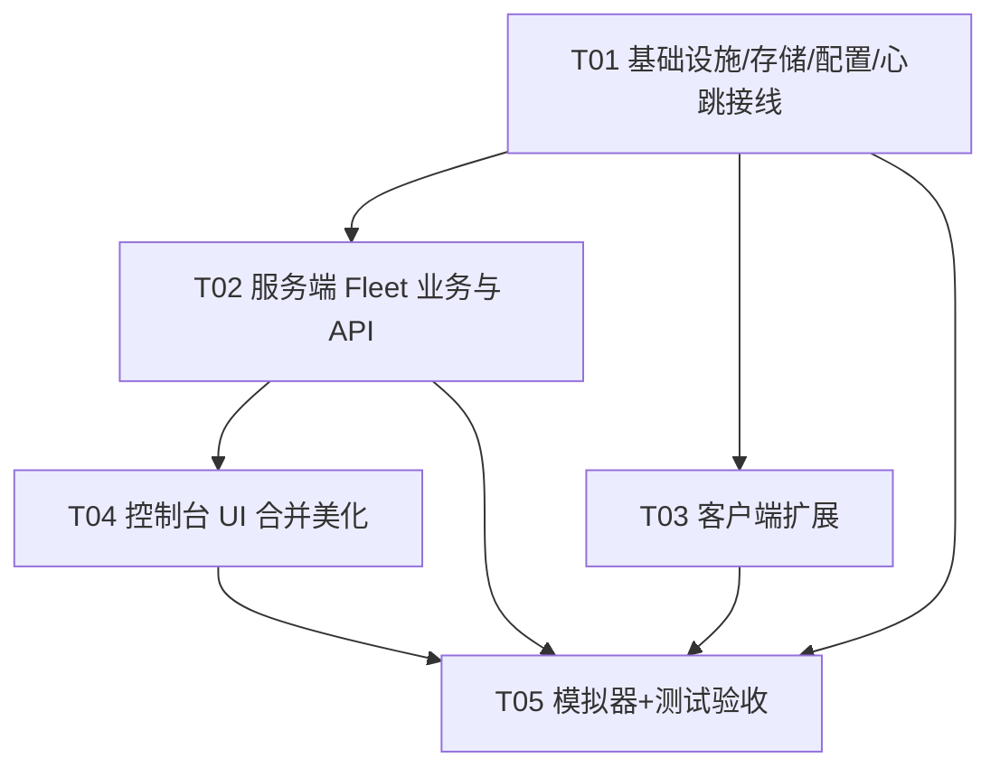

# SEA1 外网客户端集群管理（fleet）+ 控制台合并 · 系统架构设计 + 任务分解

> 作者：架构师 高见远（software-architect）　|　版本：v1.0
> 承载方：`activation-server`（同机 `:3457`）+ 外网 `sea1` 客户端（role=client）
> 语言：简体中文　|　配套图：`class-diagram-fleet.mermaid`（类/接口）、`sequence-diagram-fleet.mermaid`（时序）
> 输入：PRD_fleet_console.md + 纠偏事实（外网客户端=已存在 sea1 bot，不新建 agent；模拟种子仅测试）+ 用户 3 决策（D1 合并+302、D2 弃服务端 CUPS 增删改、D3 扩展现有客户端）

---

## 〇、设计基线（务必先读）

本设计**构建在已上线的商业化控制台基础之上**，不推翻任何既有机制：

| 既有能力 | 文件 | 本设计如何复用 |
|---|---|---|
| 控制台路由 + 鉴权分发 | `lib/consoleApi.js` `lib/console/auth.js` | 新增 fleet 端点走同一 `verifyAuth(req,cfg,minLevel)` 中间件 |
| 审计 | `lib/console/audit.js` | 所有写操作（指令下发、异常处置、黑名单）先 `audit.logAction` |
| 设备操作（禁用=吊销） | `lib/console/devices.js` | `disable()` 复用为 `disable_client`/`anomaly→revoke` 的底层吊销 |
| 配置中心（23 项） | `lib/configManager.js` | 新增「集群管理」分组字段，复用 `readConfig`/`writeConfig` |
| N4 权限（L0–L3） | `lib/console/permissionBridge.js` | fleet 端点复用 `W2` 等级校验 |
| 激活/心跳 | `server.js` `/api/activate` `/api/heartbeat` | **增量扩展**心跳协议，不重写 |
| 存储 | `lib/store.js`（`store.json` 全量同步写） | **不**在 store.json 写心跳；改用独立 `fleetStore`（A5） |
| 客户端授权门禁 | `sea1/licensing/index.js` `LicenseGate` | 扩展 `startHeartbeat` 富化 + 命令回执，降级机制不变 |
| 激活地址解析 | `sea1/lib/activation-url.js` | A6 已天然满足（scheme 无关 + env/config 覆盖），客户端零改 |

> ⚠️ 纠偏事实核心：外网客户端 = 已分发部署的 `sea1` bot（arm64/win64/x86，arm/win 已写好待真机测；主服务器 X86 端 napcat 未部署→N8 阻塞真机验证）。因此 A1/A4 的"客户端"代码全部落在 `sea1/licensing`，**扩展现有心跳而非新建 agent**；500 台模拟种子仅用于无真机时验证服务端（见 T05 模拟器）。

---

## 一、实现方案 + 框架选型

### 1.1 总体结论（与现有栈一致，零新增依赖）

- **前端**：延续 `config.html` 深色玻璃拟态风格，纯原生 `HTML/CSS/JS`，无 CDN、无构建步骤。在已上线的 `console.html` 骨架**新增** `集群 / 打印机 / 异常 / 许可证` 四个 Tab（D1/D2/B4），侧栏统一为 9 个 Tab。
- **后端**：`activation-server` 的 Node 原生 `http` 扩展。fleet 端点统一由 `lib/consoleApi.js` 接管（新增 `/api/admin/fleet/*` 前缀），`server.js` 仅做接线 + 心跳扩展 + 静态 302。
- **依赖**：**仅用 Node 内置**（`http`/`fs`/`os`/`child_process`/`path`/`crypto`/`util`）。**不引入任何第三方包**（与现有 activation-server 一致）。
- **客户端**：`sea1` 为 Node 进程（SEA1_ROLE=client）。扩展 `sea1/licensing`，新增 `command-handler.js` / `printer-provider.js` / `sysinfo.js`，**仅用 Node 内置**。

### 1.2 规模化存储选型（A5，关键决策）

**问题**：现有 `store.json` 在每次 `recordHeartbeat` 时全量 `JSON.stringify` + 同步写盘（500 台×60s≈8.3 req/s → 每秒 8 次全文件重写，心跳历史 50 条/机 × 500 = 2.5 万条 + 打印机，单文件可达数 MB，写阻塞主流程，p99 必超 100ms）。

**决策：独立 Fleet 存储 `lib/fleetStore.js`，JSON + 内存索引 + 节流批量落盘**（不引入 SQLite）。理由：
1. **零依赖、零迁移风险**：与现有 `store.js` 哲学一致（"接口抽象清晰，生产可平滑替换为 SQLite"），部署机无需装原生模块。
2. **读写分离满足性能**：心跳写 = 纯内存 `Map` 更新（O(1)）+ 历史数组 `unshift`+`slice(50)`，**不碰磁盘**；磁盘由 debounce 定时器（默认 2s）批量落盘到 `data/fleet.json`（原子 tmp+rename）。p99 < 5ms，远低于 100ms。
3. **列表/聚合/详情/异常扫描全在内存**：`clients` 为 `Map<machineId, ClientRecord>`，聚合（online/offline/abnormal/total）O(N) 遍历 500 条 < 1ms；异常扫描 < 2s（异步定时，结果缓存）。
4. **黑名单/指令/异常低频写即时落盘**：这几类数据量小、写频率低，随同一 debounce 落盘，必要时强制 flush（如 admin 拉黑后立即 flush 保证即时生效）。

> 备选 SQLite：若未来 > 5k 机器或需复杂联表查询再迁移；当前 500 规模 JSON 方案绰绰有余。接口封装在 `fleetStore` 内，迁移不影响上层。

**`data/fleet.json` 结构**（每机聚合，非全量心跳日志）：
```json
{
  "clients": {
    "<machine_id>": {
      "snapshot": { "machineId":"", "code":"", "qq":"", "version":"", "publicIp":"", "region":"",
                     "cpuUsage":0, "memUsage":0, "bootTime":0, "clientTs":0,
                     "lastHeartbeatAt":0, "online":true, "status":"online", "license":{...} },
      "history": [ { "at":0, "code":"", "valid":true, "reason":"ok", "nonce":"" } ],
      "printers": [ { "printerId":"", "name":"", "status":"online", "paperLevel":0, "inkLevel":0, "lastPrintAt":0, "online":true } ],
      "commands": [ { "id":"", "action":"", "payload":{}, "status":"pending", "issuedAt":0, "sentAt":0, "ackedAt":0, "timeoutAt":0 } ],
      "anomalies": [ "code_shared:mid", "expired_online:mid" ]
    }
  },
  "blacklist": { "<machine_id>": { "reason":"", "at":0, "by":"" } },
  "ignored": { "code_shared:mid": true }
}
```

### 1.3 通信地址参数化（A6）

传输层天然满足（`activation-url.js` scheme 无关 + `SEA1_ACTIVATION_URL`>config>兜底）。本设计仅在 `configManager` 新增 `externalEndpoint`/`internalEndpoint` 两字段：服务端**仅用于展示**（部署物料页给客户端抄写公钥+穿透地址）；客户端切换地址纯配置（改 `SEA1_ACTIVATION_URL` 或 `config.json.license.activationServer`，**不碰代码**）。`externalEndpoint` 为空时前端提示"尚未配置穿透"，缺省回退 `internalEndpoint`。

### 1.4 远程指令通道（A4，pull 模式）

服务端不主动连客户端（外网客户端不可直达）。指令存于 fleetStore 的**按机指令队列**，状态机 `pending→sent→acked | timeout`：
- 服务端下发指令入队（`status:'pending'`）；
- 客户端**下次心跳**的响应里携带 `commands[]`（服务端将其标 `sent`）；
- 客户端执行后，在**再下一次心跳**带 `ack_id` 回执（服务端标 `acked`）；
- 若 `2×心跳间隔` 内未收到 ack → 定时扫描标 `timeout`。

> 关键区分：`restart_client` 是**客户端收到指令后在自己机器上 `pm2 restart sea1-bot`**（pull 自执行），与现有 `devices.restart`（服务端本机 `pm2 restart sea1-bot`，同机 bot）**不是一回事**——后者是后端机，前者是外网客户端机。

### 1.5 异常授权检测（A3，异步定时 + 缓存）

5 类规则（阈值存 `configManager`「集群管理」分组，运行时热读）：
| 规则 | 触发条件 | 严重级 | 默认阈值 |
|---|---|---|---|
| `code_shared` | 同一 `code` 在 ≥N 台不同 `machine_id` 出现有效近期心跳 | 高 | N=2 |
| `expired_online` | license 已过期（超宽限期）但仍有有效近期心跳 | 高 | 宽限沿用 graceDays |
| `machine_mismatch` | 心跳 `reason==='machine-mismatch'`（机器码被篡改/换机） | 高 | — |
| `long_offline` | 最后心跳距 now > T 秒 | 低 | T=7 天 |
| `freq_anomaly` | 心跳间隔持续偏离区间（过快/过慢） | 中 | <0.5× / >2× interval，持续 3 次 |

- 异步定时扫描（默认 60s），结果缓存到 `fleetStore.anomalies`（按 `rule:mid` 去重）；扫描 < 2s。
- 处置：`revoke`（复用 `devices.disable`→吊销 license，客户端下次心跳降级）、`blacklist`（新增 machine_id 黑名单→下次心跳 `reason:'blacklisted'` 降级）、`ignore`（持久化 ignored 集合，不再浮现）。三者均 `audit` 留痕；`revoke`/`blacklist` 即时生效。

---

## 二、文件列表及相对路径

> 根目录：`sea1-installer/activation-server/`（服务端）；`sea1/`（客户端，另注）。仅列本期新增/修改。

### 2.1 服务端（activation-server）

| 文件 | 职责 | 类型 |
|---|---|---|
| `lib/fleetStore.js` | **Fleet 存储**：内存索引 `Map<mid,ClientRecord>` + 节流批量落盘 `data/fleet.json` + 指令队列 + 黑名单 + 异常缓存 | 新增 |
| `lib/fleetConfig.js` | Fleet 阈值运行时读写（`data/fleet-config.json`，热更，供扫描/超时实时取） | 新增 |
| `lib/fleet.js` | Fleet 业务：客户端列表(筛选/搜索/聚合)、详情、跨客户端打印机聚合、指令下发/历史/超时扫描 | 新增 |
| `lib/anomaly.js` | 异常扫描引擎：5 规则实现 + 结果归并去重 | 新增 |
| `lib/configManager.js` | **修改**：SCHEMA 新增「集群管理」分组（externalEndpoint/internalEndpoint/心跳间隔/离线天数/code_shared 阈值/扫描周期/频率区间/flush 间隔），fleet 字段落到 `fleet-config.json` | 修改 |
| `lib/consoleApi.js` | **修改**：新增 `/api/admin/fleet/*` 全部端点（复用 verifyAuth + audit） | 修改 |
| `server.js` | **修改**：`/api/heartbeat` 扩展（记录富化字段 + 响应 `commands[]` + 处理 `ack_id` + reason 优先级含 `blacklisted`）；`/admin`、`/admin/config` 302 重定向到 `/console`；`start()` 启动 fleet flush / 异常扫描 / 指令超时 三定时器；转发 `/api/admin/fleet` 到 consoleApi | 修改 |
| `public/console.html` | **修改**：侧栏扩为 9 Tab，新增 集群/打印机/异常/许可证 视图骨架 + 危险操作确认弹窗 | 修改（前端） |
| `public/console.css` | **修改**：继承 config.html 变量，统一卡片/表格/标签/弹窗/toast，新增 fleet 表格与状态点样式 | 修改（前端） |
| `public/console.js` | **修改**：新增 fleet 取数/渲染（clients/printers/anomalies/license 部署物料），命令下发面板，重定向 hash 路由 | 修改（前端） |

### 2.2 客户端（sea1，扩展现有 sea1 bot）

| 文件 | 职责 | 类型 |
|---|---|---|
| `sea1/licensing/lib/heartbeat.js` | **修改**：心跳体富化（version/public_ip/region/cpu/mem/boot_time/client_ts + printers[]）；解析响应 `commands[]` 交 command-handler；下次心跳带 `ack_id` | 修改 |
| `sea1/licensing/lib/command-handler.js` | **新增**：6 类指令本地执行（restart_client/disable_client/disable_printer/enable_printer/push_notice/push_config） | 新增 |
| `sea1/licensing/lib/printer-provider.js` | **新增**：枚举本机打印机状态（集成 `PrintPlugin` 已知打印机 + `lpstat` 本地 CUPS；Windows 降级读 PrintPlugin） | 新增 |
| `sea1/licensing/lib/sysinfo.js` | **新增**：采集 cpu/mem/boot_time/version（跨平台，`os` + 读 `package.json` version） | 新增 |
| `sea1/licensing/index.js` | **修改**：`startHeartbeat` 间隔可配（默认 60s），驱动富化 + 命令循环 + 打印机枚举 | 修改 |

### 2.3 模拟器 / 测试

| 文件 | 职责 | 类型 |
|---|---|---|
| `tools/fleet-simulator.js` | **新增**：seed N 台 mock 客户端周期心跳（含正常 + 异常样本），模拟 ack 指令；无真机时验证服务端/UI | 新增 |
| `test/fleet.test.js` | **新增**：fleet API 聚合/筛选、异常 5 规则、指令状态机、黑名单生效 | 新增 |
| `test/heartbeat-ext.test.js` | **新增**：心跳扩展向后兼容（旧字段缺省不报错）+ 响应 commands + ack 回执 | 新增 |

---

## 三、数据结构与接口（类图见 `class-diagram-fleet.mermaid`）

### 3.1 心跳协议扩展契约（A1，向后兼容）

**请求 `POST /api/heartbeat`**（新字段全部可选，旧客户端不报不报即忽略）：
```json
{
  "machine_id": "abc123",          // 必填（既有）
  "code": "SEA1-XXXX",             // 必填（既有）
  "nonce": "hex",                  // 既有
  "ack_id": "cmd-1700000100-aaa",  // 新增：回执已执行的指令 id（可选）
  "online": true,                  // 新增
  "version": "2.3.1",              // 新增：客户端版本
  "public_ip": "1.2.3.4",          // 新增：公网 IP（缺省时服务端用 socket IP）
  "region": "华东",                // 新增：地区（客户端自报）
  "cpu_usage": 0.12,               // 新增：0~1
  "mem_usage": 0.40,               // 新增：0~1
  "boot_time": 1700000000,         // 新增：unix 秒
  "client_ts": 1700000100,         // 新增：客户端时间戳
  "printers": [                    // 新增：本机打印机列表
    { "printer_id":"p1", "name":"Printer-A", "status":"online",
      "paper_level":80, "ink_level":60, "last_print_at":1700000000 }
  ]
}
```

**响应**（兼容既有 `{ok,valid,reason,server_time}`，新增 `commands`）：
```json
{
  "ok": true,
  "valid": true,
  "reason": "ok",                  // 或 revoked | expired | machine-mismatch | blacklisted
  "server_time": 1700000200,
  "license": { "...": "..." },     // valid 时返回（既有）
  "commands": [                    // 新增：待本机执行的指令（pull）
    { "id":"cmd-1700000100-aaa", "action":"disable_printer",
      "payload":{ "printer_id":"p1" }, "issued_at":1700000100 }
  ]
}
```
> **reason 优先级**（服务端）：`blacklisted` > `revoked` > `expired` > `machine-mismatch` > `ok`。
> 旧客户端忽略 `commands`，不报错；不报 `ack_id`/`printers` 时服务端按缺省处理（旧字段缺失不写快照对应项）。

### 3.2 Fleet API 契约（A2，复用 R0/W2 鉴权模型）

> 鉴权列：`R0`=登录即可读，`W2`=需 L2+（超管令牌可绕过），`PUB`=公开。
> 统一响应 `{ok:true,...}`；错误 `{ok:false,error}`；HTTP 401/403/400/404/500。

| 端点 | 方法/路径 | 鉴权 | 说明 / 关键响应字段 |
|---|---|---|---|
| 客户端列表 | `GET /api/admin/fleet/clients` | R0 | `?page&pageSize&status=online\|offline\|abnormal&version=&region=&q=`（搜 machine_id/qq/code）。返回 `{items:[ClientView], total, page, pageSize, agg:{online,offline,abnormal,total}}` |
| 客户端详情 | `GET /api/admin/fleet/clients/:machine_id` | R0 | `{snapshot, history:[...], printers:[...], license, anomalies:[...]}` |
| 打印机聚合 | `GET /api/admin/fleet/printers` | R0 | `?status=&client=&q=`；返回 `{items:[{printerId,name,clientMachineId,clientVersion,status,paperLevel,inkLevel,lastPrintAt,online}]}` |
| 异常列表 | `GET /api/admin/fleet/anomalies` | R0 | `?rule=&severity=&status=&q=`；返回 `{items:[Anomaly], rules:[...]}` |
| 异常处置-吊销 | `POST /api/admin/fleet/anomalies/:id/revoke` | W2 | 调 `devices.disable` 吊销 license；audit |
| 异常处置-拉黑 | `POST /api/admin/fleet/anomalies/:id/blacklist` | W2 | `fleetStore.addBlacklist(mid)`；audit；即时生效 |
| 异常处置-忽略 | `POST /api/admin/fleet/anomalies/:id/ignore` | W2 | `fleetStore.ignoreAnomaly(id)`；持久化 |
| 下发指令 | `POST /api/admin/fleet/clients/:machine_id/command` | W2 | body `{action, payload}`；返回 `{ok, commandId, action, status:'pending'}`；危险指令(disable_client/restart_client)额外 audit |
| 指令历史 | `GET /api/admin/fleet/clients/:machine_id/commands` | R0 | `{items:[Command]}`（含状态 pending/sent/acked/timeout） |

**指令表（A4）**：

| action | payload | 执行端 | 危险? | 说明 |
|---|---|---|---|---|
| `restart_client` | — | 客户端 | ✅ | 客户端本地 `pm2 restart sea1-bot` |
| `disable_client` | — | 服务端+客户端 | ✅ | 服务端 `devices.disable`（吊销 license）+ 下发指令（客户端可主动停服） |
| `disable_printer` | `{printer_id}` | 客户端 | ✅(物理) | 客户端经 printer-provider 禁用该打印机 |
| `enable_printer` | `{printer_id}` | 客户端 | — | 客户端启用该打印机 |
| `push_notice` | `{title,body}` | 客户端 | — | 客户端弹通知/写日志 |
| `push_config` | `{patch}` | 客户端 | — | 客户端写 `config.json`（如切换激活地址） |

### 3.3 关键派生逻辑

- **客户端 status 判定**（`fleet.js`）：`blacklisted`→'blacklisted'；（有 open 异常）→'abnormal'；近期心跳(≤2×interval)且 valid→'online'；有 license 但无近期心跳 / 超过 offline 阈值→'offline'；其余→'normal'。
- **聚合 `agg`**：遍历 `fleetStore.clients` 按 status 计数，O(N)。
- **打印机聚合**：遍历各 client 的 `printers[]`，打上 `clientMachineId`/`clientVersion`，支持按 status/client/q 过滤。
- **指令超时**：`fleet.js.timeoutScan(now)` 将 `status∈{pending,sent} && now>timeoutAt` 标 `timeout`。
- **配置中心 fleet 字段**：`configManager.SCHEMA` 新增「集群管理」分组（见 3.4）；值落 `data/fleet-config.json`，运行时热读。

### 3.4 configManager 新增字段（A6 + 阈值）

在 `SCHEMA` 末尾新增分组 `集群管理(fleet)`（23 → 约 30 项）：

| key | env | 标签 | 类型 | 默认 | 热更 |
|---|---|---|---|---|---|
| `externalEndpoint` | `EXTERNAL_ENDPOINT` | 外网/穿透基址 | text | `''` | 热 |
| `internalEndpoint` | `INTERNAL_ENDPOINT` | 内网基址 | text | `http://10.0.0.11:3457` | 热 |
| `fleetHeartbeatInterval` | `FLEET_HB_INTERVAL` | 心跳间隔(秒) | number | `60` | 热 |
| `fleetOfflineDays` | `FLEET_OFFLINE_DAYS` | 离线阈值(天) | number | `7` | 热 |
| `fleetCodeSharedMin` | `FLEET_CODE_SHARED_MIN` | 同码多机阈值 | number | `2` | 热 |
| `fleetScanInterval` | `FLEET_SCAN_INTERVAL` | 异常扫描周期(秒) | number | `60` | 热 |
| `fleetFreqMinMul` | `FLEET_FREQ_MIN_MUL` | 频率下限系数 | number | `0.5` | 热 |
| `fleetFreqMaxMul` | `FLEET_FREQ_MAX_MUL` | 频率上限系数 | number | `2` | 热 |
| `fleetFlushMs` | `FLEET_FLUSH_MS` | 落盘节流(ms) | number | `2000` | 热 |

> 这些字段**不写 `config.env`**（避免重启才生效），改由 `lib/fleetConfig.js` 读写 `data/fleet-config.json`，`configManager.readConfig` 对该分组委托 fleetConfig 读取，`writeConfig` 委托其写入；服务端 fleet 逻辑经 `fleetConfig.load()` 实时取值（缓存 + 每次扫描重读）。

---

## 四、程序调用流程（时序图见 `sequence-diagram-fleet.mermaid`）

- **图1 扩展心跳 + 指令 pull + ack**：客户端心跳 → server 记录富化字段 + 返回 `commands[]`（标 sent）+ 处理 `ack_id`（标 acked）；黑名单机返回 `reason:'blacklisted'`。
- **图2 管理员下发指令 → 客户端 ack**：console 点「禁用打印机」→ `fleet.addCommand` → 客户端下次心跳取走（sent）→ 执行 → 再下次心跳带 `ack_id` → `acked`；超时未 ack → `timeout`。
- **图3 异常扫描 → 处置**：定时 `anomaly.scan` → 缓存 anomalies → 管理员点「吊销」→ `devices.disable`（revoke）/「拉黑」→ `fleetStore.addBlacklist`；audit 留痕；客户端下次心跳降级。
- **图4 模拟器验证**：`tools/fleet-simulator.js` seed N 台 → 周期心跳（含异常样本）→ UI/API 验证；ack 指令模拟。

---

## 五、任务列表（有序、含依赖，遵循硬约束：≤5 任务、每任务≥3 文件、首任务=基础设施、尽量少线性依赖）

### T01　基础设施：Fleet 存储 + 配置扩展 + 心跳协议扩展 + 服务端接线　【P0】
- **源文件**：`lib/fleetStore.js`(新)、`lib/fleetConfig.js`(新)、`lib/configManager.js`(改)、`server.js`(改)
- **依赖**：无
- **内容**：
  - `fleetStore`：内存 `Map<mid,ClientRecord>` + `recordHeartbeat`（富化字段写入 snapshot/history/printers）+ 指令队列(addCommand/getPendingCommands/markAcked/timeoutScan) + 黑名单(addBlacklist/isBlacklisted) + 异常缓存 + **debounce 节流落盘** `data/fleet.json`（原子 tmp+rename；admin 拉黑强制 flush）。
  - `fleetConfig`：读写 `data/fleet-config.json`（9 个 fleet 阈值，热更）。
  - `configManager`：SCHEMA 新增「集群管理」分组，fleet 字段委托 fleetConfig 读写。
  - `server.js`：`/api/heartbeat` 扩展（记录富化字段、响应 `commands[]`、处理 `ack_id`、reason 优先级含 `blacklisted`）；`/admin` 与 `/admin/config` **302 重定向**到 `/console`（D1）；`start()` 启动 fleet flush / 异常扫描 / 指令超时 三定时器；转发 `/api/admin/fleet` 到 consoleApi。

### T02　服务端 Fleet 业务与 API（clients/printers/anomalies/commands 端点）　【P0】
- **源文件**：`lib/fleet.js`(新)、`lib/anomaly.js`(新)、`lib/consoleApi.js`(改)
- **依赖**：T01
- **内容**：
  - `fleet.js`：客户端列表(筛选 status/version/region + 搜索 machine_id/qq/code + 聚合 agg)、详情(snapshot+history+printers+license+recent anomalies)、跨客户端打印机聚合、指令下发/历史/超时扫描、status 派生。
  - `anomaly.js`：5 规则扫描引擎（code_shared/expired_online/machine_mismatch/long_offline/freq_anomaly），去重缓存到 `fleetStore.anomalies`。
  - `consoleApi.js`：落地全部 `/api/admin/fleet/*` 端点（clients 列表/详情、printers、anomalies 列表+revoke/blacklist/ignore、command 下发+历史）；读 `R0`、写 `W2` + `audit.logAction`；危险指令额外 audit。

### T03　客户端扩展：心跳富化 + 指令处理 + 打印机枚举　【P0，真机验证受 N8 阻塞】
- **源文件**：`sea1/licensing/lib/heartbeat.js`(改)、`sea1/licensing/lib/command-handler.js`(新)、`sea1/licensing/lib/printer-provider.js`(新)、`sea1/licensing/lib/sysinfo.js`(新)、`sea1/licensing/index.js`(改)
- **依赖**：T01（协议契约）
- **内容**：
  - `heartbeat.js`：富化 payload（version/public_ip/region/cpu/mem/boot_time/client_ts + `printers[]` 来自 printer-provider）；解析响应 `commands[]` 交 command-handler；下次心跳带已执行指令的 `ack_id`。
  - `command-handler.js`：6 类指令本地执行（restart_client=本地 `pm2 restart sea1-bot`；disable_client=本地降级/清 license；disable_printer/enable_printer 经 printer-provider/CUPS；push_notice 写日志；push_config 写 `config.json`）。
  - `printer-provider.js`：枚举本机打印机状态（集成 `PrintPlugin` 已知打印机 + `lpstat` 本地 CUPS；Windows 降级读 PrintPlugin）。
  - `sysinfo.js`：采集 cpu/mem/boot_time/version（跨平台）。
  - `index.js`：`startHeartbeat` 间隔可配（默认 60s），驱动富化 + 命令循环 + 打印机枚举。

### T04　控制台 UI 合并与美化（B1–B4）　【P0】
- **源文件**：`public/console.html`(改)、`public/console.css`(改)、`public/console.js`(改)
- **依赖**：T02
- **内容**：侧栏改为 `概览|集群|打印机|异常|许可证|订单·会员|管理员|配置|系统状态`（D1）；新增 **集群**（总览卡+表格+详情抽屉+远程指令面板）、**打印机**（跨客户端聚合+行内禁用/启用）、**异常**（告警列表+吊销/拉黑/忽略）、**许可证**（发放/吊销/已激活/部署物料显示 externalEndpoint+publicKey）四个 Tab；套用 config.html 风格（统一变量/卡片/表格/弹窗/toast）；危险操作确认弹窗 + L2 限制 + toast；`/admin`、`/admin/config` 已由 T01 做 302（D1 平滑过渡）。**D2 落地**：UI 不再有服务端打印机配置，打印机统一为客户端聚合 + 远程禁用/启用。

### T05　Fleet 模拟器 + 端到端测试验收　【P1】
- **源文件**：`tools/fleet-simulator.js`(新)、`test/fleet.test.js`(新)、`test/heartbeat-ext.test.js`(新)
- **依赖**：T01、T02、T03、T04
- **内容**：`fleet-simulator` seed N 台 mock 客户端周期心跳（含正常 + 异常样本：同码多机、过期在线、机器码篡改、长期离线、频率异常），模拟 ack 指令；测试覆盖心跳扩展向后兼容、fleet API 聚合/筛选/搜索、异常 5 规则触发与处置、指令状态机(pending→sent→acked/timeout)、黑名单即时生效、模拟器→UI 验收。

### 任务依赖图


---

## 六、依赖包列表

- **activation-server 侧**：仅 Node 内置 —— `http`、`fs`、`os`、`child_process`、`path`、`crypto`、`util`。**不新增任何 npm 依赖**。
- **客户端 sea1 侧**：仅 Node 内置（同上）；复用既有 `PrintPlugin`、`activation-url.js`、`machineId.js`。**不新增依赖**。
- **模拟器/测试**：Node 内置 + 既有 `node:test`（或沿用项目现有 test runner）。**不新增依赖**。

> 与现有 activation-server 一致：零第三方包，可移植、无原生编译风险。

---

## 七、共享知识（跨文件约定）

1. **鉴权复用**：所有 fleet 写接口 `const a = auth.verifyAuth(req, cfg, 2); if(!a.ok) return send(res, a.status||403, {ok:false,error:a.error});`；读 `verifyAuth(req,cfg,0)`。超管 `ADMIN_TOKEN`（`x-admin-token`）恒 `scope:'super'` 绕过。
2. **响应信封**：成功 `{ok:true, ...}`；失败 `{ok:false, error:'中文原因'}`。HTTP 401 未登录 / 403 等级不足 / 400 参数错 / 404 不存在 / 500 意外。复用 `consoleApi.send` / `readBody`。
3. **心跳 reason 优先级**：`blacklisted` > `revoked` > `expired` > `machine-mismatch` > `ok`（服务端统一一处实现，避免散落）。
4. **指令 id 格式**：`cmd-${issuedAt}-${randomHex}`；**异常 id 格式**：`${rule}:${machineId}`（去重键）。
5. **审计**：所有写（指令下发、revoke、blacklist、ignore）先 `verifyAuth` 后 `audit.logAction({operator, operatorLevel, action, target, detail, ok})`；危险指令(disable_client/restart_client/disable_printer)额外标注 `dangerous:true`。
6. **落盘安全**：fleetStore 落盘一律原子写（tmp+rename）；黑名单/指令即时 flush 保证生效；心跳高频写走 debounce（默认 2s），绝不每次心跳同步写整文件。
7. **public_ip/region 规则**：客户端自报优先；`public_ip` 缺省时服务端用 `req.socket.remoteAddress` 兜底；`region` 缺省空串。
8. **command 超时**：`timeoutAt = issuedAt + 2 × fleetHeartbeatInterval`；`fleet.js.timeoutScan` 定时标 `timeout`。
9. **阈值热读**：fleet 逻辑经 `fleetConfig.load()` 实时取阈值（缓存 + 每次扫描重读），不依赖 `cfg` 启动快照，避免重启。
10. **D2 合规**：部署物料/打印机视图**只读客户端上报**；服务端 CUPS 增删改（`lib/console/printers.js` 的 add/remove/enable/disable/setDefault/delete）**不再出现在新 UI**；该模块保留供本地调试，但合并页不链接。

---

## 八、待明确事项（采用合理默认并说明）

1. **打印机状态字段**：采用 `{printer_id, name, status(online|offline|paper_out|jam|error), paper_level?, ink_level?, last_print_at?, online}`。纸量/墨量客户端未必全有 → 缺失显示「—」。✅ 默认。
2. **心跳频率默认值**：60s（`fleetHeartbeatInterval`，可配）。✅ 默认。
3. **异常扫描周期**：60s（`fleetScanInterval`）。✅ 默认。
4. **离线阈值**：7 天（`fleetOfflineDays`）。✅ 默认。
5. **code_shared 阈值 N**：2（≥2 台同码有效心跳）。✅ 默认。
6. **freq_anomaly 区间**：< 0.5×interval 或 > 2×interval，且**持续 3 次**心跳才判定（防抖动）。✅ 默认。
7. **黑名单生效范围**：仅使该机后续心跳 `reason:'blacklisted'` 并降级；**不删除** license 记录（吊销请用 revoke）。拉黑即时生效（强制 flush）。✅ 默认。
8. **客户端 public_ip/region 来源**：服务端优先 socket IP；region 客户端自报（可空）。✅ 默认。
9. **客户端 version**：读 `sea1/package.json` 的 `version` 字段。✅ 默认。
10. **打印机枚举跨平台**：客户端机为 arm64/win64/x86。优先 `lpstat`（CUPS 包装随 seaqq 包分发）；Windows 无 `lpstat` 时降级读 `PrintPlugin` 已知打印机状态。**真机验证受 N8（主服务器 X86 napcat 未部署 + 等真机测试）阻塞**，但代码可完整实现，由 T05 模拟器覆盖逻辑。
11. **心跳历史保留**：每机 50 条（沿用现有 `recordHeartbeat` 上限）。指令历史每机 50 条。✅ 默认。
12. **模拟器是否进生产包**：否，仅 `tools/` 与 `test/`，不随 pm2 启动。✅ 默认。
13. **D1 重定向方式**：`/admin`、`/admin/config` 返回 **302** 到 `/console`（前端据原路径 hash 到对应 Tab：admin→许可证 Tab，config→配置 Tab）。旧页文件保留但不再直接访问。✅ 默认。
14. **现有 `/api/admin/printers` 服务端 CUPS 端点**：保留（向后兼容/本地调试），但新合并 UI 不调用其增删改（D2）。✅ 默认。
15. **fleet 阈值是否需重启**：否，落 `data/fleet-config.json` 热更，服务端实时读取。✅ 默认。

---

## 九、与现有能力的复用核对（确保"复用而非重写"）

- ✅ 控制台路由/鉴权/审计：`consoleApi`/`auth`/`audit` 直接复用，fleet 端点同管道。
- ✅ 设备禁用=吊销：`devices.disable` 复用为 `disable_client` 与 `anomaly→revoke` 底层。
- ✅ 配置中心 23 项：`configManager` 仅**追加**「集群管理」分组，读/写/掩码机制不变。
- ✅ N4 权限（L0–L3）：fleet 端点 `W2` 校验复用 `verifyAuth`。
- ✅ 激活/心跳校验：在 `server.js` `/api/heartbeat` **增量扩展**，license 绑定/吊销/机器码校验逻辑不变。
- ✅ 客户端 LicenseGate 降级：扩展 `startHeartbeat` 富化 + 命令回执，降级机制不变。
- ✅ 激活地址解析：`activation-url.js` 天然满足 A6，客户端零改。
- ✅ config.html 风格：console.css 继承其 CSS 变量与玻璃拟态，仅加 fleet 表格/状态点。
- ✅ 旧 `console.html` 5 模块（订单/管理员/变量/状态/设备打印机）：合并为新 9 Tab 中的对应项，逻辑复用。
