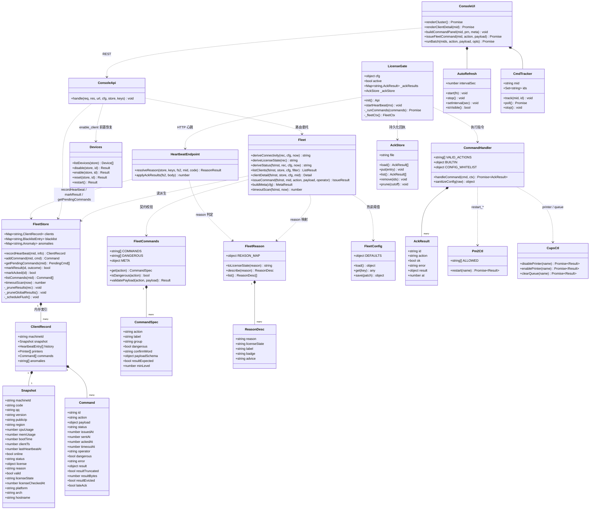
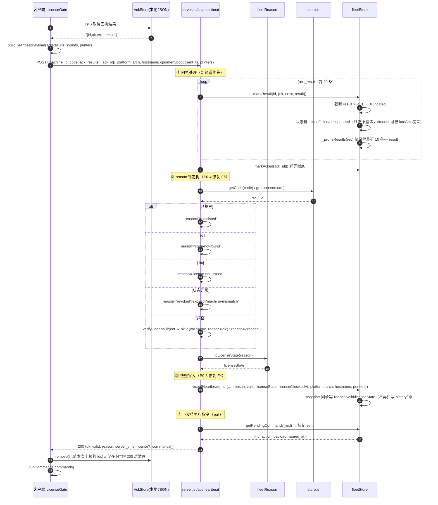
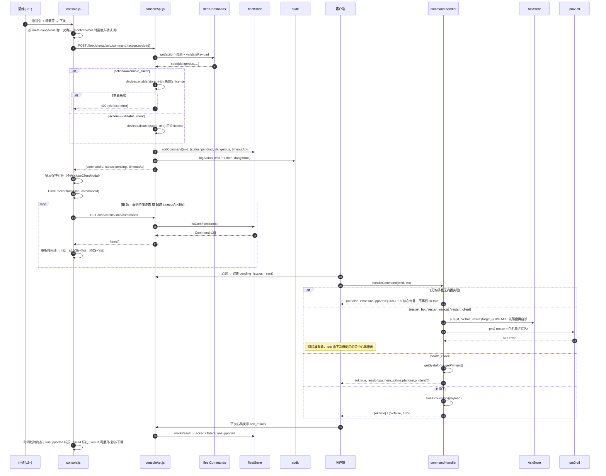
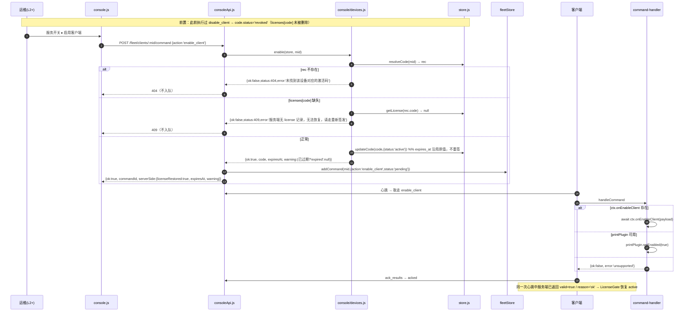
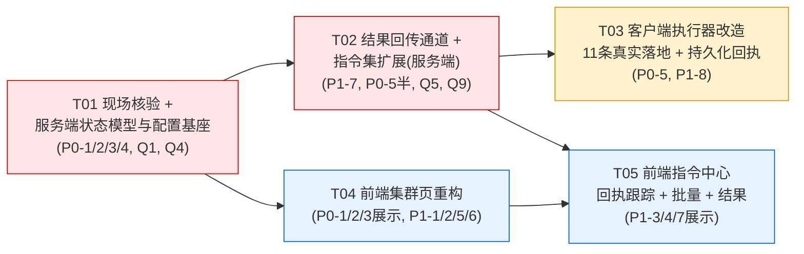

# SEA1 运维控制台（/console）增量系统设计 v1.0

> 架构师：高见远（Gao）｜语言：简体中文｜基线：现网代码实读（activation-server + sea1 客户端 + install.sh）
> 对应 PRD：`docs/PRD_fleet_ops_v1.0.md` v1.0（F1–F7 / P0×5 / P1×8 / 11 条指令）
> 读码范围：`server.js` / `lib/{fleet,fleetStore,fleetConfig,consoleApi,configManager,anomaly,license,store}.js` / `lib/console/devices.js` / `public/console.{html,js,css}` / `sea1-installer/sea1/licensing/**` / `sea1/licensing/**` / `install.sh` / `ecosystem*.cjs`

---

## 0. 读码结论先行：4 个必须先看的判定

### 0.1 【Q1 · 重大】客户端形态 —— 结论与 PRD 假设**不同**，且存在一个未纳管的第三方实现

实读证据链：

| # | 证据 | 位置 |
|---|---|---|
| E1 | 仓库里存在**两份** `sea1/licensing`：`F:/ai/开发1/sea1/licensing/`（Jul 27–28，仅 `machineId.js`/`verify.js`/**简版** `heartbeat.js`，**无 command-handler.js**、无 sysinfo、无 printer-provider、心跳不解析 `commands`）与 `F:/ai/开发1/sea1-installer/sea1/licensing/`（Aug 2，FLEET 增强版，含 `command-handler.js`/`sysinfo.js`/`printer-provider.js`/富化 `heartbeat.js`） | `ls -la` 双目录对比 |
| E2 | 全仓 `client-agent.js` / `fleet-client.js` **零命中**；`/opt/sea1-client-x86` 在 install.sh 与全部源码中**零命中**（INSTALL_ROOT 固定 `/opt/sea1`） | Glob + Grep |
| E3 | 全仓 `onRestart\|onNotice\|onConfig\|onDisableClient\|onDisablePrinter\|onEnablePrinter` **仅命中 command-handler.js 自身**，宿主侧零挂钩 | Grep（排除 node_modules） |
| E4 | **`startHeartbeat()` 在整个 sea1 宿主中从未被调用**：`sea.js:75-91` 只做 `gate.init()`，`plugins/vip/index.js:253` 只 `new LicenseGate` 取状态；`install.sh` 全文 `heartbeat` **零命中** | Grep |
| E5 | 即便被调用，`licensing/index.js:298` `if (!this.enabled \|\| !this.active) return;` —— 无有效本地 license 时直接不跳 | 源码 |

**推论**：现网 `af43645e…` 那条新鲜心跳，**不可能来自 `sea1-bot`（sea.js）**。设备上必然运行着一个**本仓库之外的心跳/指令进程**——大概率就是主理人提到的 `/opt/sea1-client-x86/client-agent.js`。

**因此 Q1 的答案是：不是"同一份代码的两种部署形态"，而是"仓内参考实现 + 仓外真实运行体"两套。** 这直接影响 P0-5 的落地路径：只改 `sea1/licensing` 不会让现网那台设备的指令生效。

**架构对策（协议优先，implementation-second）**：

1. **规范源（Normative Source）= 协议，不是代码**：`lib/fleetCommands.js`（服务端新增）是 11 条指令、危险级别、payload schema、是否需结果回传的**唯一事实来源**，通过 `GET /api/admin/fleet/meta` 下发给前端，并作为客户端实现的契约文档。
2. **参考实现（Reference Implementation）= `sea1-installer/sea1/licensing/lib/command-handler.js`**：本期在此落地全部 11 条分支 + 内置实现，任何客户端（含 x86 agent）以 `require` 或 vendor 拷贝方式复用。
3. **强制现场核验（T01 首步，只读、零风险）**：在 10.0.0.11 上确认真实心跳进程与其代码路径，决定 x86 agent 是"vendor 同一份"还是"照协议独立实现"。核验命令见 §7.5。
4. **`F:/ai/开发1/sea1/licensing/` 标记为 DEPRECATED**：它是过期副本，若被误打包发布会让客户端**退化到连 `commands` 都不解析**。本期必须做仓库对齐（同步或删除并加 README 指向），否则是长期定时炸弹。

> ⚠️ 工作量影响：若核验结果是「x86 agent 为独立实现」，T03 需要额外 1 份 agent 侧改造（协议一致，代码不共享），工作量约 +40%。这是**唯一会显著改变排期的未知项**，故置于 T01 首步。

### 0.2 【Q4】X86 `valid=false` 根因 —— 判定为**服务端无记录**，非验签失败

`server.js:264-279` 的判定树：

```js
let valid = false;
let reason = 'no-record';               // 266 行初值
if (fs2.isBlacklisted(machine_id)) reason = 'blacklisted';
else if (rec && lic) {                   // 270 行：rec 或 lic 任一缺失 → 整个分支跳过
  ... revoked / expired / machine-mismatch / verifyLicenseObject ...
}
// 若 rec 或 lic 缺失 → reason 保持 'no-record'，valid 保持 false
```

推论：
- 设备心跳能持续到达且被记录 → 心跳产生方**至少持有可用的 code**；
- 服务端验签用的是**服务端自己签发并保存**的 `store.getLicense(code).license`。若该记录存在，`verifyLicenseObject` 用同一对 `keys.json` 必然通过（除非密钥轮换）；
- ⇒ `valid=false` 且 reason 停在初值 ⇒ **`store.getCode(code)` 或 `store.getLicense(code)` 为空**。

**结论：`license-not-issued`（授权码在、license 记录缺）或 `code-not-found`（授权码本身不在）二者之一，不是签名问题。**

现场只读判别（不改任何代码，T01 首步执行）：

```bash
# 在 10.0.0.11
node -e "const o=require('/opt/sea1/sea1-activation-server/data/fleet.json');
const c=Object.values(o.clients).find(x=>x.machineId.startsWith('af43645e'));
console.log('code=',c.snapshot.code,'h0=',JSON.stringify(c.history[0]));"
node -e "const s=require('/opt/sea1/sea1-activation-server/data/store.json');
const code='<上一步的 code>';
console.log('codeRec=',!!s.codes[code],'licRec=',!!s.licenses[code]);"
```

- `codeRec=false` → P0-4 归类 `code-not-found`（客户端很可能连错服务器 / store.json 被重置过）
- `codeRec=true, licRec=false` → 归类 `license-not-issued`（需在控制台重新签发一次 license）

**P0-4 reason 拆分方案（最终）**：

```js
let valid = false, reason = 'unknown';
if (fs2.isBlacklisted(machine_id))            reason = 'blacklisted';
else if (!rec)                                 reason = 'code-not-found';
else if (!lic)                                 reason = 'license-not-issued';
else if (rec.status === 'revoked')             reason = 'revoked';
else if (codes.isCodeExpired(rec))             reason = 'expired';
else if (rec.bound_machine_id && rec.bound_machine_id !== machine_id) reason = 'machine-mismatch';
else { const v = license.verifyLicenseObject(keys.publicKey, lic);
       if (!v.ok) reason = v.reason; else { valid = true; reason = 'ok'; } }   // ← 修复 F5
```

`verifyLicenseObject` 的 reason 全集已实读（`lib/license.js:28-37`）：`empty` / `bad-signature` / `missing:<key>` / `expired` / `not-yet-valid` / `ok`。
向后兼容：`no-record` 保留为 `code-not-found` / `license-not-issued` 的**别名**，只在 `fleetReason.js` 映射表里承认它，不再由服务端产生。

### 0.3 【Q5】`enable_client` 对称恢复 —— 天然不需要重签

实读 `lib/console/devices.js:135-140`：

```js
function disable(store, id) {
  const rec = resolveCode(store, id);
  if (!rec) return { ok:false, error:'未找到该设备对应的激活码', status:404 };
  store.updateCode(rec.code, { status: 'revoked' });   // ← 只改 code.status
  return { ok:true, code: rec.code, status:'revoked' };
}
```

**关键事实：`disable` 从不动 `store.licenses[code]`**。license 对象（含 `expires_at`、签名）原封不动躺在 store 里。

⇒ **对称恢复 = `store.updateCode(code, {status:'active'})` 即可，`expires_at` 天然沿用原值，无需重签、无需私钥参与。** 这也是最安全的方案（重签会改变 `issued_at`，破坏审计连续性，且需要私钥在线）。

新增 `devices.enable(store, id)` 语义（幂等 + 防呆）：

| 前置条件 | 行为 |
|---|---|
| 找不到 code 记录 | `{ok:false, status:404, error:'未找到该设备对应的激活码'}` |
| `store.licenses[code]` 缺失 | `{ok:false, status:409, error:'服务端无 license 记录，无法恢复，请走重新签发'}` ← 与 Q4 的 `license-not-issued` 同源，避免"恢复了但仍 invalid"的困惑 |
| `code.status !== 'revoked'` | 幂等成功 `{ok:true, already:true}` |
| `code.expires_at` 已过期 | 仍恢复为 `active`，但返回 `{ok:true, warning:'expired'}`，控制台提示"已恢复，但授权已于 x 天前过期，客户端仍将降级" |
| 正常 | `updateCode(code,{status:'active'})` → `{ok:true, code, status:'active', expires_at}` |

三端落点：
- **服务端**：`consoleApi.js` 指令路由中，`action==='enable_client'` 时**先** `devices.enable(store, mid)`，失败则整体 400/409 不入队（避免"服务端没恢复、客户端却收到 enable"的半吊子状态）；成功再 `fleet.issueCommand`。
- **客户端**：新增 `enable_client` 分支 → `ctx.onEnableClient` 优先，回退 `printPlugin.setEnabled(true)`，两者皆无 → `unsupported`。
- **前端**：「服务开关」分组新增「启用客户端」，非危险、无需二次确认。

### 0.4 【Q9】指令结果保留策略

| 维度 | 策略 |
|---|---|
| 单条 result 大小 | 序列化后 **> 64KB 截断**，存为 `{truncated:true, bytes:<原始字节>, text:<前 64KB 字符串>}`，并置 `command.resultTruncated=true` |
| 带 result 的指令条数 | **每台设备最多保留最近 10 条带 result 的指令**。`markResult` 写入后执行 `_pruneResults(rec)`：从新到旧数带 result 的指令，第 11 条起把 `result` 置 `null` 并打 `resultEvicted:true`（**保留指令元数据与状态，只丢结果体**，避免 fleet.json 膨胀，也避免历史断档） |
| 指令总条数 | 沿用现状 `commands.slice(0,50)` 不变 |
| 服务端防线 | 不信任客户端：单次心跳 `ack_results` 数组**最多 20 条**，超出丢弃并记 warn；单条 result 在**服务端侧**再做一次 64KB 截断 |
| 磁盘影响 | 最坏 = 设备数 × 10 × 64KB。500 台 ≈ 320MB —— 太大。故追加约束：**全局带 result 的指令总量上限 2000 条**（超出时按 `ackedAt` 最旧优先驱逐 result 体），由 `timeoutScan` 定时器顺带执行（零额外定时器）。默认量级（<50 台）下不会触发 |

---

## 1. 实现方案与框架选型

### 1.1 总原则

| 原则 | 落地 |
|---|---|
| **零新增运行时依赖** | 服务端沿用 Node 内置 `http`/`fs`/`crypto`；前端沿用原生 ES5 风格 IIFE（`console.js` 现状），不引入任何构建链。**新增依赖数 = 0** |
| **最小侵入生产** | 10.0.0.11 为生产环境。所有新增配置走 `fleetConfig`（`data/fleet-config.json` 热读），**不改 config.env、不需重启**；`fleetStore._normalizeClient` 已用 `Object.assign(emptySnapshot(mid), c.snapshot)`，**新增快照字段自动补默认值，零数据迁移脚本** |
| **向后兼容双通道** | `ack_id`（旧）与 `ack_results`（新）并存；`status`（旧顶层态）与 `connectivity`/`licenseState`（新正交维度）并存。旧客户端 / 旧前端缓存都不炸 |
| **契约单一事实来源** | 新增 `lib/fleetCommands.js` + `lib/fleetReason.js`，服务端消费、前端通过 `/fleet/meta` 消费、客户端以之为规范。**一次性消除 PRD P2-5 指出的三处硬编码不一致（`fleet.js:16 DANGEROUS` / `console.js:661-667 danger` / 客户端 `VALID_ACTIONS`）** |
| **失败安全（fail-safe）** | 客户端指令执行器改为"**无实现即 unsupported**"，宁可报未支持，不可报假成功（P0-5 信任底线） |

### 1.2 架构模式

- 服务端：沿用现有**分层纯函数 + 依赖注入**（`fleetStore` 持状态 / `fleet.js` 纯派生 / `consoleApi.js` 路由与鉴权 / `fleetConfig` 热配置）。本次只做**同层扩展**，不引入新层。
- 客户端：沿用 **Pull + Ack** 模型（心跳拉指令、心跳回结果），不引入长连接/WebSocket——设备在外网 NAT 后，pull 模型是唯一低成本可靠方案。
- 前端：沿用**无框架 IIFE + 视图函数**。新增两个轻量控制器（`AutoRefresh`、`CmdTracker`）与一个并发闸（`runBatch`），均为 <60 行的纯函数模块，内联在 `console.js`。

### 1.3 三个新引入的机制（本设计的核心增量）

#### M1 · 正交状态模型（替代单一 `status` 耦合）

```
connectivity  ∈ { online, stale, offline, unreported }   ← 只看心跳新鲜度
licenseState  ∈ { valid, invalid, expired, mismatch, revoked, no-record, unknown }   ← 只看授权
status        = blacklisted > abnormal > connectivity     ← 兼容旧前端 + 置顶告警
```

`connectivity` 判定（`fleet.js` 新增 `deriveConnectivity`）：

```js
const interval  = cfg.fleetHeartbeatInterval || 60;
const onlineSec = 2 * interval;                                   // 默认 120s
const staleSec  = Math.max(onlineSec + 1, (cfg.fleetStaleMinutes || 30) * 60);  // 防配置倒挂
if (last === 0)                  return 'unreported';
if (now - last <= onlineSec)     return 'online';
if (now - last <= staleSec)      return 'stale';
return 'offline';
```

> `fleetOfflineDays` **不再参与列表状态判定**，仅保留给 `anomaly.js:ruleLongOffline`（`long_offline` 异常规则）使用——这一点必须写进代码注释，否则后人会以为它失效了。

#### M2 · `ack_results` 结果回传通道（P1-7，全部新指令的前置基础设施）

心跳请求体新增（与 `ack_id` **并存**）：

```jsonc
{
  "machine_id": "...", "code": "...",
  "ack_id": ["cmd-1739500000-ab12cd34"],          // 旧通道：仅含 ok:true 的 id，供旧服务端兼容
  "ack_results": [                                 // 新通道：全量结果
    { "id": "cmd-...-ab12", "ok": true,  "result": { "cpu": 23, "mem": 61, "printers": 2 } },
    { "id": "cmd-...-cd34", "ok": false, "error": "unsupported" },
    { "id": "cmd-...-ef56", "ok": false, "error": "pm2 restart ncqq exit 1: ..." }
  ]
}
```

服务端处理顺序：**先 `ack_results`（权威），后 `ack_id`（幂等兜底，已终态不覆盖）**。

#### M3 · 客户端持久化 ack 队列（解决"重启类指令永远 timeout"）

**这是 PRD 未覆盖但必须解决的设计缺陷**：`restart_client` / `restart_bot` 执行成功即杀掉自己，`ack_results` 还没来得及随下次心跳发出，进程就没了 → 控制台永远看到 `timeout`，等于 P0-5 修完还是"看不出真假"。

对策：新增 `licensing/lib/ack-store.js`（JSON 文件，原子写，与 `license.json` 同目录）：

```
执行指令 → 结果先 ackStore.put({id, ok, error, result, at})（同步落盘）
        → 再执行有副作用的动作（pm2 restart / process.exit）
进程重启 → LicenseGate.init() 时 ackStore.load() → 首次心跳带上 → 服务端 200 后 ackStore.remove(ids)
```

保留期 48 小时（沿用现有 `_pruneAcks` 的 2 天窗口），超期丢弃。

---

## 2. 文件列表（相对路径 · 标注 新增/修改）

### 2.1 服务端（`sea1-installer/activation-server/`）

| 文件 | 状态 | 改动摘要 |
|---|---|---|
| `lib/fleetReason.js` | **新增** | reason ↔ licenseState ↔ 中文文案 ↔ 处置建议 映射表；`toLicenseState(reason)` / `describe(reason)` |
| `lib/fleetCommands.js` | **新增** | 11 条指令契约表：`action / label / group / dangerous / confirmWord / payloadSchema / resultExpected / minLevel`；导出 `COMMANDS`(名单) / `DANGEROUS`(名单) / `META`(全量) |
| `lib/fleet.js` | 修改 | `COMMANDS`/`DANGEROUS` 改为从 `fleetCommands` 转出（保持导出签名不变）；新增 `deriveConnectivity` / `deriveLicenseState`；`deriveStatus` 解耦重写；`listClients` 新字段 + `agg` 扩展（stale/unreported/onlineLicenseBad/byVersion/byRegion）+ 新筛选（connectivity/licenseState）；`clientDetail` 补 `heartbeatLagSec`/`uptimeSec`/`pendingCount`/`sentCount` |
| `lib/fleetStore.js` | 修改 | `emptySnapshot` 增 `reason/valid/licenseState/licenseCheckedAt/platform/arch/hostname`；`recordHeartbeat` 同步写快照（修 F4）+ 收 platform/arch/hostname；`addCommand` 增 `dangerous/error/result/...` 默认字段；新增 `markResult(id,{ok,error,result})` + `_pruneResults()` + `_pruneGlobalResults()`；`markAcked` 保留为 `markResult(id,{ok:true})` 的薄封装 |
| `lib/fleetConfig.js` | 修改 | `DEFAULTS` 增 `fleetStaleMinutes:30` / `fleetCpuWarn:85` / `fleetMemWarn:85`；`ENV_MAP` 增 `FLEET_STALE_MINUTES` / `FLEET_CPU_WARN` / `FLEET_MEM_WARN` |
| `lib/configManager.js` | 修改 | 「集群管理」分组增 3 行 field（`hot:true, fleet:true`），复用既有 fleet 委托读写路径（`:101` / `:186`） |
| `lib/console/devices.js` | 修改 | 新增 `enable(store, id)`（§0.3 语义）；导出增补 |
| `lib/consoleApi.js` | 修改 | 新增 `GET /api/admin/fleet/meta`（R0）；指令路由增 `enable_client` 前置恢复分支；`clients` 列表路由透传新筛选参数；指令历史路由返回 result 相关字段 |
| `server.js` | 修改 | 心跳 handler：reason 判定树重写（P0-4）、`ack_results` 解析与限流、`platform/arch/hostname` 透传、`licenseCheckedAt` 写入 |
| `docs/system_design_fleet_ops_v1.0.md` | **新增** | 本文档 |
| `docs/sequence-diagram.mermaid` | **新增** | 时序图（抽取） |
| `docs/class-diagram.mermaid` | **新增** | 类图（抽取） |

### 2.2 前端（`sea1-installer/activation-server/public/`）

| 文件 | 状态 | 改动摘要 |
|---|---|---|
| `console.html` | 修改 | 集群 Tab：聚合卡片区改 5 卡；新增分布条容器 `#clusterDist`；工具栏增 `#clusterLicense`(授权▾) / `#clusterAuto`(自动刷新▾) / `#clusterUpdated`(最后更新)；表格增复选框列；新增批量操作条 `#clusterBulk`；状态下拉项改为 connectivity 四态 |
| `console.js` | 修改 | `renderCluster` 重写（复选/徽标/相对时间/CPU 内存/分色待执行）；新增 `AutoRefresh` 控制器、`CmdTracker` 指令跟踪器、`runBatch` 并发闸、`fleetMeta` 缓存、`relTime()`、`licenseBadge()`、`connBadge()`、`fmtUptime()`、指令面板由 meta 驱动重建、指令历史时间线 + result 展开/复制/下载 |
| `console.css` | 修改 | 新增 `.st-stale`/`.st-unreported` 状态色；`.lic-badge` 授权徽标 6 色；`.row-dim`（离线 60% 灰度）；`.cd-timeline` 指令时间线；`.cd-result` 结果折叠块；`.bulk-bar` 批量条；`.dist-bar` 分布条；`.metric-warn` 超阈值橙 |

### 2.3 客户端（`sea1-installer/sea1/licensing/` —— 规范参考实现）

| 文件 | 状态 | 改动摘要 |
|---|---|---|
| `lib/command-handler.js` | 修改 | `VALID_ACTIONS` 扩至 11 条；新增 `BUILTIN` 能力表；**无钩子且无内置实现 → `{ok:false, error:'unsupported'}`**（修 P0-5）；新增 6 个分支（`enable_client`/`restart_bot`/`restart_napcat`/`health_check`/`clear_print_queue` + `push_config` 白名单可扩展）；`push_notice`/`push_config` 改为无钩子即 unsupported |
| `lib/pm2-ctl.js` | **新增** | `restart(name)`：`execFile('pm2',['restart',name])`，进程名**白名单** `sea1-bot\|ncqq\|sea1-login-gateway`，15s 超时，返回 `{ok, stdout, code}` |
| `lib/ack-store.js` | **新增** | 持久化待回执队列（§M3）：`load()/put()/list()/remove(ids)/prune()`，原子 tmp+rename |
| `lib/cups-ctl.js` | **新增** | `disablePrinter/enablePrinter/clearQueue`：`cupsdisable`/`cupsenable`/`cancel -a`，`execFile` 无 shell，5s 超时，失败返回结构化 error |
| `lib/heartbeat.js` | 修改 | `buildHeartbeatPayload` 新增 `ackResults` 参数 → `payload.ack_results`；`ack_id` 仅填 `ok:true` 的 id（兼容旧服务端） |
| `index.js` | 修改 | `_ackIds` → `_ackResults`（挂 ackStore 持久化）；`_runCommands` 无论成败都登记结果；`_fleetCtx` 增 `onEnableClient`/`onClearPrintQueue`/`onHealthCheck`；心跳 200 后清理已确认 id；`getStatus()` 增 `pending_acks` 语义修正 |
| `../sea.js` | 修改 | 构造 `LicenseGate` 时注入 `fleet: { printPlugin, logger, onNotice, onConfig, dataDir }`；`qqAdapter` 就绪后 `global.sea1.qqAdapter = qqAdapter`（供 onNotice 懒引用）；**显式调用 `global.sea1.license.startHeartbeat()`**（修 E4：当前从未调用） |

### 2.4 仓库对齐（技术债清理，本期必做）

| 路径 | 动作 |
|---|---|
| `F:/ai/开发1/sea1/licensing/` | 与 `sea1-installer/sea1/licensing/` 对齐（同步或删除 + 加 `README.deprecated.md` 指向唯一源）。**理由见 §0.1 E1：过期副本若被打包发布，客户端会退化到连 `commands` 都不解析** |
| 设备侧 x86 agent | 按 T01 核验结果处理：vendor 同一份 / 照 `fleetCommands.js` 契约独立实现 |

---

## 3. 数据结构与接口

### 3.1 类图



### 3.2 快照（Snapshot）字段 diff

```jsonc
{
  // ——— 现存字段（不动）———
  "machineId":"af43645e…", "code":"SEA1-XXXX", "qq":"12345678",
  "version":"1.2.3", "publicIp":"1.2.3.4", "region":"华东",
  "cpuUsage":23, "memUsage":61, "bootTime":1739200000, "clientTs":1739500000,
  "lastHeartbeatAt":1739500002, "online":true, "status":"normal", "license":{...},

  // ——— 本期新增（7 个）———
  "reason":"license-not-issued",   // P0-3：修 F4，recordHeartbeat 同步写快照
  "valid":false,                   // P0-3
  "licenseState":"no-record",      // P0-1：由 reason 派生并冻结在快照，避免每次列表重算
  "licenseCheckedAt":1739500002,   // P0-3：授权校验时间（= 最近一次心跳被服务端校验的时刻）
  "platform":"linux",              // P1-2：客户端早已上报，服务端此前未接
  "arch":"x64",                    // P1-2
  "hostname":"sea1-x86-01"         // P1-2
}
```

> **零迁移**：`fleetStore._normalizeClient` 现有实现为 `Object.assign(emptySnapshot(mid), c.snapshot || {})`，老 `fleet.json` 加载后自动补齐新字段默认值。**无需任何数据迁移脚本，可直接热部署。**

### 3.3 指令对象（Command）schema v2 与状态机

```jsonc
{
  "id":"cmd-1739500000-ab12cd34",
  "action":"health_check",
  "payload":{},
  "status":"acked",                 // pending|sent|acked|failed|unsupported|timeout
  "issuedAt":1739500000,
  "sentAt":1739500014,
  "ackedAt":1739500016,
  "timeoutAt":1739500120,           // = issuedAt + 2×fleetHeartbeatInterval
  "operator":"12345678",
  "dangerous":false,                // 新增：下发时由 fleetCommands 冻结，避免事后改表导致审计漂移
  "error":"",                       // 新增
  "result":{"cpu":23,"mem":61,"printers":2,"uptime":275400},   // 新增
  "resultTruncated":false,          // 新增
  "resultBytes":128,                // 新增
  "resultEvicted":false,            // 新增：结果体被保留策略驱逐（元数据仍在）
  "lateAck":false                   // 新增：timeout 之后才到达的迟到回执
}
```

状态机：

```
                 getPendingCommands()            markResult(ok:true)
   [pending] ─────────────────────────► [sent] ───────────────────────► [acked]   ★终态
       │                                   │
       │                                   ├── markResult(ok:false, error='unsupported') ─► [unsupported] ★终态
       │                                   └── markResult(ok:false, error=其他)          ─► [failed]      ★终态
       │                                   │
       └───────────── timeoutScan(now > timeoutAt) ─────────────────────► [timeout]  ☆准终态
                                                                              │
                              迟到 ack_results 到达（lateAck=true，允许覆盖）  │
                                                                              ▼
                                                            [acked] / [failed] / [unsupported]
```

幂等规则：
1. 已处于 `acked`/`failed`/`unsupported` 的指令，**不再被任何回执改写**。
2. `timeout` 允许被迟到回执覆盖，并置 `lateAck:true`（真实场景：设备离线 3 天后上线，指令排队执行）。
3. `ack_id`（旧通道）等价于 `markResult(id,{ok:true})`，但**在 `ack_results` 之后处理**，因此不会把 `unsupported` 错误地翻成 `acked`。

### 3.4 `ack_results` 协议（P1-7）

**请求（客户端 → `POST /api/heartbeat`）**

| 字段 | 类型 | 约束 |
|---|---|---|
| `ack_results` | `Array<AckResult>` | 最多 **20** 条/次，超出服务端丢弃并 warn |
| `ack_results[].id` | string | 必填，指令 id |
| `ack_results[].ok` | boolean | 必填 |
| `ack_results[].error` | string | `ok=false` 时必填；保留字 `unsupported` 触发 `unsupported` 状态 |
| `ack_results[].result` | object \| string \| null | 可选；序列化 >64KB 由**客户端先截断**，服务端再截断一次 |

**服务端处理伪码（`server.js` 心跳 handler）**

```js
// ① 新通道优先
if (Array.isArray(body.ack_results)) {
  for (const r of body.ack_results.slice(0, 20)) {
    if (!r || !r.id) continue;
    fs2.markResult(String(r.id), {
      ok: !!r.ok,
      error: r.ok ? '' : String(r.error || 'unknown'),
      result: r.result,          // markResult 内部做 64KB 截断 + 保留策略
    });
  }
}
// ② 旧通道兜底（幂等，已终态不覆盖）
if (body.ack_id) {
  const ids = Array.isArray(body.ack_id) ? body.ack_id : [body.ack_id];
  for (const aid of ids.slice(0, 20)) fs2.markAcked(aid);
}
```

**保留字 `error` 语义表**

| error | 服务端状态 | 控制台呈现 |
|---|---|---|
| `unsupported` | `unsupported` | 灰色「未支持」+「该客户端版本不支持此指令」 |
| `unknown-action` | `unsupported` | 同上（客户端 VALID_ACTIONS 未收录） |
| 其他任意字符串 | `failed` | 红色「执行失败」+ 原文 error |

### 3.5 API 响应 diff

#### `GET /api/admin/fleet/clients`（R0）

新增查询参数：`connectivity=online|stale|offline|unreported`、`licenseState=valid|invalid|expired|mismatch|revoked|no-record|unknown`（原 `status` 参数保留，兼容旧书签）。

```jsonc
{
  "ok": true,
  "items": [{
    // 现存
    "machineId":"…","code":"…","qq":"…","version":"1.2.3","publicIp":"…","region":"华东",
    "cpuUsage":23,"memUsage":61,"bootTime":1739200000,"lastHeartbeatAt":1739500002,
    "online":true,"status":"online","pendingCommands":2,
    // 新增
    "connectivity":"online",            // P0-1/2
    "licenseState":"no-record",         // P0-1
    "reason":"license-not-issued",      // P0-3：修 F3 死列
    "valid":false,                      // P0-3
    "licenseCheckedAt":1739500002,      // P0-3
    "platform":"linux","arch":"x64","hostname":"sea1-x86-01",   // P1-2
    "pendingCount":1,                   // P1-3：pending 蓝徽标
    "sentCount":1,                      // P1-3：sent 黄徽标
    "blacklisted":false                 // 便于前端叠加显示（不再只靠 status 覆盖）
  }],
  "total":1,"page":1,"pageSize":50,
  "agg":{
    // 现存（保留，旧前端不炸）
    "online":1,"offline":0,"abnormal":0,"total":1,
    // 新增
    "stale":0,"unreported":0,"blacklisted":0,
    "onlineLicenseBad":1,               // P0-1 验收 3：「在线」卡片下方「其中 N 台授权异常」
    "byVersion":[{"key":"1.2.3","count":1,"pct":100}],   // P1-6（Top5 + other 归并）
    "byRegion":[{"key":"华东","count":1,"pct":100}]      // P1-6
  }
}
```

#### `GET /api/admin/fleet/clients/:mid`（R0）

```jsonc
{
  "ok":true,"machineId":"…","code":"…","qq":"…",
  "status":"online","connectivity":"online","licenseState":"no-record",   // 新增两维
  "snapshot":{ /* §3.2 全部字段 + status/connectivity/licenseState */ },
  "derived":{                          // 新增：P1-2 详情增强，由服务端算好避免前端时区/时钟坑
    "uptimeSec":275400,                // now - bootTime → 前端渲染「3天4小时」
    "heartbeatLagSec":2,               // lastHeartbeatAt - clientTs（负数=客户端时钟超前，用于发现漂移）
    "pendingCount":1,"sentCount":1,
    "reasonDesc":{                     // 来自 fleetReason.js，前端零硬编码
      "reason":"license-not-issued","licenseState":"no-record",
      "label":"未签发许可","badge":"warn",
      "advice":"授权码存在但服务端未保存 license 记录，请在「订单/授权」重新签发一次"
    }
  },
  "history":[…],"printers":[…],"license":{…},"anomalies":[…],
  "commands":[ /* §3.3 Command v2 全字段 */ ]
}
```

#### `GET /api/admin/fleet/meta`（R0，**新增**）

驱动前端指令面板/徽标/阈值，彻底消除三处硬编码不一致：

```jsonc
{
  "ok":true,
  "commands":[
    {"action":"health_check","label":"健康检查","group":"诊断","dangerous":false,
     "confirmWord":null,"payloadSchema":{},"resultExpected":true,"minLevel":2},
    {"action":"restart_client","label":"重启客户端","group":"进程","dangerous":true,
     "confirmWord":null,"payloadSchema":{},"resultExpected":false,"minLevel":2},
    {"action":"push_notice","label":"推送通知","group":"下发","dangerous":false,
     "confirmWord":null,"payloadSchema":{"text":{"type":"string","required":true,"maxLen":500}},
     "resultExpected":false,"minLevel":2}
    /* … 共 11 条 … */
  ],
  "groups":["诊断","进程","服务开关","打印","下发"],
  "reasons":[ {"reason":"ok","licenseState":"valid","label":"已授权","badge":"ok","advice":""}, … ],
  "connectivity":[
    {"key":"online","label":"在线","badge":"online"},
    {"key":"stale","label":"掉线","badge":"stale"},
    {"key":"offline","label":"离线","badge":"offline"},
    {"key":"unreported","label":"未上报","badge":"unknown"}
  ],
  "thresholds":{"heartbeatInterval":60,"staleMinutes":30,"cpuWarn":85,"memWarn":85,"commandTimeoutSec":120}
}
```

#### `POST /api/admin/fleet/clients/:mid/command`（W2）

```jsonc
// 请求（不变）
{"action":"enable_client","payload":{}}

// 响应新增字段
{"ok":true,"commandId":"cmd-…","action":"enable_client","status":"pending",
 "dangerous":false,
 "timeoutAt":1739500120,                       // 新增：前端据此设置跟踪超时
 "serverSide":{"licenseRestored":true,"expiresAt":1767225600,"warning":null}}  // 新增：enable_client 专属
```

失败分支（enable_client 前置恢复失败时**整体不入队**）：

```jsonc
{"ok":false,"error":"服务端无 license 记录，无法恢复，请走重新签发"}   // HTTP 409
```

#### `GET /api/admin/fleet/clients/:mid/commands`（R0）

`items[]` 升级为 Command v2 全字段（§3.3）；供 P1-3 的 5s 轮询消费。

### 3.6 配置项 diff（`fleetConfig.DEFAULTS`）

| key | env | 默认 | 分组 | 热更 | 说明 |
|---|---|---|---|---|---|
| `fleetStaleMinutes` | `FLEET_STALE_MINUTES` | **30** | 集群管理 | ✅ | 掉线→离线的分界（分钟）。**主理人已拍板 30** |
| `fleetCpuWarn` | `FLEET_CPU_WARN` | 85 | 集群管理 | ✅ | 集群表 CPU 标橙阈值（%） |
| `fleetMemWarn` | `FLEET_MEM_WARN` | 85 | 集群管理 | ✅ | 集群表内存标橙阈值（%） |

`fleetOfflineDays` **保留但语义收窄**：仅供 `anomaly.js:ruleLongOffline` 使用，不再参与列表状态判定（需在 `configManager.js` 的 `help` 文案里改写，否则运维会误配）。

---

## 4. 程序调用流程（时序图）

### 4.1 心跳携带 ack_results（含 reason 修正与快照写入）



### 4.2 指令下发 → 跟踪轮询 → 终态（含 unsupported 与自重启场景）



### 4.3 `enable_client` 对称恢复（三端）



---

## 5. 任务列表（有序 · 含依赖 · 每项标注文件/验收/PRD 编号）

> 排期原则：**服务端契约先行 → 客户端跟进 → 前端消费**。T01/T02 是纯服务端，可独立灰度验证（curl 即可验收），风险最低；T03 触碰生产设备，放在协议冻结之后；T04/T05 是纯前端，不影响后端稳定性。

### T01 · 现场只读核验 + 服务端状态模型与配置基座 【P0】

**对应 PRD**：P0-1 / P0-2 / P0-3 / P0-4 ｜ 修复 F1 / F2 / F3 / F4 / F5 ｜ 回答 Q1 / Q4

**依赖**：无（起点）

**涉及文件**
- 新增 `lib/fleetReason.js`、`lib/fleetCommands.js`
- 修改 `lib/fleet.js`（deriveConnectivity / deriveLicenseState / deriveStatus / listClients / clientDetail / buildMeta）
- 修改 `lib/fleetStore.js`（emptySnapshot 7 字段 + recordHeartbeat 同步写快照）
- 修改 `lib/fleetConfig.js`（3 个新阈值 + ENV_MAP）
- 修改 `lib/configManager.js`（集群管理分组 3 行 field + `fleetOfflineDays` help 文案收窄）
- 修改 `server.js`（心跳 reason 判定树 + platform/arch/hostname 透传）
- 修改 `lib/consoleApi.js`（新增 `GET /fleet/meta`；clients 路由透传 connectivity/licenseState 筛选）

**子步骤（必须按序）**
1. **【只读核验，零改动】** 在 10.0.0.11 执行 §7.5 的三条 `node -e` 探针 + `pm2 list` + `ps aux | grep -i heartbeat`，产出：① 真实心跳进程与代码路径（Q1）② `af43645e` 的 code / `codes[code]` / `licenses[code]` 存在性（Q4）。**结论写回本文档 §8 并同步主理人后再动代码。**
2. 落 `fleetReason.js` / `fleetCommands.js` 两张契约表。
3. 改 `fleetStore` 快照 + `recordHeartbeat`（先跑单测：老 fleet.json 加载后新字段应为默认值）。
4. 改 `server.js` reason 判定树。
5. 改 `fleet.js` 状态派生与聚合。
6. 改 `fleetConfig` / `configManager` / `consoleApi`。

**验收要点**
1. `curl /api/admin/fleet/clients` 中 `af43645e…` 返回 `connectivity='online'`、`licenseState='no-record'`（或核验结论对应值）、`reason` 非空、`agg.online >= 1`、`agg.onlineLicenseBad >= 1`。〔P0-1 验收 1/2/3〕
2. 一台正常授权设备心跳响应体为 `{ok:true, valid:true, reason:'ok'}`。〔P0-4 验收 1〕
3. 有 code 无 license → `reason='license-not-issued'`；无 code → `reason='code-not-found'`。〔P0-4 验收 2〕
4. 停一台心跳：2×interval 后 `connectivity='stale'`，30 分钟后 `='offline'`，`agg` 同步。〔P0-2 验收 1〕
5. 配置管理「集群管理」出现「掉线阈值(分钟)」，改为 5 后**不重启**，下次列表请求即按 5 分钟判定。〔P0-2 验收 2〕
6. `clientDetail.snapshot.reason` 有真实值；`derived.reasonDesc.advice` 非空。〔P0-3 验收 1/2/3〕
7. 拉黑一台在线设备，`status` 仍为 `blacklisted`（不被 online 覆盖），`blacklisted:true`。〔P0-1 验收 4〕
8. `GET /fleet/meta` 返回 11 条指令 + 阈值。
9. **回归**：用旧版 `console.js`（未改动）打开集群页不报错（`agg.online/offline/abnormal/total` 与 `status` 字段均在）。

---

### T02 · 指令结果回传通道 + 指令集扩展（服务端）【P0/P1】

**对应 PRD**：P1-7 ★ / P0-5（服务端半） / P1-8（服务端半） ｜ 修复 F6 / F7 ｜ 回答 Q5 / Q9

**依赖**：T01（复用 `fleetCommands` / `fleetReason` / 新快照）

**涉及文件**
- 修改 `lib/fleetStore.js`（`markResult` / `_pruneResults` / `_pruneGlobalResults` / `addCommand` 新字段 / `markAcked` 薄封装）
- 修改 `lib/fleet.js`（`COMMANDS` `DANGEROUS` 转出自 `fleetCommands`；`issueCommand` 写入 `dangerous`/`timeoutAt`；`validatePayload` 接入）
- 修改 `server.js`（`ack_results` 解析 + 20 条限流 + 先新后旧顺序）
- 修改 `lib/console/devices.js`（新增 `enable`）
- 修改 `lib/consoleApi.js`（`enable_client` 前置恢复；command 响应增 `timeoutAt`/`serverSide`；commands 历史返回 v2 全字段）

**验收要点**
1. `curl` 模拟心跳带 `ack_results:[{id,ok:false,error:'unsupported'}]` → 该指令状态变 `unsupported`（**不是 acked**）。〔P0-5 验收 1〕
2. 带 `ack_results:[{id,ok:true,result:{...}}]` → `acked` 且 `result` 可从 `GET /commands` 读回。〔P1-7 验收 1〕
3. 构造 80KB result → `resultTruncated:true`、`resultBytes` 为原始大小、`result.text` 长度 ≤64KB。〔P1-7 验收 2 / Q9〕
4. 对同一设备连续下发 12 条 `health_check` 并全部回执 → 只有最近 10 条保留 `result`，第 11/12 条 `resultEvicted:true` 但 `status='acked'` 仍在。〔Q9〕
5. 旧客户端只发 `ack_id` → 仍能标 `acked`（向后兼容）。
6. 已是 `unsupported` 的指令收到旧式 `ack_id` → **不被翻成 acked**（顺序与幂等正确）。
7. `disable_client` 后 `enable_client`：`store.codes[code].status` 回 `active`，`expires_at` **与吊销前完全一致**（不重签）。〔Q5〕
8. 对无 license 记录的设备下发 `enable_client` → HTTP 409 且**指令未入队**（`listCommands` 无新增）。〔Q5〕
9. `timeoutScan` 后迟到回执可覆盖 `timeout` 并置 `lateAck:true`。
10. 审计日志：每条指令一条 `cmd-<action>` 记录，危险指令带 `[危险]`。

---

### T03 · 客户端指令执行器改造（11 条真实落地 + 持久化回执）【P0/P1】

**对应 PRD**：P0-5（客户端 + 宿主半） / P1-8（客户端半） / 第 4 节三端改造铁律 ｜ 修复 F6

**依赖**：T02（`ack_results` 协议与 `fleetCommands` 契约必须先冻结）

**涉及文件**
- 修改 `sea1/licensing/lib/command-handler.js`（11 条 `VALID_ACTIONS` + `BUILTIN` 能力表 + unsupported 语义）
- 新增 `sea1/licensing/lib/pm2-ctl.js`、`sea1/licensing/lib/ack-store.js`、`sea1/licensing/lib/cups-ctl.js`
- 修改 `sea1/licensing/lib/heartbeat.js`（`ackResults` → `ack_results`；`ack_id` 仅含 ok 项）
- 修改 `sea1/licensing/index.js`（`_ackResults` + AckStore + `_runCommands` 全量登记 + 3 个新钩子）
- 修改 `sea1/sea.js`（注入 `fleet` 上下文钩子；`global.sea1.qqAdapter` 赋值；**显式调用 `startHeartbeat()`** —— 修 E4）
- 仓库对齐：`F:/ai/开发1/sea1/licensing/` 同步或 DEPRECATED 标记
- 视 T01 核验结论：x86 agent 侧 vendor 同一份 / 照契约独立实现

**11 条指令三端落点表**（客户端列即本任务范围）

| action | 服务端 COMMANDS/DANGEROUS | 前端面板 | 客户端分支 + 内置实现 | 钩子 |
|---|---|---|---|---|
| `health_check` | ✔ / 非危险 | 诊断·无载荷 | ✔ `getSysInfo()+getPrinters()` 组装 result | `onHealthCheck`(可选覆盖) |
| `restart_client` | ✔ / **危险** | 进程·无载荷 | ✔ pm2 restart `sea1-bot ncqq sea1-login-gateway`（整栈） | `onRestart` 优先 |
| `restart_bot` | ✔ / **危险** | 进程·无载荷 | ✔ pm2 restart `sea1-bot` | `onRestart`(带 target) |
| `restart_napcat` | ✔ / **危险** | 进程·无载荷 | ✔ pm2 restart `ncqq` | 同上 |
| `disable_client` | ✔ / **危险**(确认词) | 服务开关 | 回退 `printPlugin.setEnabled(false)`；皆无 → `unsupported` | `onDisableClient` |
| `enable_client` | ✔ / 非危险 | 服务开关 | 回退 `printPlugin.setEnabled(true)`；皆无 → `unsupported` | `onEnableClient` **新增** |
| `disable_printer` | ✔ / **危险** | 服务开关·打印机下拉 | ✔ `cupsdisable <name>` | `onDisablePrinter` 优先 |
| `enable_printer` | ✔ / 非危险 | 服务开关·打印机下拉 | ✔ `cupsenable <name>` | `onEnablePrinter` 优先 |
| `clear_print_queue` | ✔ / **危险** | 打印·打印机下拉(可空=全部) | ✔ `cancel -a [name]`，result 返回取消数 | `onClearPrintQueue` **新增** |
| `push_notice` | ✔ / 非危险 | 下发·多行文本+字数 | **无内置** → 无 `onNotice` 即 `unsupported` | `onNotice`（sea.js 本期落地） |
| `push_config` | ✔ / 非危险 | 下发·键值表单+JSON 预览 | **无内置** → 无 `onConfig` 即 `unsupported`；`CONFIG_WHITELIST` 净化 | `onConfig`（sea.js 本期落地） |

**验收要点**
1. 未挂钩子且无内置实现的指令（如无 printPlugin 时的 `disable_client`）→ 客户端返回 `{ok:false,error:'unsupported'}`，控制台终态 `unsupported`。〔P0-5 验收 1〕
2. `push_notice` 挂上 `onNotice` 后，QQ 群确实收到文本，控制台终态 `acked`。〔P0-5 验收 2〕
3. `restart_napcat` 执行后 `pm2 list` 中 `ncqq` 的 `restarts` +1，且**重启后的首个心跳把 ack 带回**（控制台 60s 内变 `acked`，不是 timeout）。〔M3 / P1-8〕
4. `health_check` 的 result 在控制台可展开，含 cpu/mem/uptime/platform/printers。〔P1-7 验收 1〕
5. `pm2-ctl` 传入白名单外进程名 → 直接返回 `{ok:false,error:'process-not-allowed'}`，不执行。〔安全〕
6. 断网 30 分钟后恢复：`ack-store.json` 中积压的回执被首个成功心跳一次带出并清空。
7. 客户端任何指令异常都不导致进程崩溃（`handleCommand` 外层 try/catch 保持）。
8. 仓库对齐完成：`F:/ai/开发1/sea1/licensing/` 与 installer 版本一致或已标记 DEPRECATED。

---

### T04 · 前端集群页重构（状态可视 + 自动刷新 + 分布 + 降权）【P0/P1】

**对应 PRD**：P0-1/2/3 展示层 / P1-1 / P1-2 / P1-5 / P1-6 ｜ UI 设计稿 §5.1

**依赖**：T01（API 字段与 `/fleet/meta`）

**涉及文件**：`public/console.html`、`public/console.js`、`public/console.css`

**改造清单**
- 聚合卡片：在线 / 掉线 / 离线 / 异常 + 右侧总计；「在线」卡片下方小字 `其中 N 台授权异常`（`agg.onlineLicenseBad`）。
- 分布条 `#clusterDist`：`agg.byVersion` / `agg.byRegion` Top5（数量+占比），点击写入对应筛选并重渲染。〔P1-6〕
- 工具栏：新增 授权▾（licenseState）、自动刷新▾（关闭/15/30/60，默认 30，`localStorage['sea1.console.cluster.autoRefresh']`）、「最后更新 xx 秒前」+ 刷新中态。
- `AutoRefresh` 控制器：仅当 `currentView==='cluster' && document.visibilityState==='visible'` 时 tick；失败**不清空表格**，仅顶部提示；与手动刷新互斥去抖。〔P1-1〕
- 表格列：`☐ | 机器码 | QQ | 授权码 | 版本 | 地域 | 连接 | 授权 | CPU/内存 | 最近心跳 | 待执行 | 操作`
  - 连接徽标 4 态 + 拉黑/异常覆盖；授权徽标 6 态（悬浮显示 raw reason + `advice`，全部来自 `/fleet/meta`，前端零硬编码）。〔P0-3 验收 3〕
  - CPU/内存 `23% / 61%`，超 `thresholds.cpuWarn/memWarn` 标橙。〔P1-2〕
  - 最近心跳相对时间（`relTime`），`title` 悬浮绝对时间。〔P1-5〕
  - 待执行：`pendingCount` 蓝徽标 / `sentCount` 黄徽标分色。〔P1-3 前半〕
  - `offline`/`stale` 行加 `.row-dim`（60% 灰度）。〔P1-5〕
- 详情抽屉顶部状态条：`机器码 + 连接徽标(相对时间) + 授权徽标(raw reason)` / `版本 · platform/arch · 地域 · IP · 已运行 X天Y小时` / `建议：<advice>`。〔UI §5.2 ①〕
- 详情「基础信息」补：平台/架构、主机名、开机时长（`derived.uptimeSec`）、心跳时延（`derived.heartbeatLagSec`）、待回执指令数。〔P1-2〕
- 状态筛选下拉移除 `normal`，替换为 在线/掉线/离线/未上报。〔P0-2 验收 3〕

**验收要点**
1. 集群表「原因/授权」列不再全 `—`；`af43645e…` 显示「🟢在线」+「🟠未授权」。〔P0-1 验收 3 / P0-3 验收 1〕
2. 切走 Tab 或浏览器切后台 → 停止轮询（Network 面板无请求）；切回自动恢复。〔P1-1〕
3. 刷新时已展开的详情抽屉不被关闭、不闪烁。〔P1-1〕
4. 断网模拟：轮询失败仅顶部红条提示，表格数据保留。〔P1-1〕
5. 真实设备详情 12 项字段无 `—`（除确实未上报）；开机时长与 `uptime` 误差 ≤1 分钟。〔P1-2 验收〕
6. 分布条数字之和 == `agg.total`；点击「1.2.3」表格自动筛选。〔P1-6 验收〕
7. 离线行一眼可辨（灰度）；相对时间悬浮出绝对时间。〔P1-5〕

---

### T05 · 前端指令中心：回执实时跟踪 + 批量操作 + 结果查看 【P1】

**对应 PRD**：P1-3 / P1-4 / P0-5 展示层 / P1-7 展示层 ｜ UI 设计稿 §5.2②③ / §5.3

**依赖**：T02（Command v2 与 result）+ T04（表格复选框与 meta 缓存）

**涉及文件**：`public/console.js`、`public/console.html`、`public/console.css`

**改造清单**
- 指令面板由 `/fleet/meta` 驱动重建：按 `group` 分组下拉（诊断/进程/服务开关/打印/下发），避免 11 条平铺；选中后按 `payloadSchema` 动态渲染载荷控件（无载荷隐藏 / 打印机下拉 / 多行文本+字数 / 键值表单+JSON 预览）。〔UI §5.2②〕
- 面板常驻提示条：「该客户端不支持的指令将显示为『未支持』而非成功」。〔P0-5〕
- 离线设备：危险按钮**可点但提示**「设备当前离线，指令将排队至下次上线执行」（pull 模型下指令确实会排队，明确告知而非隐藏）。〔P1-5〕
- **下发后不再关闭抽屉**（删除 `console.js:729` 的 `closeClientModal()`），历史顶部插入「跟踪中」行。〔P1-3〕
- `CmdTracker`：5s 轮询 `GET /clients/:mid/commands`，只更新被跟踪 id 的行；全部终态或超 `timeoutAt+30s` 停止；超时行标红 +「客户端可能已离线」。〔P1-3 验收〕
- 指令时间线：`下发 hh:mm:ss → 已下发(+Xs) → 终态(+Ys)` + 操作人 + 危险标记；`unsupported` 灰、`failed` 红并显示 `error` 原文。〔UI §5.2③〕
- 结果查看：`resultExpected` 或存在 `result` 时显示「展开查看返回结果 ▾」+ 复制 + 下载 JSON；`resultTruncated` 显示「结果过大已截断（原始 N KB）」；`resultEvicted` 显示「结果已按保留策略清理」。〔P1-7 验收 1/2〕
- 批量：表格首列复选（支持 shift 连选、「全选当前筛选结果」）；底部 `.bulk-bar` 浮出「已选 N 台 ｜ 批量通知 ｜ 批量配置 ｜ 批量探活 ｜ 批量重启(危险，需输入确认词)」；`runBatch` **并发上限 5**，走现有单机接口，**不新增后端批量接口**；结果面板逐台列成功/失败明细。〔P1-4〕

**验收要点**
1. 下发 `push_notice` 后抽屉保持打开，60s 内状态自动变 `acked`，无需手动刷新。〔P1-3 验收〕
2. 对未支持指令下发 → 时间线终态为灰色「未支持」并给出提示文案。〔P0-5 验收 1 展示层〕
3. `health_check` 结果可展开为 JSON 并复制/下载。〔P1-7 验收 1〕
4. 超时指令自动变红并提示「客户端可能已离线」。〔P1-3 验收〕
5. 选中 10 台批量推送通知 → 结果面板 10 条明细；任一台失败不影响其余；审计产生 10 条 `cmd-push_notice`。〔P1-4 验收〕
6. 批量重启需输入确认词方可执行；未输入时按钮禁用。〔P1-4〕
7. 全站无 `danger` 硬编码：`grep -n "danger: true" public/console.js` 应无命中（全部来自 meta）。〔消除 P2-5 隐患〕

---

### 任务依赖图



关键路径：**T01 → T02 → T03**（涉及生产设备，最长）。T04 可与 T02 并行，T05 需 T02+T04 就绪。

---

## 6. 依赖包列表

| 依赖 | 版本 | 用途 | 说明 |
|---|---|---|---|
| — | — | — | **本期新增第三方依赖数 = 0** |

沿用的运行时能力（均为 Node 内置 / 系统命令，无 npm 依赖）：

| 能力 | 来源 | 使用方 | 备注 |
|---|---|---|---|
| `node:http` / `node:fs` / `node:path` / `node:crypto` | Node 内置 | 服务端全部 | 现状即如此 |
| `node:child_process.execFile` | Node 内置 | `pm2-ctl.js` / `cups-ctl.js` | **必须用 `execFile` 不用 `exec`**，避免 shell 注入 |
| `pm2` | 系统已安装（设备侧托管 4 进程） | `pm2-ctl.js` | 进程名白名单 `sea1-bot\|ncqq\|sea1-login-gateway` |
| `cupsdisable` / `cupsenable` / `cancel` / `lpstat` | CUPS，设备已装（`printer-provider.js` 已在用 `lpstat`） | `cups-ctl.js` | 缺失时返回 `{ok:false,error:'cups-not-available'}` → 上报 `failed`（**不是** unsupported，因为是环境问题不是版本问题） |
| 原生 `fetch` / `AbortController` | Node ≥18 | 客户端 `heartbeat.js` | 现状已用 |
| 浏览器原生 `localStorage` / `Page Visibility API` | 浏览器内置 | `AutoRefresh` | 无 polyfill 需求（控制台仅内部使用） |

---

## 7. 共享知识（跨文件约定，Engineer 必读）

### 7.1 状态枚举（唯一权威）

```js
// connectivity —— 只看心跳新鲜度
const CONNECTIVITY = ['online', 'stale', 'offline', 'unreported'];
// licenseState —— 只看授权
const LICENSE_STATE = ['valid', 'invalid', 'expired', 'mismatch', 'revoked', 'no-record', 'unknown'];
// status —— 兼容旧前端 + 置顶告警；优先级 blacklisted > abnormal > connectivity
// command.status
const CMD_STATUS = ['pending', 'sent', 'acked', 'failed', 'unsupported', 'timeout'];
const CMD_TERMINAL = ['acked', 'failed', 'unsupported'];   // timeout 为「准终态」，可被迟到回执覆盖
```

### 7.2 reason → licenseState → 文案 → 处置建议（`lib/fleetReason.js` 全表）

| reason (raw) | licenseState | 徽标 | 中文 | 处置建议 |
|---|---|---|---|---|
| `ok` | valid | ✅ ok | 已授权 | — |
| `code-not-found` | no-record | 🟠 warn | 授权码不存在 | 服务端 codes 表无此授权码。请核对客户端 `config.json` 的 `activationServer` 是否指向本服务器，或该授权码是否在本服务器激活过 |
| `license-not-issued` | no-record | 🟠 warn | 未签发许可 | 授权码存在但服务端未保存 license 记录。请在「订单/授权」页对该授权码重新签发一次 |
| `no-record` *(legacy 别名)* | no-record | 🟠 warn | 无授权记录 | 旧版兼容值，处置同上 |
| `revoked` | revoked | 🔴 bad | 已吊销 | 运维主动吊销。若为误操作，用「服务开关 ▸ 启用客户端」对称恢复（沿用原 expires_at，不重签） |
| `expired` | expired | 🟠 warn | 已过期 | 授权到期。续费后重新签发 license |
| `machine-mismatch` | mismatch | 🟠 warn | 机器码不匹配 | 心跳机器码与授权绑定不符（换机/搬迁/篡改）。核实后走解绑或重新激活 |
| `blacklisted` | unknown | ⚫ black | —（顶层显示「已拉黑」） | 设备已拉黑，服务端未进行授权校验。如需恢复请先移出黑名单 |
| `bad-signature` | invalid | 🔴 bad | 签名无效 | 服务端 `keys.json` 可能已轮换，license 与当前公钥不匹配，需重新签发 |
| `empty` / `missing:<key>` / `not-yet-valid` | invalid | 🔴 bad | 许可证异常 | license 结构损坏或时间异常，重新签发 |
| `network` *(客户端本地态)* | unknown | ⚪ unknown | 网络异常 | 仅客户端本地出现，服务端不会产生 |
| *(lastHeartbeatAt=0)* | unknown | ⚪ unknown | 未知 | 设备从未上报心跳 |

**约定**：任何未收录的 reason 一律 fallback 为 `licenseState='invalid'`、`label='授权异常'`，并把 raw reason 原样透出到 UI 悬浮——**永远不吞掉未知值**。

### 7.3 指令危险级别与载荷契约（`lib/fleetCommands.js` 全表）

| action | label | group | dangerous | confirmWord | payload | resultExpected | minLevel |
|---|---|---|---|---|---|---|---|
| `health_check` | 健康检查 | 诊断 | ✗ | — | `{}` | ✅ | 2 |
| `restart_client` | 重启客户端 | 进程 | ✅ | — | `{}` | ✗ | 2 |
| `restart_bot` | 重启 sea1-bot | 进程 | ✅ | — | `{}` | ✗ | 2 |
| `restart_napcat` | 重启 napcat | 进程 | ✅ | — | `{}` | ✗ | 2 |
| `disable_client` | 禁用客户端 | 服务开关 | ✅ | `DISABLE` | `{}` | ✗ | 2 |
| `enable_client` | 启用客户端 | 服务开关 | ✗ | — | `{}` | ✗ | 2 |
| `disable_printer` | 禁用打印机 | 服务开关 | ✅ | — | `{printerName:string!}` | ✗ | 2 |
| `enable_printer` | 启用打印机 | 服务开关 | ✗ | — | `{printerName:string!}` | ✗ | 2 |
| `clear_print_queue` | 清空打印队列 | 打印 | ✅ | — | `{printerName?:string}` | ✅ | 2 |
| `push_notice` | 推送通知 | 下发 | ✗ | — | `{text:string!, maxLen:500}` | ✗ | 2 |
| `push_config` | 下发配置 | 下发 | ✗ | — | `{config:object!}`（客户端白名单净化） | ✅(applied) | 2 |

> **铁律（PRD §4 开头）**：新增任一指令必须同时改三处 —— ① `lib/fleetCommands.js`（服务端契约，`fleet.js` 自动转出）② 前端**无需改代码**（由 `/fleet/meta` 驱动，这是本设计相对 PRD 的改进）③ 客户端 `VALID_ACTIONS` + switch 分支（+ 内置实现或钩子）。**本设计把三处硬编码收敛为两处，前端不再是遗漏源。**

### 7.4 通用约定

| 约定 | 内容 |
|---|---|
| API 响应格式 | 沿用现状 `{ok:true, ...data}` / `{ok:false, error:'中文文案'}`（**不是** `{code,data,message}`，勿自作主张改） |
| 时间单位 | 服务端存储与传输一律 **Unix 秒**（`Math.floor(Date.now()/1000)`）；客户端 `ack-store` 内部用毫秒，上报前转秒 |
| 鉴权 | 读接口 `authRead()`（R0）/ 写接口 `authWrite()`（W2，L2+）。`/fleet/meta` 为 R0 |
| 审计 | 所有写操作走 `audit.logAction({operator, operatorLevel, action, target, detail, ok, dangerous})`。批量操作**逐条记录**（不合并） |
| 落盘 | fleet 数据走 `fleetStore._scheduleFlush()`（debounce）；黑名单/ignored 用 `flush()` 即时；**新增的 `markResult` 用 `_scheduleFlush()`**（高频，不即时） |
| 命名 | 服务端内部 camelCase（`lastHeartbeatAt`）；心跳**请求体**保持 snake_case（`cpu_usage`/`ack_results`/`client_ts`）——这是既有对外契约，勿改 |
| 子进程调用 | 一律 `execFile(cmd, args[], {timeout, windowsHide:true})`，**禁止 `exec` 拼字符串**；进程名/打印机名必须走白名单或正则校验（`/^[A-Za-z0-9._-]{1,64}$/`） |
| 失败安全 | 客户端任何采集/执行失败都不得抛出到心跳主流程；服务端任何 fleet 逻辑异常不得影响 `/api/heartbeat` 的 200 返回（心跳是生命线） |
| 大小限制 | `ack_results` ≤20 条/次；单条 `result` ≤64KB；带 result 指令 ≤10 条/设备、≤2000 条/全局；`push_notice.text` ≤500 字 |
| 前端存储 | `localStorage['sea1.console.cluster.autoRefresh']`（'0'/'15'/'30'/'60'）、`['sea1.console.cluster.filters']`（JSON） |

### 7.5 现场只读核验命令集（T01 首步，**只读、可安全在生产执行**）

```bash
# ① 真实心跳/指令进程是什么？（回答 Q1）
pm2 list
pm2 jlist | node -e "let s='';process.stdin.on('data',d=>s+=d).on('end',()=>{JSON.parse(s).forEach(p=>console.log(p.name,'|',p.pm2_env.pm_cwd,'|',p.pm2_env.pm_exec_path))})"
ls -la /opt/sea1-client-x86/ 2>/dev/null || echo 'NO /opt/sea1-client-x86'
grep -rl 'api/heartbeat' /opt --include=*.js 2>/dev/null | head -20

# ② af43645e 的授权链路到底缺哪一环？（回答 Q4）
node -e "const o=require('/opt/sea1/sea1-activation-server/data/fleet.json');
const c=Object.values(o.clients).find(x=>x.machineId.startsWith('af43645e'));
console.log('code=',c.snapshot.code);console.log('h0=',JSON.stringify(c.history[0]));
console.log('snapKeys=',Object.keys(c.snapshot).join(','));"

node -e "const s=require('/opt/sea1/sea1-activation-server/data/store.json');
const code=process.argv[1];
console.log('codeRec=',!!s.codes[code],'licRec=',!!s.licenses[code]);
if(s.codes[code])console.log('status=',s.codes[code].status,'bound=',s.codes[code].bound_machine_id,'exp=',s.codes[code].expires_at);" '<上一步的 code>'

# ③ 客户端是否真的在跑 fleet 增强版 licensing？
ls -la /opt/sea1/sea1/licensing/lib/
grep -c 'ack_results\|command-handler' /opt/sea1/sea1/licensing/index.js 2>/dev/null
```

---

## 8. 待明确事项（需主理人/用户决策）

| # | 事项 | 现状与影响 | 我的建议 |
|---|---|---|---|
| **A1** | **设备侧真实心跳进程是什么？**（Q1 未闭环） | 仓内证据显示 `sea1-bot` **从不发心跳**（`startHeartbeat` 无人调用、`install.sh` 零 heartbeat 引用），但现网确有新鲜心跳 → 必然存在仓外进程。若为独立实现，T03 工作量 +40% | **T01 首步用 §7.5 只读命令核验后再动代码。** 这是唯一会显著改变排期的未知项，务必先跑 |
| **A2** | `sea1-bot` 是否本期就补上 `startHeartbeat()` 调用？ | 补了之后，装了 sea1 的设备会**新增一条心跳来源**；若设备上已有 x86 agent 在跳同一个 machineId，会出现**双心跳**（频率翻倍 → 触发 `freq_anomaly` 误报） | **建议：先核验 A1，若已有 agent 在跳，则 sea1 侧不启用心跳，只作为 fallback（配置开关 `license.heartbeat.enabled`，默认 false）。** 需主理人确认 |
| **A3** | `restart_client` 的语义 | 我定义为「重启整栈」（`sea1-bot`+`ncqq`+`sea1-login-gateway`），与 `restart_bot`（仅 sea1-bot）区分。PRD 原文是「pm2 restart sea1-bot（或宿主自定义）」，与 `restart_bot` 完全重叠 | **建议采纳我的区分**（整栈 vs 单进程），否则两条指令等价、运维困惑。需主理人拍板 |
| **A4** | `disable_client` 是否加确认词 | 现状仅弹窗确认。它会**吊销服务端 license**（不可静默恢复，需 `enable_client`），破坏性接近重启 | **建议加确认词 `DISABLE`**（已写入 §7.3）。若主理人认为影响运维效率，可去掉 |
| **A5** | `push_notice` 的宿主实现落点 | sea.js 中 `LicenseGate` 初始化（:75-91）**早于** `qqAdapter.connect()`（:104），钩子里必须懒引用 `global.sea1.qqAdapter`；推送目标是 `config.notify_groups` 还是 `superAdmin` 私聊？ | **建议：payload 支持 `{text, target?:'groups'\|'admin'}`，默认 `groups`（`config.notify_groups`），为空时回退 superAdmin 私聊。** 需产品确认文案与目标 |
| **A6** | `push_config` 白名单是否扩展 | 现状 `CONFIG_WHITELIST = {printer:['default']}`，只能改默认打印机。PRD P2 说 `set_config` 并入 `push_config` 并扩白名单，但未给键清单 | **本期保持现状白名单不变**（最小改动），前端键下拉即由 `/fleet/meta` 下发的白名单驱动。扩展键清单请产品另行给出（涉及客户端行为，需评估） |
| **A7** | `result` 全局 2000 条上限是否合适 | 我按「500 台 × 10 条 × 64KB = 320MB 过大」推出全局上限，但当前实际设备量未知（现网仅 1 台） | 若设备量长期 <50 台，全局上限**不会触发**，可视为无害保险丝。若未来上量，建议改为把 result 外置到 `data/fleet-results/<mid>/<cmdId>.json` 单独文件（本期不做） |
| **A8** | `F:/ai/开发1/sea1/` 与 `F:/ai/开发1/sea1-installer/sea1/` 的主从关系 | 两处 `licensing` 已分叉（前者 Jul 27 旧版、后者 Aug 2 FLEET 版），但 `sea1/sea.js` 却比 installer 里的新（Aug 2 04:57）→ **双向分叉，无单一主干** | **建议：明确 `sea1-installer/sea1/` 为发布主干，`F:/ai/开发1/sea1/` 为开发主干，本期先做一次全量对齐并在 README 写清同步流程。** 否则每次发布都在赌哪份是对的 |
| **A9** | 生产灰度方式 | 10.0.0.11 是生产，T01/T02 改动服务端心跳端点（生命线） | **建议：T01/T02 合并成一次发布，发布前 `cp -a data data.bak.$(date +%s)`，发布后先只读验证 `/fleet/clients` 与 `/fleet/meta`，再观察 3 个心跳周期（3 分钟）确认无 500；异常则 `pm2 restart sea1-activation` 回滚上一版目录。** 需主理人确认发布窗口 |

---

## 9. 变更影响与回归清单

| 受影响面 | 风险 | 缓解 |
|---|---|---|
| `/api/heartbeat`（生命线） | reason 判定树重写、新增 ack_results 解析 | 判定树为**纯分支替换**，无外部调用新增；ack_results 解析全程 try/catch 且限流 20 条；**先在测试端口跑 `_test_real.sh` 再上生产** |
| `fleet.json` 数据文件 | 新增 7 个快照字段 + 指令新字段 | `_normalizeClient` 的 `Object.assign(emptySnapshot(),…)` 自动补默认值，**零迁移**；发布前 `cp -a data data.bak` |
| `anomaly.js` 5 条规则 | `deriveStatus` 变了，但 anomaly 用的是 `rec.snapshot.lastHeartbeatAt` / `history[0]`，**不依赖 deriveStatus** | 无影响；仅 `ruleLongOffline` 继续独占 `fleetOfflineDays`，需在注释中标明 |
| 旧版前端缓存 | 用户浏览器可能缓存旧 `console.js` | `agg.online/offline/abnormal/total` 与 `items[].status` 全部保留 → 旧前端可正常降级运行；建议 html 引用加 `?v=` 版本串 |
| 旧版客户端（只发 `ack_id`） | 新服务端是否兼容 | `markAcked` 保留，且在 `ack_results` **之后**处理，幂等不覆盖终态 |
| 新客户端 + 旧服务端 | `ack_results` 被忽略 | 客户端**同时**发 `ack_id`（仅 ok 项），确保成功项仍能 ack |
| SEA/sea1 现有功能 | sea.js 新增钩子注入 + startHeartbeat | 钩子全部 optional，异常被 `handleCommand` 外层 catch；`startHeartbeat` 是否启用取决于 A2 决策，建议加配置开关默认关 |
