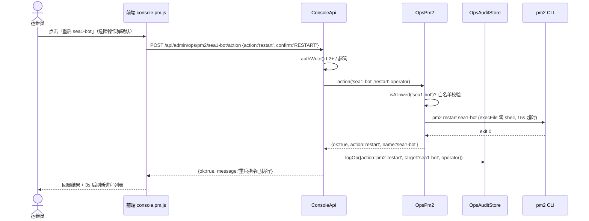
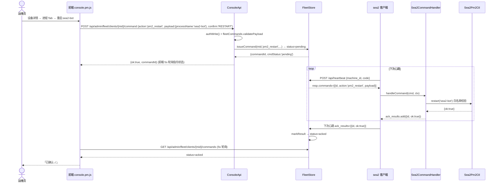
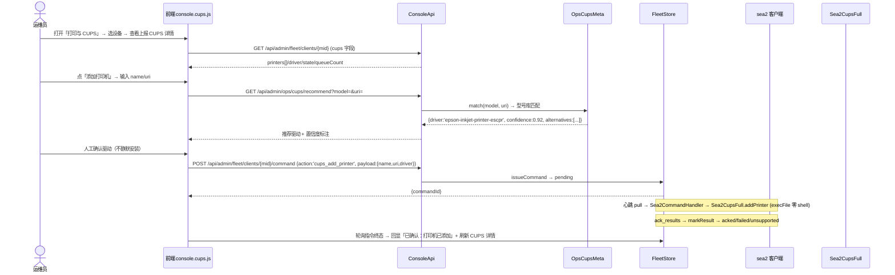
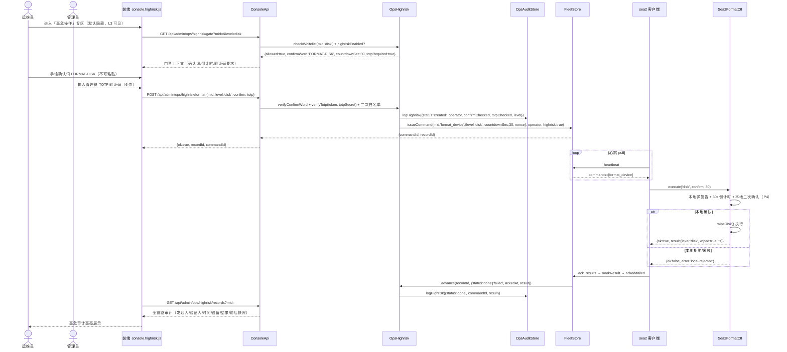
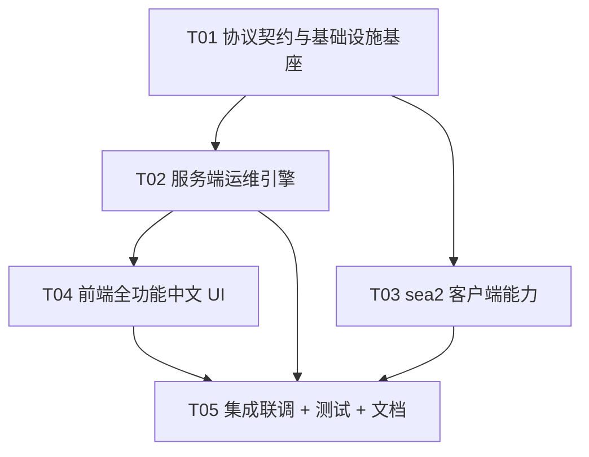
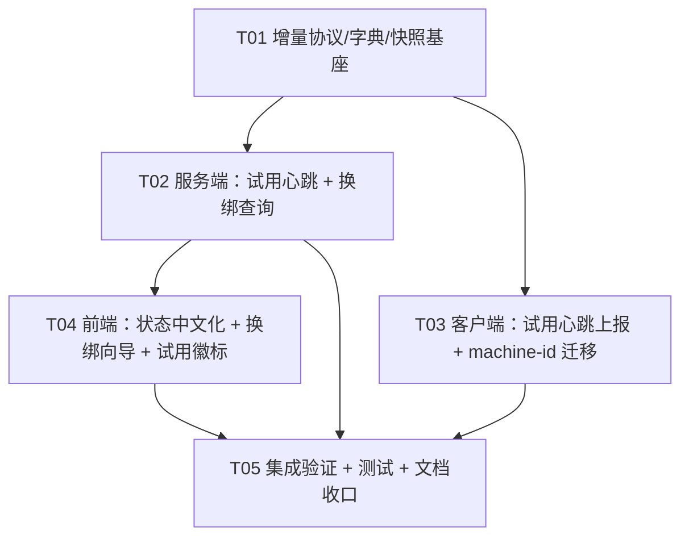
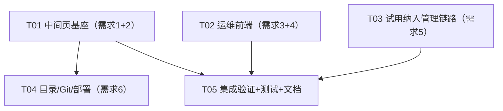

# sea2 商用客户端 + sea1 运维控制台全功能中文 UI 改造 · 系统设计 v1.0

> 架构师：高见远（Gao）｜ 语言：简体中文 ｜ 版本：v1.0
> 上游输入：`docs/prd_sea2_ops_v1.0.md`（PRD v1.1）+ `docs/research_binary_napcat.md`（Part A 调研结论）
> 沿用基线：`docs/system_design_fleet_ops_v1.0.md`（已落地集群/指令/授权模型，本设计在其上做增量，不重复展开）
> 输出路径：`activation-server/docs/system_design_sea2_ops_v1.0.md`
>
> **修订记录**：v1.1（T01 核验后口径修正）——§3.4 指令契约扩展由「8 条」更正为「9 条」：pm2_list/pm2_restart/pm2_stop/pm2_start/pm2_logs（5 条）+ cups_info/cups_set_printer/cups_add_printer（3 条）+ format_device（1 条），总指令 = 原 11 + 新增 9 = **20 条**（已按 fleetCommands.js 实现核验）；归 T02（C4：/command 响应回带 timeoutAt）与 T04（F5：console.js 遗留布尔 s.online）确认。
>
> **修订记录 v1.2（T05 集成联调 + 测试 + 文档收口）**：
> - **心跳 ack 自动推进接线**：server.js 心跳回执处理分支新增 format_device 自动推进——ack_results 里 format_device 指令回执（acked/failed/unsupported）经 commandId 反查 fleetStore.highrisk[]（含 commandId 字段）best-effort 调用 `OpsHighrisk.advance(recordId, outcome)` 推进高危记录到 done/failed 终态；失败不阻断心跳主流程（try/catch 包裹）。
> - **确认词来源决策（T05 拍板）**：沿用 T03 现状——本地确认词透传 `ctx.localConfirmWord` 或 `payload.confirm` 兼容通道；服务端强门禁**不**扩展 schema 下发确认词。理由：确认词本质是「本地操作者确认」，服务端下发反而削弱 P4 本地再确认原则（详见 §7.12）。
> - **disk 档目标盘决策（T05 拍板）**：新增 fleetConfig 键 `formatDiskTarget`（默认空=拒绝），运维在配置中心预填目标盘（如 /dev/sda）；强门禁签发 disk 档时校验非空并随 `payload.diskTarget` 携带；客户端无 target 仍拒绝（`disk-target-required`），双侧 fail-closed（详见 §7.13）。
> - **新测试落地**：`test/ops-crud.test.js` / `test/highrisk.test.js` / `test/pm2-ctl-v2.test.js` / `test/cups-full.test.js` 四套自包含测试（临时 DATA_DIR，不联网不部署）；schema 计数 41→42（新增 formatDiskTarget，qa_config_ui.test.js 同步更新）。

---

## 0. 设计前置结论（读码 + 调研后的关键判定）

| # | 判定 | 依据 |
|---|---|---|
| D1 | **sea2 双平台集成官方二进制 NapCat.Shell 可行**，x86_64 + arm64 官方同版本发布；arm32 无官方支持，玩客云仅作非 napcat 链路沙盒 | research_binary_napcat.md §5 |
| D2 | **前端继续原生 JS、零构建**；将 console.js 按视图拆分为多个 IIFE 文件（console.html 按序 `<script>` 引入），避免单文件膨胀到 4000+ 行失控 | 既有 1900 行单文件 + 新增 6 大视图；server.js serveFile 直服 public/ |
| D3 | **服务端维持 server.js 单体 + consoleApi 聚合路由**，新增 `lib/ops/*` 独立模块群（crud/pm2/highrisk/audit/totp/cupsmeta），不引入 Express/Koa | 既有架构零框架、fail-closed 鉴权成熟，1000 台目标下无性能瓶颈 |
| D4 | **客户端 sea2 以 sea1/licensing 为基准 clone 到 `/root/sea2`**，新增 4 个能力模块；PM2/CUPS/格式化全部走既有指令通道（心跳 pull + ack_results），**不新增长连接** | 复用成熟通道，客户端离线天然降级 |
| D5 | **PM2 分两类**：服务端进程（sea1-*）走服务端本地 pm2 直控（复用 runtime.js jlist 缓存，新增操作端点）；客户端进程（sea2-*）走指令通道 | 服务端直控延迟 <1s 且不依赖目标机在线；客户端进程本就必须由目标机执行 |
| D6 | **协议版本化**：心跳 body 沿用 snake_case，快照字段沿用 camelCase；新增 `heartbeatProto=2` / `commandsProto=2` 双字段声明 | 既有 fleet.json 快照 camelCase、心跳 snake_case 的既定事实，新字段严格对齐，杜绝混用 |
| D7 | 格式化三档分级（data/factory/disk），强门禁七原则全部落地，`remote_shell`/`update_client` 本期不做 | PRD §5 / P2-3 / P2-4 |

---

## 1. 实现方案与框架选型

### 1.1 总原则
- **零新增三方依赖**（服务端/前端/客户端全零依赖，node 内置 crypto/fs/http/child_process + 原生 fetch 即可），降低供应链风险与审计面。
- **契约单一事实来源**：指令契约表 `lib/fleetCommands.js`、状态语义表 `lib/fleetReason.js`、配置 schema `lib/configManager.js`、中文字典 `public/i18n.js` 四张表驱动全栈，前端/服务端/客户端零硬编码。
- **sea1 铁律**：只动"运维 UI 增强 + reason 文案"；核心授权/验签链路（lib/license.js、lib/crypto.js、/api/activate、/api/order/*）一律不碰。绑定纠正 = 新 API 调既有 `store.updateCode` + 审计，不改 store.js 本体。

### 1.2 架构模式
- **服务端**：单体 HTTP handler（server.js）→ 前缀路由 → `consoleApi.handle` 聚合 + 鉴权分发（L0 读 / L2 写 / L3 超管）→ `lib/ops/*` 业务模块。分层：Route → Auth → Ops 业务 → Store/FleetStore。MVC 的 Controller 即 consoleApi，Service 即 lib/ops/*，Model 即 store.js/fleetStore.js/fleet-config.json。
- **前端**：原生 JS IIFE 多文件（无模块打包器），全局命名空间 `window.ConsoleApp`，视图注册表驱动 Tab 渲染；所有文案查 `I18N` 字典 + meta 下发。
- **客户端 sea2**：LicenseGate 门禁模式不变（enabled=true），宿主钩子接线扩展；新增能力模块均以"存在才调用"的钩子注入，未挂载如实回 `unsupported`，绝不伪造成功（延续 v1 修复的 P0-5 精神）。

### 1.3 三个新引入的机制（本设计核心增量）
1. **M1 强门禁引擎（Highrisk Gate）**：TOTP 管理员二次验证码 + 确认词 + 白名单机型 + 客户端本地倒计时 + 全程审计，格式化三档分级（§3.3 / §4.3）。
2. **M2 三类审计中心（Audit Store）**：操作审计（CRUD）/ 指令审计（下发回执）/ 高危审计（门禁全链路）三通道，JSONL 只增不改，支持检索 + CSV 导出。
3. **M3 全变量配置中心（Config Center）**：`configManager` schema 扩到全键（含 fleetConfig 阈值、TOTP 密钥、白名单机型、高危开关），支持热生效/重启后生效标注/历史回滚。

---

## 2. 文件列表（相对路径 · 标注 归属/新增/修改）

> 归属标注：**[S]** sea1 服务端 `activation-server/`；**[F]** 前端 `activation-server/public/`；**[C]** sea2 客户端 `sea2/`（以 sea1/licensing 为基准 clone）；**[T]** 测试；**[D]** 文档

### 2.1 服务端（[S] `activation-server/`）
| 文件 | 动作 | 内容 |
|---|---|---|
| `server.js` | 改 | 新增 `/api/admin/ops/*` 前缀转发到 consoleApi（一行分支） |
| `lib/consoleApi.js` | 改 | 新增 ops 路由组：CRUD / PM2 / 强门禁 / 审计 / CUPS meta / 绑定纠正 |
| `lib/ops/crud.js` | 新 | 通用 CRUD 引擎（entity: codes/devices/printers/configs），统一分页/筛选/审计 |
| `lib/ops/pm2.js` | 新 | 服务端 pm2 直控：list/restart/stop/start/logs，进程名白名单 sea1-*、sea2-server-* |
| `lib/ops/highrisk.js` | 新 | 强门禁引擎：白名单校验、确认词校验、TOTP 校验、format_device 签发、高危记录推进 |
| `lib/ops/totp.js` | 新 | TOTP（RFC 6238，HMAC-SHA1 6 位 / 30s 窗口，node:crypto 实现，零依赖） |
| `lib/ops/auditStore.js` | 新 | 三类审计 JSONL（op/cmd/highrisk），检索 + CSV 导出 |
| `lib/ops/cupsmeta.js` | 新 | CUPS 驱动识别库：机型→驱动映射 + 置信度 + 推荐（纯静态数据 + 匹配函数） |
| `lib/ops/binding.js` | 新 | 授权码↔机器码绑定纠正（调 store.updateCode + 审计），修复 P0-1 |
| `lib/fleetCommands.js` | 改 | SPECS 扩展 9 条指令（§3.4，总指令 11+9=20）：pm2_list/pm2_restart/pm2_stop/pm2_start/pm2_logs、cups_info/cups_set_printer/cups_add_printer、format_device |
| `lib/fleet.js` | 改 | buildMeta 扩展（新指令/新配置/新状态）、clientDetail 扩展（pm2_processes/cups/login） |
| `lib/fleetStore.js` | 改 | 快照字段扩展：pm2Processes/cups/loginInfo/formatLevel；新增高危操作记录表 highrisk[] |
| `lib/fleetConfig.js` | 改 | DEFAULTS 扩展：formatWhitelist、totpSecret、highriskEnabled、cupsDriverRepo 等 |
| `lib/configManager.js` | 改 | schema 扩展：新增键全量可视化可编辑（热生效/重启后生效标注、历史回滚） |
| `lib/console/runtime.js` | 改 | pm2 只读采集 → 增加操作能力（restart/stop/start/logs，白名单 + 审计） |
| `lib/console/devices.js` | 改 | 设备档案 CRUD 扩展：备注/分组/机型白名单标记 |
| `lib/console/printers.js` | 改 | 打印机 CRUD 扩展：型号/驱动/URI/队列 |
| `lib/fleetReason.js` | 改 | reason 'ok' 文案已在 v1 修；本期补充 format 相关 reason 文案（如 `format-pending`/`format-done`） |

### 2.2 前端（[F] `activation-server/public/`）
| 文件 | 动作 | 内容 |
|---|---|---|
| `console.html` | 改 | 新 Tab 容器（进程管理/打印与CUPS/配置中心/设备管理/高危操作/审计中心）+ 按序引入多文件 `<script>` |
| `console.i18n.js` | 新 | 中文字典 `window.I18N`（全站文案单一事实来源） |
| `console.api.js` | 新 | fetch 封装 + 通用 CRUD 客户端 + 轮询助手 |
| `console.js` | 改 | 保留主控/登录/集群/详情，剔除遗留布尔 `s.online`（P1-2，console.js:1445 死代码），接入 i18n |
| `console.admin.js` | 新 | 授权管理 / 设备管理 / 配置中心 视图（CRUD） |
| `console.pm.js` | 新 | 进程管理视图（服务端 + 客户端两类进程，即时操作 + 日志抽屉） |
| `console.cups.js` | 新 | 打印与 CUPS 视图（跨设备打印机、驱动识别推荐、配置下发） |
| `console.highrisk.js` | 新 | 高危操作专区视图（强门禁流程向导：选设备→白名单→确认词→TOTP→进度） |
| `console.audit.js` | 新 | 审计中心视图（三类审计检索 + CSV 导出） |
| `console.css` | 改 | 新视图样式 + 高危专区红黑配色 |

### 2.3 客户端 sea2（[C] `sea2/`，基准 `sea1/licensing/`）
| 文件 | 动作 | 内容 |
|---|---|---|
| `index.js` | 改 | LicenseGate 扩展：新钩子接线（onPm2Ops/onCupsOps/onFormat）、登录中间页启动、心跳 v2 |
| `lib/heartbeat.js` | 改 | payload 扩展：`pm2_processes` / `cups` / `login_info` / `heartbeatProto:2` |
| `lib/command-handler.js` | 改 | SPECS + switch 扩展：pm2_* / cups_* / format_device 分支 |
| `lib/pm2-ctl.js` | 改 | 扩展 stop/start/logs/list（白名单 ALLOWED_PROCESSES 扩展 sea2-*），保持零 shell |
| `lib/cups-full.js` | 新 | CUPS 全功能：lpstat -v/-p、lpinfo -m、驱动识别、cupsaddprinter 封装（execFile 零 shell） |
| `lib/format-ctl.js` | 新 | 三档格式化执行器：数据分区/恢复出厂/整盘；本地倒计时≥15s + 本地二次确认 + 结果上报 |
| `lib/login-gate.js` | 新 | 登录中间页：napcat 登录态查询（QQ号/昵称/头像）、「记住本机」开关、确认进入/切换/退出 |
| `scripts/install-sea2.sh` | 新 | 一键安装：装 nodejs/linuxqq/napcat（按 uname -m 分发）、目录迁入 /root/sea2、pm2 托管 sea2-* |
| `scripts/build-package.sh` | 新 | 双平台打包：sea2-x86_64 / sea2-arm64 安装包（tar.gz + install 脚本） |
| `test_command_handler.js` | 改 | 新指令分支单测（38/0 基线之上扩展） |

### 2.4 测试（[T] `activation-server/test/`）
| 文件 | 动作 | 内容 |
|---|---|---|
| `test/ops-crud.test.js` | 新 | 通用 CRUD 引擎（四实体）自包含 in-process 测试 |
| `test/highrisk.test.js` | 新 | 强门禁引擎：白名单/TOTP/确认词/审计链路（141 断言风格） |
| `test/pm2-ctl-v2.test.js` | 新 | 服务端 + 客户端 pm2 白名单与操作（spawn mock） |
| `test/cups-full.test.js` | 新 | CUPS 命令封装 + 驱动识别匹配（execFile mock） |
| `test/fleet-ops-v1.test.js` | 改 | 回归：新增指令不影响既有 141 断言 |

### 2.5 文档（[D] `activation-server/docs/`）
| 文件 | 动作 | 内容 |
|---|---|---|
| `docs/research_binary_napcat.md` | 新 | Part A 调研结论 |
| `docs/system_design_sea2_ops_v1.0.md` | 新 | 本设计文档 |
| `docs/class-diagram-sea2-ops.mermaid` | 新 | 类图 |
| `docs/sequence-diagram-sea2-ops.mermaid` | 新 | 时序图 |

---

## 3. 数据结构与接口

### 3.1 类图

```mermaid
classDiagram
    class ConsoleApi {
        +handle(req, res, url, cfg, store, keys) Promise
        -authRead() AuthResult
        -authWrite() AuthResult
    }
    class OpsCrud {
        +list(entity, filter) Page
        +create(entity, body, operator) Result
        +update(entity, id, body, operator) Result
        +remove(entity, id, operator) Result
    }
    class OpsPm2 {
        +listLocal(whitelist) Process[]
        +action(name, action, operator) Result
        +logs(name, lines) LogTail
        -isAllowed(name) bool
    }
    class OpsHighrisk {
        +checkWhitelist(machineId, level) Result
        +verifyConfirmWord(action, confirm) Result
        +verifyTotp(token, secret) Result
        +issueFormat(mid, level, operator) Command
        +advance(recordId, outcome) void
    }
    class OpsAuditStore {
        +logOp(entry) void
        +logCmd(entry) void
        +logHighrisk(entry) void
        +query(kind, filter) Page
        +exportCsv(kind, filter) string
    }
    class OpsCupsMeta {
        +match(model, uri) DriverRecommend
        +listDrivers() Driver[]
    }
    class Totp {
        +generateSecret() string
        +verify(token, secret, window) bool
    }
    class FleetCommands {
        +get(action) Spec
        +validatePayload(action, payload) Checked
        +list() Spec[]
    }
    class FleetStore {
        +recordHeartbeat(mid, info) ClientRecord
        +addCommand(mid, cmd) Command
        +markResult(id, outcome) bool
        +getPendingCommands(mid) Command[]
        +addHighrisk(record) void
    }
    class Sea2CommandHandler {
        +handleCommand(cmd, ctx) Promise~Outcome~
        +sanitizeConfig(raw) object
    }
    class Sea2Pm2Ctl {
        +restart(name) Result
        +stop(name) Result
        +start(name) Result
        +logs(name, lines) Result
        +list() Process[]
        -isAllowed(name) bool
    }
    class Sea2CupsFull {
        +info() CupsInfo
        +listPrinters() Printer[]
        +addPrinter(name, uri, driver) Result
        +setPrinter(name, patch) Result
        +recommendDriver(model, uri) Recommend
    }
    class Sea2FormatCtl {
        +execute(level, confirm, countdownSec) FormatResult
        -countdown(sec) Promise
        -wipeData() Result
        -factoryReset() Result
        -wipeDisk() Result
    }
    class Sea2LoginGate {
        +status() LoginInfo
        +remember(on) void
        +confirm() void
        +switchAccount() void
        +logout() void
    }

    ConsoleApi --> OpsCrud
    ConsoleApi --> OpsPm2
    ConsoleApi --> OpsHighrisk
    ConsoleApi --> OpsAuditStore
    ConsoleApi --> OpsCupsMeta
    ConsoleApi --> FleetCommands
    ConsoleApi --> FleetStore
    OpsHighrisk --> Totp
    OpsHighrisk --> OpsAuditStore
    OpsCrud --> OpsAuditStore
    OpsPm2 --> OpsAuditStore
    FleetStore --> FleetCommands

    Sea2CommandHandler --> Sea2Pm2Ctl
    Sea2CommandHandler --> Sea2CupsFull
    Sea2CommandHandler --> Sea2FormatCtl
    Sea2CommandHandler --> Sea2LoginGate
```



### 3.2 心跳上报扩展（body snake_case，`heartbeatProto: 2`）

```jsonc
// POST /api/heartbeat 新增字段（其余沿用 v1）
{
  "heartbeatProto": 2,
  "commandsProto": 2,
  "pm2_processes": [
    { "pm_id": 0, "name": "sea2-bot", "status": "online",
      "restarts": 3, "uptime": 86400, "cpu": 2.1, "mem": 104857600 }
  ],
  "cups": {
    "running": true,
    "printers": [
      { "name": "EPSON-L3150", "uri": "usb://EPSON/L3150?serial=xxx",
        "model": "EPSON L3150 Series", "driver": "epson-inkjet-printer-escpr",
        "state": "idle", "queueCount": 0, "default": true, "enabled": true }
    ]
  },
  "login_info": {
    "qq": "123456789", "nickname": "华东·打印-01",
    "avatar": "data:image/png;base64,...", "remembered": false, "loggedIn": true
  }
}
```

### 3.3 强门禁记录（fleetStore.highrisk[] / highrisk-audit.jsonl）

```jsonc
{
  "recordId": "hr-1722-9f3a",
  "machineId": "SEA2-xxxx",
  "code": "SEA2-XXXX-XXXX",
  "level": "disk",                    // data | factory | disk
  "confirmWord": "FORMAT-DISK",
  "confirmChecked": true,
  "totpChecked": true,
  "totpOperator": "admin-qq-or-token",
  "whitelistChecked": true,
  "commandId": "cmd-1722-abc",
  "status": "issued",                 // created | issued | local-confirmed | done | failed | rejected
  "countdownSec": 15,
  "issuedAt": 1722000000,
  "ackedAt": 0,
  "result": null,
  "before": { "snapshot": {...} },    // 前后状态快照
  "after": null
}
```

### 3.4 指令契约扩展（9 条新指令，总指令 11 + 9 = 20 条）

| action | 分组 | dangerous | confirmWord | payloadSchema 关键字段 | resultExpected |
|---|---|---|---|---|---|
| `pm2_list` | 进程 | false | — | {} | true |
| `pm2_restart` | 进程 | true | — | `processName`(string, whitelist 校验) | false |
| `pm2_stop` | 进程 | true | `STOP` | `processName` | false |
| `pm2_start` | 进程 | false | — | `processName` | false |
| `pm2_logs` | 进程 | false | — | `processName`, `lines`(int ≤200) | true |
| `cups_info` | 打印 | false | — | {} | true |
| `cups_set_printer` | 打印 | false | — | `name`, `enabled`(bool), `default`(bool), `driver`(opt) | true |
| `cups_add_printer` | 打印 | false | — | `name`, `uri`, `driver`(opt), `options`(object opt) | true |
| `format_device` | 高危 | true | `FORMAT-DATA`/`FORMAT-FACTORY`/`FORMAT-DISK` | `level`(enum), `countdownSec`(int ≥15), `nonce` | true |

- 客户端 `Sea2CommandHandler.SPECS` 与服务端表**严格一致**；`format_device` 由强门禁引擎签发，普通下发接口拒绝直发（`minLevel: 3` 且必须带 highrisk 上下文）。

### 3.5 通用 CRUD 接口（`/api/admin/ops/crud/:entity`）

| 方法 | 路径 | 说明 | 鉴权 |
|---|---|---|---|
| GET | `/api/admin/ops/crud/:entity?page=&q=&filter=` | 列表（分页/搜索/筛选） | R0 |
| POST | `/api/admin/ops/crud/:entity` | 创建 | W2 |
| PUT | `/api/admin/ops/crud/:entity/:id` | 更新（记录变更前后值） | W2 |
| DELETE | `/api/admin/ops/crud/:entity/:id` | 删除（软删标记） | W2 |

- `entity ∈ {codes, devices, printers, configs}`；所有写操作经 `OpsAuditStore.logOp`（operator/时间/前后值）。

### 3.6 配置中心扩展（fleetConfig.DEFAULTS 增量）

```jsonc
{
  "formatWhitelist": ["SEA2-", "SEA1-8GA4"],   // 机器码前缀白名单（Q3 默认方案）
  "formatLevels": { "data": { "countdownSec": 15, "confirmWord": "FORMAT-DATA" },
                    "factory": { "countdownSec": 20, "confirmWord": "FORMAT-FACTORY" },
                    "disk": { "countdownSec": 30, "confirmWord": "FORMAT-DISK" } },
  "totpSecret": "",                              // 管理员二次验证码共享密钥（首次生成）
  "highriskEnabled": true,                       // 高危专区总开关（false = 全区拒绝）
  "cupsDriverRepo": "",                          // 驱动包仓库 URL（空 = 仅内置型号库）
  "pm2ServerWhitelist": ["sea1-activation", "sea1-bot", "sea1-client-x86"]
}
```

---

## 4. 程序调用流程（时序图）

### 4.1 PM2 即时操作（服务端进程：本地直控）



### 4.2 PM2 即时操作（客户端进程：指令通道）



### 4.3 CUPS 配置下发（含驱动识别推荐）



### 4.4 格式化强门禁全链路（三档分级，disk 档最强）



---

## 5. 任务列表（有序 · 含依赖 · ≤5 任务硬上限）

> 分组原则：按功能层次分组，不按单文件拆分；T01 为项目基础设施（契约/协议/入口）。

### T01 · 协议契约与基础设施基座 【P0】
- **源文件**：
  - `lib/fleetCommands.js`（改：9 条新指令 SPECS，总指令 20 条）
  - `lib/fleetStore.js`（改：快照字段 pm2Processes/cups/loginInfo + highrisk[] 记录表）
  - `lib/fleet.js`（改：buildMeta/clientDetail 扩展）
  - `lib/fleetConfig.js`（改：新配置键）
  - `lib/fleetReason.js`（改：format 相关 reason 文案）
  - `server.js`（改：/api/admin/ops/* 前缀转发）
  - `sea2/lib/heartbeat.js`（改：心跳 v2 扩展字段）
  - `public/console.i18n.js`（新：中文字典骨架）
- **依赖**：无（先行基座）
- **验收**：meta 接口返回新指令/新配置；心跳 v2 字段服务端可接收入库；既有测试全绿（fleet.test.js / fleet-ops-v1.test.js 141 断言）
- **PRD 映射**：P0-2（协议面）、P0-3（配置键）、P0-4（协议面）、P0-8（指令面）

### T02 · 服务端运维引擎（CRUD / PM2 / 强门禁 / 审计 / CUPS meta / 绑定纠正）【P0】
- **源文件**：
  - `lib/ops/crud.js`（新）、`lib/ops/pm2.js`（新）、`lib/ops/highrisk.js`（新）、`lib/ops/totp.js`（新）、`lib/ops/auditStore.js`（新）、`lib/ops/cupsmeta.js`（新）、`lib/ops/binding.js`（新）
  - `lib/consoleApi.js`（改：ops 路由组）
  - `lib/console/runtime.js`（改：pm2 操作能力）、`lib/console/devices.js`（改：设备档案）、`lib/console/printers.js`（改：打印机 CRUD）
  - `lib/configManager.js`（改：全键配置 schema + 历史回滚）
- **依赖**：T01
- **验收**：四实体 CRUD 全通过 + 审计落库；服务端 pm2 重启/停止/启动/日志可用（白名单外拒绝）；TOTP 生成/校验；强门禁签发 format_device 且普通接口不可直发；绑定纠正 `SEA1-8GA4-NCHC-HF5P` 可改并审计
- **PRD 映射**：P0-1、P0-3、P0-4（服务端）、P0-7（meta）、P0-8（服务端）、P1-1、P1-5

### T03 · sea2 客户端能力（PM2 / CUPS / 格式化 / 登录中间页 / 安装打包）【P0】
- **源文件**：
  - `sea2/lib/pm2-ctl.js`（改）、`sea2/lib/command-handler.js`（改）、`sea2/index.js`（改）
  - `sea2/lib/cups-full.js`（新）、`sea2/lib/format-ctl.js`（新）、`sea2/lib/login-gate.js`（新）
  - `sea2/scripts/install-sea2.sh`（新）、`sea2/scripts/build-package.sh`（新）
  - `sea2/test_command_handler.js`（改：新分支单测）
- **依赖**：T01（协议对齐）；可与 T02 并行
- **验收**：pm2_* / cups_* / format_device 三组指令本地执行 + ack_results 回执；格式化本地倒计时≥15s + 二次确认；登录中间页默认显示 + 记住本机开关；双平台安装脚本按 uname -m 分发；x86_64/arm64 包可一键安装
- **PRD 映射**：P0-2、P0-4（客户端）、P0-6、P0-7（客户端）、P0-8（客户端）、P0-9、P1-6（沙盒回归）

### T04 · 前端全功能中文 UI（集群增强 + CRUD + PM2 + CUPS + 高危专区 + 审计中心）【P0】
- **源文件**：
  - `public/console.html`（改）、`public/console.js`（改：剔除遗留布尔、接入 i18n）、`public/console.css`（改）
  - `public/console.api.js`（新）、`public/console.admin.js`（新）、`public/console.pm.js`（新）、`public/console.cups.js`（新）、`public/console.highrisk.js`（新）、`public/console.audit.js`（新）
- **依赖**：T02（API 可用）；可与 T03 并行
- **验收**：9 大菜单全中文（≥99%）；授权/设备/配置 CRUD 可视化；PM2 双区进程即时操作 + 日志；CUPS 详情 + 驱动推荐；高危专区强门禁向导（无 UI 一键直达）；审计检索 + CSV 导出；集群页无 `s.online` 死代码
- **PRD 映射**：P0-3、P0-4、P0-5、P0-7、P0-8、P1-2、P1-3、P1-4、P1-5、P1-7

### T05 · 集成联调 + 测试 + 文档交付 【P0/P1】
- **源文件**：
  - `test/ops-crud.test.js`（新）、`test/highrisk.test.js`（新）、`test/pm2-ctl-v2.test.js`（新）、`test/cups-full.test.js`（新）、`test/fleet-ops-v1.test.js`（改：回归）
  - `docs/system_design_sea2_ops_v1.0.md`（新）、`docs/class-diagram-sea2-ops.mermaid`（新）、`docs/sequence-diagram-sea2-ops.mermaid`（新）
- **依赖**：T02、T03、T04
- **验收**：全部单测通过；双平台安装包在 arm32 沙盒（非 napcat 链路）回归通过；1000 台量级聚合/列表接口 P95<2s（分页/索引检查）；QA 全站中文化抽查无英文残留；强门禁 0 误触审计完整
- **PRD 映射**：G1/G3/G4/G5/G6、P0-9、P1-6

### 任务依赖图



---

## 6. 依赖包列表

| 包 | 版本 | 用途 | 归属 |
|---|---|---|---|
| （无）Node 内置 `node:crypto` `node:fs` `node:http` `node:child_process` | Node 18+ | 服务端全部能力（TOTP/CRUD/PM2/审计），**零新增 npm 依赖** | [S] |
| （无）原生 fetch / 原生 JS | 浏览器内置 | 前端全部能力，**零 CDN、零构建** | [F] |
| NapCat.Shell（linux x64 / arm64 DEB 或 RPM） | v4.18.x（配套 linuxqq 9.9.26-44343） | sea2 内置 QQ 机器人框架（随安装脚本分发，非 npm） | [C] |
| linuxqq（官方 QQ Linux 客户端） | 9.9.26-44343（与 NapCat 兼容表锁定） | NapCat 运行前提 | [C] |
| Node.js 运行时 | ≥18 LTS | sea2 客户端运行时（安装脚本自动装） | [C] |
| pm2 | 已装（生产栈既有） | sea2-napcat / sea2-bot / sea2-client 托管 | [C] |

> 说明：TOTP 用 `node:crypto` 自实现（HMAC-SHA1 + 30s 窗口，约 40 行），**不引入 otplib**；CUPS 交互全部走 `execFile` 调用系统 cups 命令（cupsenable/cupsdisable/cancel/lpstat/lpinfo/lpadmin），**不引入 node-cups 类库**。

---

## 7. 共享知识（跨文件约定，Engineer 必读）

1. **API 响应格式**：成功 `{ok:true, ...}`；失败 `{ok:false, error}`。HTTP：401 未登录 / 403 等级不足 / 400 参数错 / 404 不存在 / 500 意外。（沿用 v1）
2. **命名规范**：心跳/回执 body **snake_case**（`pm2_processes`、`cups`、`login_info`）；fleet.json 快照与 API 响应 **camelCase**（`pm2Processes`、`cups`、`loginInfo`）；指令 action 全小写下划线。
3. **契约单一事实来源**：新增指令先改 `lib/fleetCommands.js` → meta 自动下发 → 服务端/前端自动同步 → 客户端 `Sea2CommandHandler.SPECS` 同步一处。**铁律**。
4. **中文字典**：全站可见文案集中在 `public/console.i18n.js`（`window.I18N`）；状态值中文（连接四态/授权七态/指令六态）由 meta 下发，前端不硬编码。专有名词 napcat/PM2/CUPS/QQ 保留原文。
5. **审计三分类**：`OpsAuditStore` 写 `data/ops-audit-{op|cmd|highrisk}.jsonl`，只增不改不删；高危审计记录含前后状态快照，缺一不可（P5）。
6. **协议版本号**：心跳 `heartbeatProto: 2`、指令 `commandsProto: 2`；服务端对旧版（无版本字段）按 v1 兼容处理。
7. **PM2 白名单**：服务端 `OpsPm2` 白名单 = `pm2ServerWhitelist`（sea1-*、sea2-server-*）；客户端 `Sea2Pm2Ctl.ALLOWED_PROCESSES` = sea2-*；两侧独立收口，**绝不拼接 shell**（spawn/execFile 数组传参）。
8. **格式化三档**：`data`(数据分区) / `factory`(恢复出厂，保留系统与程序与授权) / `disk`(整盘 wipe，需 L3 + 双验证)；`factory` 保留 `/root/sea2/config` 下 license/machineId 授权文件（待 Q8 确认）。
9. **TOTP**：HMAC-SHA1 6 位 / 30s 窗口 / ±1 窗口容差；密钥存 `fleet-config.json` 的 `totpSecret`（首次生成，经 `/api/admin/ops/totp/status` 查看状态、`/api/admin/ops/totp/reset` 重置，均 L3）。
10. **绑定纠正**：`lib/ops/binding.js` 调既有 `store.updateCode(code,{bound_machine_id})` + `OpsAuditStore.logOp`；不改 store.js 本体、不改验签链路。
11. **测试约定**：自包含 in-process（临时 DATA_DIR），`node test/xxx.test.js` 直跑（package.json test 脚本指向不存在的 test/test.js，勿依赖 npm test）。
12. **format_device 确认词来源（T05 决策）**：确认词 = **本地操作者确认**。服务端强门禁签发 `format_device` 时**不**在 payload 中下发确认词；客户端 `Sea2CommandHandler` 取 `ctx.localConfirmWord`（本地操作员在登录中间页确认，由宿主注入）或 `payload.confirm`（兼容通道，仅作兜底）。本地无确认 → `execute` 内部回 `local-rejected`，绝不擦除。服务端只校验自己签发的门禁上下文（level/countdownSec/nonce），确认词校验在客户端本地完成——服务端下发确认词会削弱 P4「本地再确认」原则，故明确不做。
13. **disk 档目标盘（T05 决策）**：新增 fleetConfig 键 `formatDiskTarget`（默认 `''` = 拒绝签发 disk 档），在配置中心（`/api/admin/ops/crud/configs` 或 `/api/admin/console/vars`，fleet 键）预填目标整盘（如 `/dev/sda`）。强门禁 `OpsHighrisk.issueFormat` 在 `level==='disk'` 时强制校验非空，否则返回 `disk-target-required` 并写审计；签发时随 `payload.diskTarget` 携带（fleetCommands format_device payloadSchema 已加可选字段）。客户端 `wipeDisk` 无 target 同样拒绝（`disk-target-required`），target 优先级 = 本地 `ctx.formatDiskTarget` > 服务端 `payload.diskTarget`。双侧 fail-closed，杜绝「没搞清目标盘就整盘擦除」。

---

## 8. 待明确事项（需主理人/用户拍板）

| # | 事项 | 建议默认 | 影响 |
|---|---|---|---|
| Q1 | 管理员二次验证码实现：TOTP vs 短信 vs 一次性口令 | **TOTP**（Google Authenticator 兼容，零依赖） | P0-8 落地成本 |
| Q2 | 白名单机型判定依据：机器码前缀 / 授权码批次 / 硬件型号 | **机器码前缀 + 授权批次双条件** | P0-8 校验实现 |
| Q3 | CUPS 驱动数据源：离线仓库 vs 在线下载；arm64 驱动可用性 | **内置型号库（CUPS 自带 ppd）+ 在线仓库可配**；arm64 需现场验证 | P0-7 可行性 |
| Q4 | 1000 台容量压测是否本期做（压测环境与 SLA 验收口径） | 建议做：合成 1000 心跳 + 聚合接口 P95<2s | G1 验收 |
| Q5 | sea2 是否保留 docker napcat 兼容模式（灰度过渡） | 不保留，本期纯二进制（减少运维面） | P0-2 范围 |
| Q6 | 前端拆分为多文件 IIFE vs 维持单文件 | 拆分（10 个文件按序 `<script>`），若评审否决可回退单文件，任务编号不变 | T04 文件粒度 |
| Q7 | linuxqq 捆绑分发合规确认（腾讯客户端条款）+ QQ 账号 1000 台风控策略 | 安装脚本自动下载，不捆绑账号凭据；账号养号/分组灰度 | P0-2/P0-9 合规 |
| Q8 | 「恢复出厂」档保留范围：是否保留授权文件 | 保留 `/root/sea2/config` 授权文件，只清数据与打印配置 | 格式化语义 |
| Q9 | 「绑定纠正」权限等级 | 仅 L3 超管 | P0-1 权限 |
| Q10 | 登录中间页形态：独立本地页面 vs 嵌入 napcat WebUI | 独立本地页面（login-gate 起 localhost 端口） | P0-6 实现 |

---

# §9 增量需求设计 v1.3（追加 · 不修改 §0–§8 既有内容）

> 架构师：高见远（Gao）｜ 版本：v1.3 ｜ 上游：主理人四项增量指令（主理人原始指令）
> 范围：① `/etc/sea2/machine-id` 派生程序目录迁移；② 运维页「换绑新设备」；③ 页面设备状态中文；④ 试用设备上线 + 标记「试用」。
> 铁律沿用（§1.1）：sea1 核心授权/验签链路不动；只动「运维 UI 增强 + reason 文案 + 客户端心跳逻辑 + 部署配置」。不 SSH、不部署，纯文档设计。
> 读码核验：本节约全部改动点均已对照本地代码逐行定位（sea2/lib/machineId.js、sea2/index.js、sea2/lib/heartbeat.js、activation-server/lib/fleetReason.js / fleetStore.js / fleet.js / ops/binding.js / consoleApi.js、public/console.js / console.i18n.js / console.admin.js）。

---

## 9.1 增量需求一：`/etc/sea2/machine-id` 派生程序目录迁移

### 9.1.1 现状核验（读码结论）

| 项 | 现状 | 结论 |
|---|---|---|
| 持久化 UUID 文件 | `/etc/sea2/machine-id`（sea2 生产 `config.json` 的 `machineIdPath` 指向）；sea1 为 `/etc/sea1/machine-id`（**不动**） | 需迁移的目标 |
| 派生程序 | `sea2/lib/machineId.js`（部署到 `/root/sea2/licensing/lib/machineId.js`），`getMachineId(machineIdPath)` 已支持显式路径 | **代码本身已在项目目录内，无需迁移** |
| 派生算法 | `MachineID = HMAC_SHA256(PersistentUUID, SECRET_SEED)`；`persistent` = 文件首行 UUID | 机器码只依赖「文件内容 + 种子」 |
| 关键结论 | **文件内容原样复制 → 机器码不变 → 已绑定授权不失效** | 迁移必须「复制」而非「重新生成」 |

### 9.1.2 落点

| 文件 | 动作 | 具体改动点 |
|---|---|---|
| `/root/sea2/config/machine-id` | 新（迁移目标） | 内容 = 旧文件 UUID **原样复制**（禁止 `readOrCreatePersistent` 重建） |
| `/root/sea2/config.json` | 改（部署后） | `machineIdPath: "/etc/sea2/machine-id"` → `"/root/sea2/config/machine-id"` |
| `sea2/scripts/migrate-machine-id.sh` | 新 | 一键迁移脚本（复制 → 校验 → 备份 → 改 config.json → 重启提示） |
| `sea2/lib/machineId.js` | 不改 | `getMachineId(machineIdPath)` 已支持显式路径；默认值注释维持 sea1 语义（sea2 由 config.json 显式注入，不碰 sea1 默认路径逻辑） |

### 9.1.3 迁移方案（一次性，部署现场执行）

```
1. pm2 stop sea2-*（sea2-client/sea2-bot/sea2-napcat）        # 避免运行期并发写
2. mkdir -p /root/sea2/config && cp -p /etc/sea2/machine-id /root/sea2/config/machine-id   # 原样复制，不是重建
3. cmp /etc/sea2/machine-id /root/sea2/config/machine-id && echo OK   # 不一致立即中止（禁止继续）
4. 改 /root/sea2/config.json：machineIdPath = "/root/sea2/config/machine-id"（脚本 sed 或手工）
5. mv /etc/sea2/machine-id /etc/sea2/machine-id.bak-$(date +%Y%m%d)   # 回滚锚点，稳定后清理
6. pm2 restart sea2-*；验证：日志无 INIT_ERROR / MACHINE_MISMATCH；控制台授权仍 valid（机器码未变）；心跳正常
7. 回滚：改回 config.json machineIdPath=/etc/sea2/machine-id → mv 回备份文件 → 重启 sea2-*
```

### 9.1.4 附带收益（需知悉，非目标）

- `sea2/index.js` 的 `_ackStorePath()`（`fleet-acks.json`）与 `_trialStatus()`（`trial.json`）均以 `path.dirname(machineIdPath)` 为基准 → `machineIdPath` 迁移后，回执队列与试用记录自动收敛到 `/root/sea2/config/`，数据全部落在项目目录内，与「服务端目录内」诉求一致。
- 注意：迁移后 `fleet-acks.json` 在新目录重新开始（旧目录历史不回迁）；指令终态不受影响——服务端已有终态保护 + 迟到回执（§7/既有 T05 接线）。

---

## 9.2 增量需求二：运维页「换绑新设备」功能

### 9.2.1 现状核验

| 项 | 现状 | 结论 |
|---|---|---|
| 服务端 `lib/ops/binding.js` | `correctBinding(store, code, machineId, operator, operatorLevel)`：必填/存在校验 → `store.updateCode(code, {bound_machine_id, binding_corrected_at})` → `logOp` 审计 | **满足换绑核心**（不改 store.js 本体、不改验签链路） |
| 路由 `consoleApi.js:695` | `POST /api/admin/ops/binding` 仅 L3（`authSuper`） | 满足 |
| 前端 `console.admin.js:175` | `openBinding()`：输入授权码 + 目标机器码 → POST → toast | 有基础入口，但**无「先查后换」确认、无旧设备失效提示** |

### 9.2.2 落点

| 文件 | 动作 | 具体改动点 |
|---|---|---|
| `lib/ops/binding.js` | 改（**新增函数，不动 correctBinding**） | `lookupBinding(store, code)`：返回授权码当前绑定信息（bound_machine_id / status / expires_at / customer），供换绑前确认 |
| `lib/consoleApi.js` | 改（新增端点） | `GET /api/admin/ops/binding/lookup?code=`（L3）；POST `/api/admin/ops/binding` body 扩展可选 `oldMachineId`（若传则必须与当前 `bound_machine_id` 一致，防误换） |
| `public/console.admin.js` | 改 | 「绑定纠正」升级为「换绑新设备」向导：①输入授权码 → ②lookup 展示旧设备绑定信息（警告：旧设备将立即失效）→ ③输入新设备机器码 → ④POST 换绑 → ⑤toast + 刷新 + 审计提示 |
| `public/console.i18n.js` | 改 | 新增 `rebind` 词条组（标题/步骤/警告/成功文案） |
| `public/console.css` | 改 | 换绑向导样式（复用既有 modal，最小改动） |

### 9.2.3 数据 / 接口变化

- 新增 `GET /api/admin/ops/binding/lookup?code=SEA2-XXXX` → `{ok:true, code, bound_machine_id, status, expires_at, customer}`；code 不存在 → 404。
- `POST /api/admin/ops/binding` body：`{code, machineId, oldMachineId?}`；`oldMachineId` 传且不匹配 → 400 `old-machine-mismatch`。
- 审计：沿用 `OpsAuditStore.logOp` action=`binding-correct`，detail 记录 `旧绑定 → 新绑定`；换机场景 detail 追加 `rebind-replacement` 标记（便于审计检索区分「纠正」与「换机」）。

### 9.2.4 新设备机器码获取路径（设计说明）

新设备安装 sea2 并启动后，其心跳 `machine_id` 即机器码。运维可：① 集群列表按新设备搜索；② 新设备本地 `/root/sea2/licensing` 状态接口 `getStatus().machine_id`；③ 控制台「设备管理」档案。换绑输入框校验：非空、≤128、建议前缀 `SEA2-`。

---

## 9.3 增量需求三：页面设备状态中文

### 9.3.1 现状核验（全部读码定位）

| 函数 | 位置 | 现状 | 问题 |
|---|---|---|---|
| `devStatusTag` | console.js:514 | `'<span class="tag s-'+esc(st)+'">'+esc(st)+'</span>'` | **直接显示英文状态值**（active/revoked/expired…） |
| `statusTag`（订单） | console.js:403 | map 只给配色，文案 `esc(st)` | **显示英文**（paid/issued/pending/await_verify/expired） |
| `anomalyStatusBadge` | console.js:826 | 有中文 map（open→待处置…），但 unknown 回退原始 key，且中文硬编码在组件内 | 未知值英文；未走字典 |
| `codeStatusTag` | console.admin.js:35 | `CODE_STATUS_CN` 中文 map 硬编码 | 语义正确但未统一进 I18N（迁移统一） |
| 打印机状态 | console.js:573-575 | `esc(st)` 原样显示 | CUPS 打印机状态英文 |
| `licenseBadge` / `connBadge` | console.js:627 / 620 | 已走 META 下发 | ✅ 无需改 |

### 9.3.2 方案：meta 下发 + I18N 兜底（沿用既有架构铁律 §7.4）

1. **服务端 `buildMeta` 增加状态语义表**（`lib/fleet.js`）：
   - `deviceStatus`: unused 未使用 / active 已激活 / revoked 已吊销 / expired 已过期 / disabled 已禁用
   - `orderStatus`: paid 已支付 / issued 已签发 / pending 待支付 / await_verify 待核验 / expired 已过期 / cancelled 已取消
   - `anomalyStatus`: open 待处置 / ignored 已忽略 / revoked 已吊销 / blacklisted 已拉黑 / resolved 已自愈
   - `printerStatus`: online 在线 / offline 离线 / error 异常 / idle 空闲 / disabled 已禁用
   - `trialBadge`: trial 试用 / trialExpired 试用到期（与需求四共用）
2. **前端新增通用取词函数 `metaStatus(metaKey, st)`**（console.js，仿 `metaConn`/`metaReason`）：META[metaKey] 命中 → `{label,badge}`；未命中 → `I18N[metaKey][st]`；再未命中 → 原样 key（fail-safe 不回退英文）。
3. **逐个函数替换**：
   - `devStatusTag(st)` → `metaStatus('deviceStatus', st)` 渲染 `<span class="tag s-{badge}">{label}</span>`
   - `statusTag(st)`（订单）→ `metaStatus('orderStatus', st)`
   - `anomalyStatusBadge(st)` → `metaStatus('anomalyStatus', st)`（删除组件内硬编码 map）
   - `codeStatusTag`（admin.js）→ `metaStatus('deviceStatus', st)`
   - 打印机状态 → `metaStatus('printerStatus', p.status)`
4. **`console.i18n.js` 增加对应词条**（meta 未加载/离线兜底，保证 100% 中文）。

### 9.3.3 验收口径

全站抽查无英文状态残留（设备/订单/异常/打印机/授权/连接六类）；meta 接口字段与 I18N key 严格一致（防漂移，测试断言）。

---

## 9.4 增量需求四：试用设备上线 + 标记「试用」

### 9.4.1 现状核验（逐行定位）

| 位置 | 现状 | 判定 |
|---|---|---|
| `sea2/index.js` `startHeartbeat`(436) | `if (!this.enabled || !this.active) return` | 试用期 `active=true` → **此关通过**（非根因） |
| `sea2/index.js` `tick`(440) | `if (!this.cfg.activationServer || !this.license) return` | **根因①：试用期无 license → tick 直接 return，心跳不发** |
| `sea2/index.js` payload 构造 | `code: this.license.code` | **根因②：license=null 时取 code 抛错**（被 try/catch 吞掉） |
| `server.js:261` | `if (!machine_id || !code) return 400` | **根因③：即使客户端发了无 code 心跳也被服务端拒绝** |
| `sea2/index.js` 心跳响应(472) | `if (!res.valid) { 降级 }` | **根因④：试用心跳 `resp.valid=false` 会误触发客户端降级** |
| 服务端已具备 | `/api/trial/status`（`trials.trialStatus(store, machine_id, cfg.trialDays)`） | 可复用试用心跳判定 |

### 9.4.2 方案总览

```
试用设备（无 license，TRIAL_ACTIVE）
   │ ① 客户端 tick 去掉 license 门槛，带 trial:true 上报
   ▼
POST /api/heartbeat {machine_id, code:'', trial:true, trial_info:{...}, ...}
   │ ② 服务端允许无 code 的 trial 心跳 → trialStatus 判定
   ▼
reason='trial-active' / 'trial-expired'；快照 isTrial=true；licenseState='unknown'
   │ ③④ 客户端收到 valid=false 且 trialActive → 不降级
   ▼
集群列表 isTrial=true → 前端「试用」徽标 + 聚合卡
```

### 9.4.3 落点（客户端）

| 文件 | 具体改动点 |
|---|---|
| `sea2/index.js` | ① `tick`(440)：`if (!this.cfg.activationServer) return;`（去掉 license 门槛）；② payload `code` 分支：`code: this.license ? this.license.code : ''`；③ 传 `trial: this.trialActive`、`trialInfo: 本地试用状态（_trialStatus()）`；④ 响应处理(472)：`if (!res.valid && !this.trialActive) { 降级 }`——试用中不因服务端无 license 而降级；⑤ 试用到期（`TRIAL_EXPIRED`）时 `active=false`，`startHeartbeat` 的 active 门槛自然停跳，无需额外逻辑 |
| `sea2/lib/heartbeat.js` | `buildHeartbeatPayload` 支持 `code` 为空串；payload 新增 `trial`（布尔）、`trial_info`（{active, expired, remaining_ms, end}）；保持向后兼容（旧服务端忽略新字段） |

### 9.4.4 落点（服务端）

| 文件 | 具体改动点 |
|---|---|
| `server.js` `/api/heartbeat` | ① 261 行放宽：`if (!machine_id) return 400`；② `code` 为空时要求 `body.trial === true`，否则 400 `trial-required`（fail-closed）；③ 试用心跳分支：`trials.trialStatus(store, machine_id, cfg.trialDays)` → `active` → `{valid:false, reason:'trial-active', licenseState:'unknown', isTrial:true, trialInfo:{...}}`；`expired` → `{valid:false, reason:'trial-expired', isTrial:true}`；④ 下发待执行指令照常（`getPendingCommands` 不变）；⑤ **正式心跳（有 code）逻辑完全不动**（铁律） |
| `lib/fleetReason.js` | REASON_MAP 新增：`trial-active`（licenseState:'unknown', label:'试用中', badge:'warn', advice:'设备处于试用期，未绑定正式授权码。到期后需购买并激活。'）；`trial-expired`（label:'试用已到期', badge:'warn', advice:'试用已结束，请为设备签发正式授权。'） |
| `lib/fleetStore.js` | `emptySnapshot` 新增 `isTrial:false`、`trialInfo:null`；`recordHeartbeat` 接收 `isTrial`/`trialInfo` 写入快照 |
| `lib/fleet.js` | `listClients` items 新增 `isTrial: !!snap.isTrial`；`agg` 新增 `trial` 计数；`clientDetail` 新增 `isTrial`/`trialInfo`；`buildMeta` 新增 `trialBadge` 字典（见 §9.3.2） |

### 9.4.5 落点（前端）

| 文件 | 具体改动点 |
|---|---|
| `public/console.js` | 集群行授权列：`x.isTrial` → 追加 `<span class="tag s-trial">试用</span>`（文案走 `metaStatus('trialBadge')` / I18N.trial）；总览聚合卡新增「试用 N 台」；详情抽屉授权态显示「试用中」（reason `trial-active` 由 metaReason 自动中文） |
| `public/console.css` | `.tag.s-trial` 配色（橙/紫区分正式授权） |
| `public/console.i18n.js` | 新增 `trial: { label:'试用', expired:'试用到期', active:'试用中' }` |

### 9.4.6 协议示例（试用心跳）

```jsonc
// POST /api/heartbeat（试用设备；其余字段与心跳 v2 一致）
{
  "machine_id": "SEA2-xxxx",
  "code": "",
  "trial": true,
  "trial_info": { "active": true, "expired": false, "remaining_ms": 518400000, "end": 1730000000 },
  "heartbeatProto": 2, "commandsProto": 2, "...": "pm2_processes/cups/login_info 等沿用 §3.2"
}
// 响应
{ "ok": true, "valid": false, "reason": "trial-active", "server_time": 1728000000, "commands": [] }
```

---

## 9.5 增量任务列表（v1.3 · 有序 · 含依赖 · ≤5 任务硬上限）

| Task | 名称 | 源文件（创建/修改） | 依赖 | 优先级 |
|---|---|---|---|---|
| **T01** | 增量协议/字典/快照基座 | `lib/fleetReason.js`（改：trial-active/trial-expired reason）、`lib/fleetStore.js`（改：isTrial/trialInfo 快照字段）、`lib/fleet.js`（改：buildMeta 五张状态字典 + listClients/clientDetail isTrial + agg.trial）、`public/console.i18n.js`（改：deviceStatus/orderStatus/anomalyStatus/printerStatus/trial/rebind 词条骨架）、`docs/system_design_sea2_ops_v1.0.md`（§9 本设计） | 无 | P0 |
| **T02** | 服务端：试用心跳 + 换绑查询 | `server.js`（改：/api/heartbeat 允许 trial 心跳分支）、`lib/ops/binding.js`（改：lookupBinding）、`lib/consoleApi.js`（改：GET binding/lookup + POST oldMachineId 校验）、`test/binding-lookup.test.js`（新）、`test/trial-heartbeat.test.js`（新） | T01 | P0 |
| **T03** | 客户端：试用心跳上报 + machine-id 迁移 | `sea2/index.js`（改：tick 去 license 门槛 + payload trial + 试用不降级）、`sea2/lib/heartbeat.js`（改：空 code + trial/trial_info 字段）、`sea2/scripts/migrate-machine-id.sh`（新：迁移脚本）、`sea2/test_command_handler.js`（改：心跳 payload 单测） | T01 | P0 |
| **T04** | 前端：状态中文化 + 换绑向导 + 试用徽标 | `public/console.js`（改：metaStatus 通用取词 + devStatusTag/statusTag/anomalyStatusBadge/打印机状态 + 试用徽标/聚合卡）、`public/console.admin.js`（改：换绑新设备向导）、`public/console.css`（改：s-trial 配色 + 向导样式）、`public/console.i18n.js`（改：词条补全） | T02 | P0 |
| **T05** | 集成验证 + 测试 + 文档收口 | `test/*`（回归全绿）、`docs/system_design_sea2_ops_v1.0.md`（§9 收口）、`docs/class-diagram-sea2-ops-v13.mermaid`（新：增量类图）、`docs/sequence-diagram-sea2-ops-v13.mermaid`（新：试用心跳/换绑时序） | T02、T03、T04 | P1 |

### 增量任务依赖图



---

## 9.6 共享知识新增（增量 v1.3）

1. **试用心跳语义**：试用设备心跳 `code=''` + `trial:true`；服务端 `valid:false` + `reason='trial-active'` + `licenseState='unknown'`（**试用不进入授权七态**，用独立 `isTrial` 布尔表达）；客户端 `trialActive` 时不因 `!res.valid` 降级。
2. **machine-id 迁移铁律**：只允许「文件内容原样复制」，**禁止重新生成 UUID**；迁移前置 `cmp` 校验，不一致立即中止；`/etc/sea1/machine-id` 与 sea1 `config.json` **一律不动**。
3. **状态中文单一事实来源**：服务端 `buildMeta` 新增 `deviceStatus/orderStatus/anomalyStatus/printerStatus/trialBadge` 五张表；前端一律经 `metaStatus(metaKey, st)` 取词，回退 `I18N`；**禁止在组件内硬编码中文状态 map**（存量 `anomalyStatusBadge`/`CODE_STATUS_CN` 一并迁移）。
4. **换绑接口**：`GET /api/admin/ops/binding/lookup`（L3）只读当前绑定；`POST /api/admin/ops/binding` 可选 `oldMachineId` 二次校验；换绑 = `store.updateCode(code, {bound_machine_id})` + 审计，**不改 store.js 本体、不动验签链路**。
5. **协议版本**：试用心跳仍为 `heartbeatProto:2`，新增 `trial`/`trial_info` 字段为可选扩展；旧服务端忽略、旧客户端不发，双向兼容。

---

## 9.7 待明确事项（增量 v1.3）

| # | 事项 | 建议默认 | 影响 |
|---|---|---|---|
| V1 | machine-id 迁移的**执行时机**：随下次 sea2 发版一起做，还是独立运维操作？ | 独立运维操作（脚本一次性执行），不依赖客户端代码发版 | 需求 1 排期 |
| V2 | 试用设备**是否可接收/执行远程指令**（format_device 等）？ | 可接收（试用全功能放开）；高危格式化仍走强门禁 | 需求 4 权限边界 |
| V3 | 试用设备在集群的**授权列文案**：显示「试用中」徽标 + 悬浮倒计时，还是仅徽标？ | 徽标 + 悬浮显示剩余天数 | 前端细节 |
| V4 | 换绑前是否强制输入**旧设备机器码**（oldMachineId）二次校验？ | 可选（填则校验，不填仅 L3 权限把关） | 换绑防呆强度 |
| V5 | `sea2/lib/machineId.js` 默认路径是否随本次改为 `/root/sea2/config/machine-id`？ | 不改默认值，继续由 config.json 显式注入（改动面最小） | 需求 1 代码面 |
| V6 | 服务端是否新增 `fleetTrialEnabled` 配置开关（关闭后服务端拒绝试用心跳）？ | 本期不加，沿用 `cfg.trialDays` 既有试用配置 | 需求 4 可控性 |

---

# §10 增量需求设计 v2.0（追加 · 不修改 §0–§9 既有内容）

> 架构师：高见远（Gao）｜ 版本：v2.0 ｜ 上游：主理人六项增量指令（主理人原始指令）
> 范围：① 中间页登录后显示已登录 QQ 账号信息；② 内网穿透后外网访问原生 UI 白屏；③ 集群页设备列表列调整 + 机器码折叠/复制；④ 运维后台手机竖版显示异常；⑤ 试用设备纳入进程/设备管理；⑥ 目录整理 + Git 私有仓 + 一键部署。
> 铁律沿用（§1.1 / §9）：sea1 核心授权/验签链路不动；不 SSH、不连生产、不部署；纯文档设计。
> 读码核验：本节约全部改动点均已对照本地代码逐行定位（main-ops/qr-server.js.new、main-ops/index.html.new、activation-server/public/console.js / console.css / console.html / console.pm.js / console.admin.js / console.i18n.js、activation-server/lib/fleet.js / fleetStore.js / consoleApi.js / ops/crud.js / console/devices.js / trials.js、activation-server/server.js、sea2/index.js / lib/heartbeat.js / lib/login-gate.js）。
> 关键现状结论：① 服务端心跳链路**已支持**试用分支（server.js:327-343）且 `pm2_processes` 在正式/试用心跳统一经 recordHeartbeat 写入快照（server.js:393 → fleetStore.js:341-343），fleetStore 快照已含 `pm2Processes/loginInfo/isTrial/trialInfo`（fleetStore.js:106-113）；② 列表接口 `/api/admin/fleet/clients` **不含** pm2Processes（fleet.js:198-228 只给明细字段），进程页「全部设备」因此恒为空态（console.pm.js:177-188）；③ 设备管理 CRUD 的 devices 实体由 `devices.listDevices(store)` 派生（codes + store 试用 + 用户试用）合并档案（crud.js:122-151），**未纳入 fleetStore 心跳设备**，故「仅心跳、无 codes/无 store 试用记录」的设备不会出现；④ 中间页 `/api/status` 无 login_info（qr-server.js.new:699-702），前端成功区只显示「客户端已连接」（index.html.new:105-109）；⑤ `buildWebuiUrl()` 硬编码 `http://lanIp:PORT/webui/`（qr-server.js.new:235），前端 openWebui 用 `location.origin+'/webui/'`（index.html.new:242），EXTERNAL_URL 未参与 webui 入口；⑥ console.css 存在 `@media(max-width:760px)`（:394，侧边栏改顶部 Tab 条）与 `@media(max-width:980px)`（:537，侧边栏压 64px）**两个互踩块**，<760px 时 980px 块（文件后部、同特异性）覆盖 760px 块的 `width:100%` → 手机竖版导航异常；⑦ 集群列现状 thead 顺序 机器码/QQ/授权码/版本/地域/连接/授权/CPU/内存/最近心跳/待执行/操作（console.js:1217-1220），`CLUSTER_COLS=13`（console.js:26）。

---

## 10.1 增量需求一：中间页登录后显示已登录 QQ 账号信息（昵称/头像等）

### 10.1.1 现状核验

| 项 | 现状 | 结论 |
|---|---|---|
| 中间页 `/api/status` | 返回 connected/lan_ip/external/fixed_url/token/switching（qr-server.js.new:699-702） | **缺 login_info** |
| 前端成功区 | 仅「客户端已连接」+ 文案（index.html.new:105-109），无账号卡片 | 需新增账号区 |
| NapCat 登录态来源 | sea2 客户端 login-gate 已有 NapCat 状态查询模式（login-gate.js:94-126，`napcatStatusUrl` 配置化）；NapCat HTTP API `get_login_info`（http://127.0.0.1:4000，token 必须配置化、禁止硬编码） | 中间页可复用同模式 |
| 头像来源 | NapCat `get_login_info` 只返回 user_id/nickname，无头像 URL | 由 QQ 号派生 qlogo.cn 头像（服务端代理，防混合内容/跨域） |
| tick 循环 | 8s 轮询 detectLanIp/detectConnected/detectToken（qr-server.js.new:821-827） | 追加 detectLoginInfo |

### 10.1.2 落点

| 文件 | 动作 | 具体改动点 |
|---|---|---|
| `qr-server.js.new`（→ 整理后 `sea2-client/qr-server/qr-server.js`，见 §10.6） | 改 | ① 新增 env：`NAPCAT_HTTP_URL`（默认 `http://127.0.0.1:4000`）、`NAPCAT_HTTP_TOKEN`（默认空；空则跳过查询，如实返回未登录）；② state 新增 `loginInfo: {qq:'', nickname:'', avatar:'', loggedIn:false}`；③ 新增 `detectLoginInfo()`：`GET {NAPCAT_HTTP_URL}/get_login_info`，`Authorization: Bearer {NAPCAT_HTTP_TOKEN}`，3s 超时，映射 `qq=user_id / nickname`，`loggedIn = !!user_id`；失败/未配置 → 保持空态（诚实原则）；④ tick() 追加调用；⑤ `/api/status` 响应追加 `login_info: state.loginInfo` 与 `napcat_http_configured: !!NAPCAT_HTTP_TOKEN`；⑥ 新增 `GET /api/avatar?qq=`：服务端 fetch `https://q1.qlogo.cn/g?b=qq&nk={qq}&s=640` 回传（Content-Type image/*、Cache-Control max-age=3600），失败 404（前端兜底字母头像）；⑦ `/api/account/switch` 成功后置空 `state.loginInfo`（避免旧账号残留） |
| `index.html.new`（→ `sea2-client/qr-server/public/index.html`） | 改 | ① 成功区（`#successBox`）内新增账号卡片：头像 ``（`onerror` 切字母兜底）+ QQ 号 `#accQq` + 昵称 `#accNick`；② poll() 读取 `d.login_info`，`loggedIn` 时渲染账号卡片（头像 URL 优先 `/api/avatar?qq=` 同源代理，失败用首字符头像），未登录隐藏；③ 更换账号成功后清空账号卡片 |
| `docs/system_design_sea2_ops_v1.0.md` | 改 | §10（本文档） |
| `docs/sequence-diagram-sea2-ops-v20.mermaid` | 新 | 登录信息展示时序（§10.8） |

### 10.1.3 数据 / 接口

```jsonc
// GET /api/status（qr-server）新增字段
{
  "connected": true, "lan_ip": "192.168.1.10", "external": "https://ext.example.com",
  "fixed_url": "https://ext.example.com/s", "token": "present", "switching": false,
  "login_info": { "qq": "123456789", "nickname": "华东·打印-01", "avatar": "/api/avatar?qq=123456789", "loggedIn": true },
  "napcat_http_configured": true,
  "ts": 1728000000
}
// GET /api/avatar?qq=123456789 → 200 image/jpeg（qlogo 代理，1h 缓存）；失败 404
```

### 10.1.4 方案细节

- **token 配置化铁律**：`NAPCAT_HTTP_TOKEN` 只在部署机注入（pm2 env / systemd EnvironmentFile / 独立 `napcat-http.env`），**绝不写入代码、绝不进 git**（§10.6 .gitignore 覆盖）。中间页读不到 token 时 `napcat_http_configured=false`，前端只显示「已连接」，不显示账号（诚实降级，不伪造）。
- **头像策略**：`/api/avatar?qq=` 同源代理（页面经隧道 https 时不会出现 http 图片混合内容/跨域）；qlogo 不可达（离线/内网）→ 前端 `onerror` 切换为「QQ 首字符 + 主题色」字母头像，保证布局不破。
- **登录态判定**：以 `get_login_info` 返回 `user_id` 为准（`connected` 只表达 WS 通道建立，不等同于已登录 QQ 有号）；`loggedIn=true` 才渲染账号卡片。

---

## 10.2 增量需求二：中间页内网穿透后外网访问原生 UI 白屏（内网正常）

### 10.2.1 现状核验（逐行定位）

| 位置 | 现状 | 判定 |
|---|---|---|
| `buildWebuiUrl()`（qr-server.js.new:232-242） | 硬编码 `http://lanIp:PORT/webui/`，`EXTERNAL_URL` 未参与 | **外网拿到 lanIp 地址 → 不可达 → 白屏**（若运维/前端走了 /api/webui 入口） |
| 前端 `openWebui()`（index.html.new:240-251） | 用 `location.origin + '/webui/'`（穿透域名下即外网域名） | 入口正确，但依赖隧道能透传 /webui/ 的 HTTP+WS |
| 路由守卫（qr-server.js.new:400, 688, 772） | 只转发 `/napcat-webui` `/webui` `/api`；`/assets/*` 等根路径 404 | **防御性缺口**：NapCat WebUI 若存在 /webui/ 前缀外的资源引用会 404 |
| WS 升级（qr-server.js.new:786-818） | 已支持 `/webui` `/api` upgrade 透传 + Credential 注入 | 隧道前端若不透传 Upgrade 头 → WS 失败 → **SPA 白屏主因** |
| 响应缓冲（qr-server.js.new:398-491） | 整包收集后重写（accept-encoding: identity） | WebUI 大 JS 走隧道时受隧道单响应大小/空闲超时影响 |

### 10.2.2 根因分析（按概率排序）

1. **隧道不透传 WebSocket**：NapCat WebUI（Vue SPA）强依赖 WS 做实时数据；HTTP 型隧道/反代若未配 `Upgrade`/`Connection: upgrade`，页面 JS 加载后 WS 握手失败 → 白屏或半白。内网直连 13011 无此环节，故内网正常、外网白屏。
2. **入口被 lanIp 污染**：`buildWebuiUrl()` 返回 lanIp 地址；任何走 `/api/webui` 的入口（或运维把该地址复制给外网用户）必然不可达。
3. **隧道对长连接/大响应截断**：免费隧道单请求大小限制、空闲 60s 断连、`transfer-encoding` 处理异常。
4. **根路径资源 404**：WebUI 若引用 `/assets/*` 等非 /webui、/api 前缀资源，当前守卫 404（内网同样会，但内网场景 WebUI 资源实际都在 /webui/ 下，故未暴露）。

### 10.2.3 方案（穿透场景 WebUI 入口正确方案）

**A. 入口 URL 全链路 origin-aware（核心修复）**
- 前端保持 `location.origin + '/webui/'`（穿透域名下自动为外网域名，**正确**，不改逻辑）；
- `buildWebuiUrl()` 改为：`entryUrl = EXTERNAL_URL ? EXTERNAL_URL.replace(/\/+$/,'') + '/webui/' : 'http://'+lanIp+':'+PORT+'/webui/'`，响应追加 `entryUrl` 与 `external` 字段；前端 openWebui 优先用 `location.origin`，仅当页面 host 是 lanIp/localhost 时才回退 `/api/webui` 的 entryUrl（双保险）；
- 新增排障端点 `GET /api/webui/diag`：返回 `{ok, origin, external, lan_ip, webui_port, webui_token_present, credential_present, upstream_reachable, note}`，白屏时先看此接口。

**B. 隧道转发清单（运维文档化）**
- 内网侧只需暴露 **13011 单端口（TCP）**：静态页（/、/s、/qr.png、/fixed.png）、自有 API（/api/*）、WebUI 代理（/webui/*、/napcat-webui/*）与 **WS 升级**全部经此端口，无需为 /webui 单独开端口。
- 首选 **TCP 隧道**（frp `type=tcp` remote_port→127.0.0.1:13011；ngrok/cpolar TCP 模式）：HTTP+WS 全透传，最稳。
- 若必须 HTTP/域名隧道（frp `type=http`、nginx 反代），必须透传 Upgrade 头，nginx 示例：
```nginx
location /webui/ {
  proxy_pass http://127.0.0.1:13011;
  proxy_http_version 1.1;
  proxy_set_header Upgrade $http_upgrade;
  proxy_set_header Connection "upgrade";
  proxy_set_header Host $host;
  proxy_read_timeout 3600s;   # WS 长连接
  client_max_body_size 50m;
}
# /api/、/napcat-webui/、/s、/qr.png、/fixed.png 同规则转发到同一上游
```
- 若隧道强制 HTTPS：所有资源同源经隧道回源 http://127.0.0.1:13011，无混合内容（qr-server 内部 target 始终 http://127.0.0.1:6100）。

**C. 代理层加固（qr-server）**
- 路由守卫扩展：`/assets/*`（及 `/favicon.ico` 等静态根路径）原样转发到 NapCat（`mapWebuiPath` 增加 `p.startsWith('/assets') → return p`），消除根路径 404 隐患（防御性，内网同样受益）；
- `proxyWebuiRequest` 对 `transfer-encoding: chunked` 响应保持 `identity` 收集（已具备），并加大 proxyReq 超时（15s→30s）；
- WS upgrade 分支保持现有 Credential 注入，增加对隧道透传 Host 的宽容（目标 Host 固定为 `127.0.0.1:port`，已具备）。

**D. 前端白屏兜底 UX（index.html.new）**
- `openWebui()` 打开新窗口后，若 8s 内窗口 `onload` 未触发/异常（跨域限制下尽力而为），toast 提示：「若白屏：① 确认穿透已开启 WebSocket 转发（/webui/ 路径）；② 点『复制地址』在外网浏览器重试；③ 内网访问正常 = 隧道配置问题，请检查隧道/反代 Upgrade 头」；
- 复制地址文案不变（`location.origin + '/webui/'`）。

### 10.2.4 落点

| 文件 | 动作 | 具体改动点 |
|---|---|---|
| `qr-server.js.new` | 改 | `buildWebuiUrl()`（entryUrl/external）；新增 `GET /api/webui/diag`；路由守卫与 `mapWebuiPath` 增加 `/assets/*` 透传；proxyReq 超时 15s→30s |
| `index.html.new` | 改 | `openWebui()` 白屏兜底提示；`copyWebuiUrl()` 不变 |
| `docs/system_design_sea2_ops_v1.0.md` | 改 | §10.2 隧道转发清单（运维文档） |
| `docs/sequence-diagram-sea2-ops-v20.mermaid` | 新 | 穿透 WebUI 时序 |

---

## 10.3 增量需求三：运维后台集群页设备列表列调整

### 10.3.1 现状核验

| 项 | 现状 |
|---|---|
| 表头 | `renderCluster()`（console.js:1217-1220）顺序：机器码/QQ/授权码/版本/地域/连接/授权/CPU/内存/最近心跳/待执行/操作 |
| 行渲染 | `clusterRowHtml()`（console.js:1137-1159）与表头一一对应 |
| 列数 | `CLUSTER_COLS = 13`（console.js:26，checkbox+12 列） |
| 事件绑定 | `bindClusterRows()`（console.js:1162-1188）绑定 ckbox/data-cd，复制按钮需在此追加 |

### 10.3.2 新列序（用户指定顺序，保留 待执行/操作 在末尾）

| # | 列 | 说明 |
|---|---|---|
| 0 | ☑ | 复选框（保留） |
| 1 | **QQ** | 最前；空显 — |
| 2 | **连接** | connBadge + 拉黑徽标 |
| 3 | **授权** | licenseBadge + 试用徽标 |
| 4 | **版本** | |
| 5 | **最近心跳** | 相对时间 + title 绝对时间 |
| 6 | **机器码** | **折叠显示 + 复制按钮**（新增） |
| 7 | **授权码** | |
| 8 | **CPU** | usageCell |
| 9 | **内存** | usageCell |
| 10 | **地域** | |
| 11 | **待执行** | pending/sent 徽标（保留，用户未要求删除） |
| 12 | **操作** | 详情/禁用/重启（保留） |

`CLUSTER_COLS` 仍为 **13**（checkbox + 12 数据列），colspan 无需改。

### 10.3.3 机器码折叠 + 复制设计

```js
// console.js 新增 helper
function midFoldCell(mid) {
  var safe = esc(mid);
  var folded = mid && mid.length > 16 ? esc(mid.slice(0, 8)) + '…' + esc(mid.slice(-4)) : safe;
  return '<span class="mid-fold" title="' + safe + '">' + folded + '</span>' +
         '<button class="btn ghost sm mid-copy" data-copy-mid="' + safe + '" title="复制机器码">⧉</button>';
}
```
- `bindClusterRows()` 追加：`.mid-copy` 点击 → `NS.copyText(mid)`（复用既有 console.js copyText + toast，navigator.clipboard 优先、textarea execCommand 兜底）；
- CSS（console.css）新增 `.mid-fold{display:inline-block;max-width:150px;overflow:hidden;text-overflow:ellipsis;white-space:nowrap;vertical-align:middle;font-family:ui-monospace,monospace}` 与 `.mid-copy{margin-left:6px;padding:2px 8px;font-size:11px}`；
- 折叠长度：`>16 显示前8…后4`（待明确 Q4）。

### 10.3.4 落点

| 文件 | 动作 | 具体改动点 |
|---|---|---|
| `public/console.js` | 改 | `renderCluster()` thead 重排；`clusterRowHtml()` 行重排 + 机器码列换 `midFoldCell()`；`bindClusterRows()` 追加复制绑定；新增 `midFoldCell()` |
| `public/console.css` | 改 | `.mid-fold` / `.mid-copy` 样式 |
| `public/console.i18n.js` | 改 | 可选：复制/已复制词条（`cluster.copy=复制`、`cluster.copied=已复制`） |

---

## 10.4 增量需求四：运维后台手机竖版显示异常（顶部导航无法切换 Tab）

### 10.4.1 根因（读码定位）

console.css 有两个互踩的响应式块：
- `@media (max-width:760px)`（:394）：`.app{flex-direction:column}`、`.sidebar{width:100%;flex:0 0 auto;flex-direction:row;align-items:center;height:auto;overflow-x:auto;padding:10px 12px}`（侧边栏重排为**顶部横向 Tab 条**）、`.sidebar .brand/.side-foot{display:none}`、`.nav{flex:0 0 auto;white-space:nowrap;padding:8px 13px}`；
- `@media (max-width:980px)`（:537，**在文件更后部**）：`.sidebar{width:64px;flex:0 0 64px;padding:18px 8px}`、`.nav{padding:10px 6px;font-size:12px;text-align:center}`。

竖屏宽度 <760px 时**两个 media query 同时命中**；同特异性下**后定义者胜**：980px 块的 `width:64px;flex:0 0 64px;padding:18px 8px` 覆盖 760px 块的 `width:100%;flex:0 0 auto;padding:10px 12px` → 本应成为顶部 Tab 条的 sidebar 变成 64px 窄条，nav 横向 nowrap 项在 64px 容器内溢出/裁切，点击错位、视觉异常（用户看到的「顶部导航栏显示异常、无法切换 Tab」）。`console.js` 的 nav 点击绑定与 `data-view` 切换本身无问题（console.js:1893-1895, 201-214）。

### 10.4.2 修复方案

1. **980px 块限定范围**：改为 `@media (min-width:761px) and (max-width:980px)`（平板/窄桌面才压 64px 侧边栏），杜绝与 ≤760px 顶部 Tab 条互踩；
2. **760px 块补强**：显式声明 `.sidebar{width:100% !important;flex:0 0 auto !important;padding:10px 12px !important}`（防未来新增规则再覆盖），并补 `.sidebar nav{flex-direction:row}`、`.nav{white-space:nowrap}`；
3. **移动端表格/工具条配套**：`.toolbar{flex-wrap:wrap}`（已有）；`.table-wrap{overflow-x:auto;-webkit-overflow-scrolling:touch}`（:125 已有 overflow:auto，补 touch 滚动）；`.top-right` 收缩（`.topbar{padding:12px 14px}`、`.who{max-width:40vw;overflow:hidden;text-overflow:ellipsis;white-space:nowrap}`）；`.audit-tabs{overflow-x:auto;flex-wrap:nowrap}`；modal 保持 `max-width:92vw`（:200 已有）；
4. **验证口径**：Chrome DevTools iPhone SE/14 Pro 尺寸 → 顶部 Tab 条可横向滑动、9 个 Tab 可点、各视图表格可横向滚动、登录卡不溢出。

### 10.4.3 落点

| 文件 | 动作 | 具体改动点 |
|---|---|---|
| `public/console.css` | 改 | 980px 块加 `min-width:761px`；760px 块显式 !important 复位 + 移动端配套（topbar/who/audit-tabs/table-wrap touch） |
| `public/console.html` | 改 | 资产版本串 `console.css?v=20260803` → `v=20260805`（联动 F4 静态契约，仅升 JS 侧版本不破坏 CSS 契约注释约定时保留注释说明） |
| `public/console.js` | 不改 | （已确认 nav 切换逻辑无问题；仅在需要时 toast 适配） |

---

## 10.5 增量需求五：进程管理、设备管理空空如也 → 试用设备纳入监控管理

### 10.5.1 现状核验（结论先行）

- **进程管理**：服务端**已**把 `pm2_processes` 写入快照（server.js:393 对所有心跳含试用心跳统一调用 recordHeartbeat；fleetStore.js:341-343 落库 `snap.pm2Processes`），`clientDetail` 已返回 `pm2Processes`（fleet.js:345）。但 **列表接口不含 pm2Processes**（fleet.js:198-228），console.pm.js「全部设备」模式遍历 `c.pm2Processes` 恒为空（console.pm.js:177-188）→ 进程页默认态「空空如也」（提示语「请选择设备查看客户端进程」）。试用设备只要在跑 v1.3 心跳，**选中后详情是有进程的**；用户感知为「试用设备不纳入管理」主要是默认态空 + 列表无聚合。
- **设备管理**：console.admin.js 设备管理走 `crud('devices')`（console.admin.js:310）→ `_listDevices()`（crud.js:122-151）→ `devices.listDevices(store)`（devices.js:74-159）——数据源是 codes + store 试用记录 + 用户试用，**不含 fleetStore 心跳设备**。设备只要「心跳过但没有 codes/没有 store 试用记录」（例如仅 fleet 侧 isTrial 的设备，或试用记录在 fleetStore 而未进 store.trials 的形态）就不出现 → 「空空如也」。试用心跳经 `trials.trialStatus` 会 `ensureTrial` 建 store 记录（trials.js:14-45），但**依赖 v1.3 已部署**；且「自动纳入」语义在 devices 实体上并不完整。

### 10.5.2 方案 A：进程管理「全部设备」聚合（含试用）

- 后端 `fleet.js listClients` 支持 `filter.includeProcesses === '1'`：列表项追加 `pm2Processes: Array.isArray(snap.pm2Processes)?snap.pm2Processes:[]` 与 `isTrial`（已存在）；`consoleApi.js:314-330` 透传 `includeProcesses` 参数（`pageSize` 上限内内存可承受，500 台 × 少量进程 OK）；
- 前端 `console.pm.js`：`renderClientProcesses()` 默认「全部设备」改调 `GET /api/admin/fleet/clients?pageSize=500&includeProcesses=1`，直接聚合渲染（每行：设备列 + 进程列 + isTrial 徽标）；选中单设备时仍走 `clientDetail`（行为不变）；顶部提示语改为「数据来自各设备自报快照（含试用设备），选择设备可精准操作」；
- `console.i18n.js` 词条：`pm.allHint` 更新。

### 10.5.3 方案 B：设备管理「自动纳入集群设备（含试用）」

- 后端 `lib/console/devices.js listDevices(store, fsInst)` 增加第三数据源：遍历 `fsInst.clients.values()`，凡未出现在 seen 的 machine_id 自动并入（来源标记 `source:'fleet'`），字段：`machine_id`、`qq`（snapshot.loginInfo.qq 或 _enrichQq）、`code`、`plan/planName`（`snap.isTrial?'试用':''`）、`status`（`isTrial?'trial':(connectivity...)`）、`last_heartbeat`（snapshot.lastHeartbeatAt）、`version`、`connectivity`、`isTrial`；`crud.js _listDevices()` 传入 `fleetStore.getInstance(deps.dataDir)`（与心跳同实例，零迁移）；
- 前端 `console.admin.js` 设备管理表：新增「试用」列（`isTrial` → 试用徽标，复用 `trialBadgeTag` 样式）、「连接」「最近心跳」「版本」列；表格说明「设备自动纳入（含试用），档案字段（备注/分组/机型/白名单）可编辑覆盖」；「新增设备档案」保留（预建档）；编辑/删除仅作用于档案 overlay（设备本体来自心跳，不可删，只可删档案或禁用）；
- 数据源合并顺序：codes 派生 > store 试用 > **fleet 心跳**（避免 seen 冲突，fleet 仅补漏）。

### 10.5.4 落点

| 文件 | 动作 | 具体改动点 |
|---|---|---|
| `lib/fleet.js` | 改 | `listClients` 支持 `includeProcesses`；必要时 `clientDetail` 不动 |
| `lib/consoleApi.js` | 改 | `/api/admin/fleet/clients` 透传 `includeProcesses` |
| `lib/console/devices.js` | 改 | `listDevices(store, fsInst)` 第三数据源（fleet 心跳设备自动纳入，含 isTrial/connectivity/version） |
| `lib/ops/crud.js` | 改 | `_listDevices()` 传入 `fleetStore.getInstance(deps.dataDir)` |
| `public/console.pm.js` | 改 | 全部设备聚合模式（includeProcesses）+ 试用徽标 + 提示语 |
| `public/console.admin.js` | 改 | 设备管理表加 试用/连接/最近心跳/版本 列 + 说明文案 |
| `public/console.i18n.js` | 改 | 相关词条 |

> 说明：试用设备**已可**接收远程指令（V2 决策沿用），进程操作按钮对试用设备照常可用；高危格式化仍走强门禁（不受影响）。

---

## 10.6 增量需求六：目录整理 + Git 私有仓 + 一键部署 + 敏感信息隔离

### 10.6.1 目标目录结构（两个独立根目录，根下无杂项）

```
F:/ai/开发1/
├── sea2-server/                      # ① 服务端仓库（由 activation-server 整理，git: sea2-server）
│   ├── server.js  lib/  public/  docs/  test/  tools/  package.json  ecosystem.config.cjs
│   ├── deploy.sh                     # 统一一键部署（服务端）
│   ├── .gitignore                    # 敏感/运行期排除
│   └── README.md                     # 角色说明（同时服务 sea1/sea2）、部署/回滚
└── sea2-client/                      # ② 客户端仓库（由 sea2 + 中间页源整理，git: sea2-client）
    ├── licensing/                    # 原 sea2 目录内容（部署 → /root/sea2/licensing）
    │   ├── index.js  lib/  scripts/  test_command_handler.js  public.key  trial-reminder.js
    ├── qr-server/                    # 中间页源（部署 → /opt/sea2-napcat/）
    │   ├── qr-server.js              # ← main-ops/qr-server.js.new 改名落位
    │   └── public/index.html         # ← main-ops/index.html.new 改名落位
    ├── deploy.sh                     # 统一一键部署（客户端 licensing + 中间页）
    ├── .gitignore
    └── README.md
```
- 命名说明：`sea2-server` 是「本项目交付的服务端」仓库名；activation-server 同时服务 sea1/sea2（10.0.0.11:3457），README 注明角色，**生产部署路径不变**（/root/sea1-activation-server）。
- 旧混合目录 `F:/ai/开发1/sea1-installer/` 保留为本地归档（不推送、不维护），后续只在两个新仓改代码；源文件搬运 = 复制，**生产不动**。

### 10.6.2 Git 方案（私有仓、只留最新版、敏感不上传）

- **仓库**：两个独立私有仓（推荐）：`haihaigege184/sea2-server` 与 `haihaigege184/sea2-client`（若用户坚持单一仓 `haihaigege184/seaqq`，则分两个子目录 + 单仓，二选一待明确 Q7）。
- **只留最新版**：fresh `git init`（`--orphan` 或直接 init）→ 单分支 `main` → 单次/少次提交 → `git push -f origin main`（force push 全量替换远程旧历史）；远程已有旧历史且无他人协作 → 也可删仓重建。**禁止**把旧版本文件以多提交形式入库。
- **敏感信息清单（.gitignore 双仓统一）**：
  - 服务端：`config.env`、`data/`（store.json 授权码/管理员 token/试用记录）、`node_modules/`、`.cache/`、`nul`、`*.log`、`*.bak*`、`*.key`、`.env`、`docs/*.log`；
  - 客户端：`licensing/config/`（machine-id、trial.json、fleet-acks.json、login-gate.json）、`config.env`、`node_modules/`、`*.log`、`*.key`、`qr-server/napcat-http.env`、`webui.json`（含 token，**禁止提交**）；
  - 白名单例外：`public.key`（公钥，可提交）；如确需提交示例配置，用 `config.env.example`（**去掉真实值**）。
- 推送前自检：`git status` 确认无 `data/`、无 `config.env`、无 `*.json` 运行态文件；必要时 `git ls-files | grep -E 'config.env|data/|webui.json'` 双检。

### 10.6.3 一键部署脚本（统一 deploy.sh，双仓各一）

- `sea2-server/deploy.sh`：参数 `--host root@10.0.0.11 --remote /root/sea1-activation-server`；流程：rsync（`--exclude .git --exclude node_modules --exclude data --exclude config.env`）→ 远程 `pm2 restart sea1-activation`（或 ecosystem 应用名）→ 健康检查 `curl http://127.0.0.1:3457/api/health`（或既有探活端点）→ 失败自动回滚（备份目录 `--backup`/上版本 tar）→ 输出部署摘要；
- `sea2-client/deploy.sh`：rsync `licensing/` → `/root/sea2/licensing`（排除 config/、node_modules）＋ `qr-server/` → `/opt/sea2-napcat/`（**保留**运行配置 webui.json/napcat-http.env：rsync `--exclude webui.json --exclude napcat-http.env`）→ 远程 `pm2 restart sea2-*` 与 `pm2 restart qr-server`（或 systemd）→ 健康检查 `curl http://127.0.0.1:13011/api/status` → 回滚锚点；
- 保留既有能力：`sea2/scripts/install-sea2.sh`（首装）与 `build-package.sh`（打包）继续存在，`deploy.sh` 负责增量更新；服务端沿用 `deploy_activation.py` 思路收敛进 deploy.sh（或保留脚本由 deploy.sh 调用）。
- 脚本只写设计，**本阶段不执行**（铁律：不 SSH 不部署）。

### 10.6.4 落点

| 文件 | 动作 | 具体改动点 |
|---|---|---|
| `sea2-server/`（新目录） | 新 | 从 activation-server 整理复制；`.gitignore`、`README.md`、`deploy.sh` |
| `sea2-client/`（新目录） | 新 | 从 sea2 复制 + `main-ops/qr-server.js.new`、`index.html.new` 落位 `qr-server/`；`.gitignore`、`README.md`、`deploy.sh` |
| `docs/system_design_sea2_ops_v1.0.md` | 改 | §10.6 目录/Git/部署文档 |

---

## 10.7 数据 / 协议 / API 汇总（增量 v2.0）

| 接口 | 归属 | 变化 |
|---|---|---|
| `GET /api/status` | qr-server | +`login_info`、+`napcat_http_configured` |
| `GET /api/avatar?qq=` | qr-server | 新（qlogo 代理，1h 缓存） |
| `GET /api/webui` | qr-server | +`entryUrl`（EXTERNAL_URL 优先）、+`external` |
| `GET /api/webui/diag` | qr-server | 新（穿透排障） |
| `GET /api/admin/fleet/clients?includeProcesses=1` | 服务端 | 列表项 +`pm2Processes`（`isTrial` 已有） |
| `GET /api/admin/ops/crud/devices` | 服务端 | 数据源扩展（自动纳入 fleet 心跳设备，含试用），响应项 +`isTrial/connectivity/version/lastHeartbeatAt` |
| `GET /api/heartbeat` | 服务端 | 不改（v1.3 已支持试用+pm2_processes；本次仅消费） |
| 心跳 `login_info` | 客户端 | 不改（login-gate 已上报；中间页为独立通道，与心跳解耦） |

---

## 10.8 增量任务列表（v2.0 · 有序 · 含依赖 · ≤5 任务硬上限）

| Task | 名称 | 源文件（创建/修改） | 依赖 | 优先级 |
|---|---|---|---|---|
| **T01** | 中间页基座：QQ 登录信息显示（需求1）+ 穿透 WebUI 入口修复（需求2） | `qr-server.js.new`（→`sea2-client/qr-server/qr-server.js`）改、`index.html.new`（→`sea2-client/qr-server/public/index.html`）改、`docs/system_design_sea2_ops_v1.0.md`（§10 本设计）改、`docs/sequence-diagram-sea2-ops-v20.mermaid` 新、`docs/class-diagram-sea2-ops-v20.mermaid` 新 | 无（基座先行） | P0 |
| **T02** | 运维前端：集群列重排+机器码折叠复制（需求3）+ 手机竖版导航修复（需求4） | `public/console.js` 改、`public/console.css` 改、`public/console.i18n.js` 改、`public/console.html` 改（版本串） | 无（可与 T01 并行） | P0 |
| **T03** | 试用设备纳入管理链路（需求5）：进程聚合 + 设备自动注册 | `lib/fleet.js` 改、`lib/consoleApi.js` 改、`lib/console/devices.js` 改、`lib/ops/crud.js` 改、`public/console.pm.js` 改、`public/console.admin.js` 改、`public/console.i18n.js` 改 | 无（可与 T01/T02 并行） | P0 |
| **T04** | 目录整理 + Git 私有仓 + 一键部署 + 敏感隔离（需求6） | `sea2-server/`（新：.gitignore/README/deploy.sh）、`sea2-client/`（新：.gitignore/README/deploy.sh/licensing/qr-server）、`docs/system_design_sea2_ops_v1.0.md`（§10.6）改 | T01（中间页源文件最终落位 sea2-client/qr-server，避免二次搬迁） | P1 |
| **T05** | 集成验证 + 测试 + 文档收口 | `test/trial-processes.test.js`（新：includeProcesses 聚合）、`test/devices-merge.test.js`（新：fleet 自动纳入合并）、`test/webui-diag.test.js`（新：diag/entryUrl/avatar）、`docs/system_design_sea2_ops_v1.0.md`（§10 收口）、`docs/class-diagram-sea2-ops-v20.mermaid` / `docs/sequence-diagram-sea2-ops-v20.mermaid` | T01、T02、T03 | P1 |

### 增量任务依赖图（v2.0）



---

## 10.9 共享知识新增（增量 v2.0）

1. **NapCat HTTP token 配置化铁律**：`NAPCAT_HTTP_TOKEN` 仅部署机注入（env/systemd/pm2 env 文件），**绝不硬编码、绝不进 git**；缺失时中间页如实降级（`napcat_http_configured=false`），不伪造账号信息。
2. **穿透 WebUI 入口规则**：前端入口一律用 `location.origin + '/webui/'`（穿透域名下天然正确）；服务端 `buildWebuiUrl().entryUrl` 仅在 EXTERNAL_URL 配置时用于排障/复制；**严禁**用 lanIp 地址做外网入口。
3. **隧道转发契约**：内网单端口 13011（TCP 全透传最稳）；HTTP/域名隧道必须透传 `Upgrade`/`Connection: upgrade` 并放开长连接与响应大小；WebUI 的 WS 缺失 = 白屏主因。
4. **列表进程聚合**：`/api/admin/fleet/clients?includeProcesses=1` 才带 `pm2Processes`（默认不带，保性能）；前端进程页「全部设备」用聚合模式，单设备仍走 clientDetail。
5. **设备自动纳入语义**：设备管理 = 心跳设备（fleet 源，含试用，只读本体）+ 档案 overlay（备注/分组/机型/白名单，可编辑）；「删除设备」只删档案不删心跳设备（fail-safe）。
6. **敏感文件清单**：`config.env`、`data/`、`config/`（machine-id/trial.json/fleet-acks.json/login-gate.json）、`webui.json`、`napcat-http.env`、`*.key`、`*.log`、`node_modules/`、`.cache/` 一律不入库；`public.key`（公钥）可入库。
7. **CSS 响应式铁律**：同屏宽命中多个 media query 时**后定义者胜**；新增/修改响应式块必须检查 <760px 与 761-980px 两档不互踩（980px 块必须加 `min-width:761px`）。

---

## 10.10 待明确事项（增量 v2.0）

| # | 事项 | 建议默认 | 影响 |
|---|---|---|---|
| W1 | NapCat HTTP token 注入方式 | 独立 env 文件 `/opt/sea2-napcat/napcat-http.env`（gitignore），pm2/systemd 加载 | 需求1 落地 |
| W2 | 穿透工具类型与配置（frp/ngrok/cpolar/natapp/nginx？） | 未知 → 按 TCP 隧道/HTTP+WS 两套清单交付，需用户确认实际工具 | 需求2 排障口径 |
| W3 | 集群页「待执行」「操作」列是否保留 | 保留（用户未要求删除），仅按指定顺序重排主列 | 需求3 列数 |
| W4 | 机器码折叠长度 | `>16 显示 前8…后4` | 需求3 视觉 |
| W5 | 设备管理自动纳入形态 | 只读合并视图（心跳本体 + 档案 overlay），不自动写 device-profiles.json | 需求5 语义 |
| W6 | 目录命名 `sea2-server/` / `sea2-client/` | 采用（README 注明 activation-server 同时服务 sea1/sea2） | 需求6 结构 |
| W7 | Git 远程仓形态 | 两个独立私有仓（sea2-server / sea2-client），force push 只留最新版 | 需求6 Git |
| W8 | 中间页头像策略 | qlogo.cn 在线头像（/api/avatar 代理）+ 字母兜底 | 需求1 视觉 |
